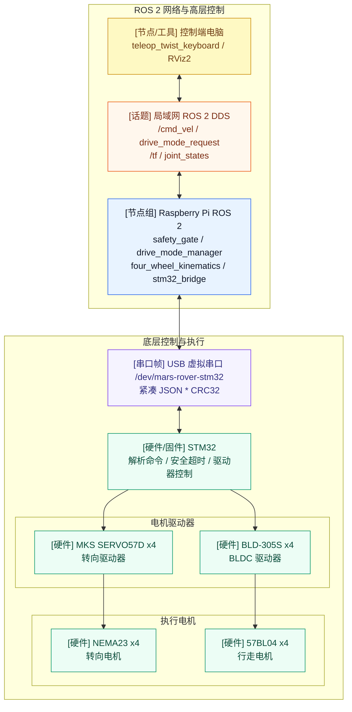
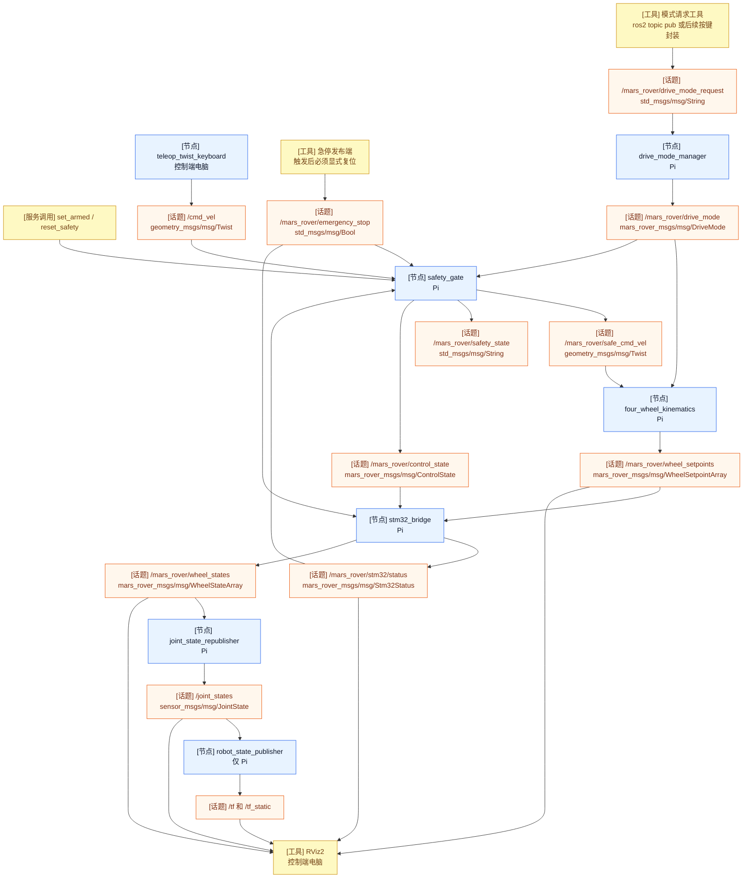
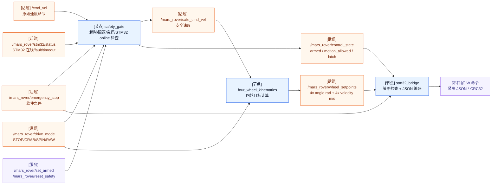
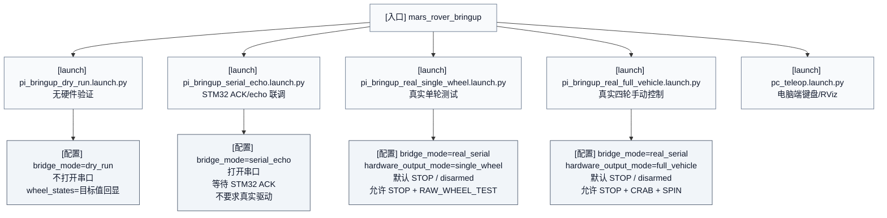
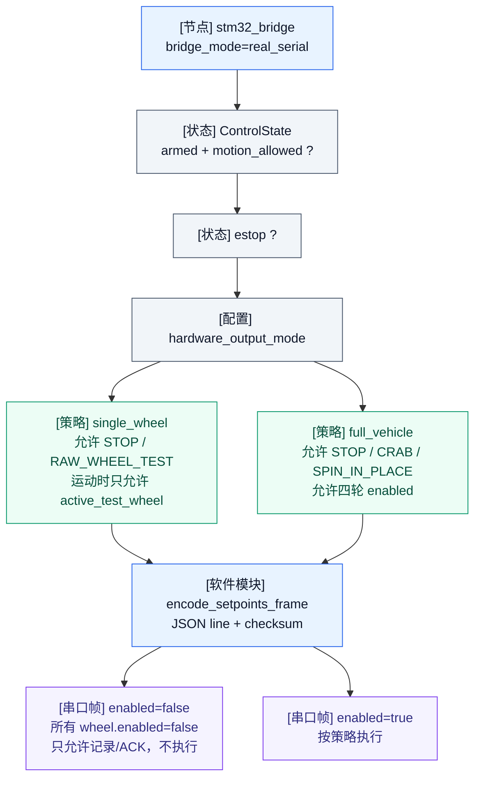
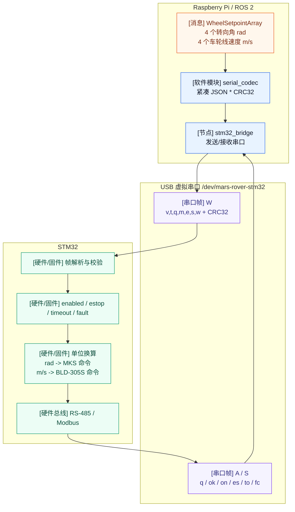
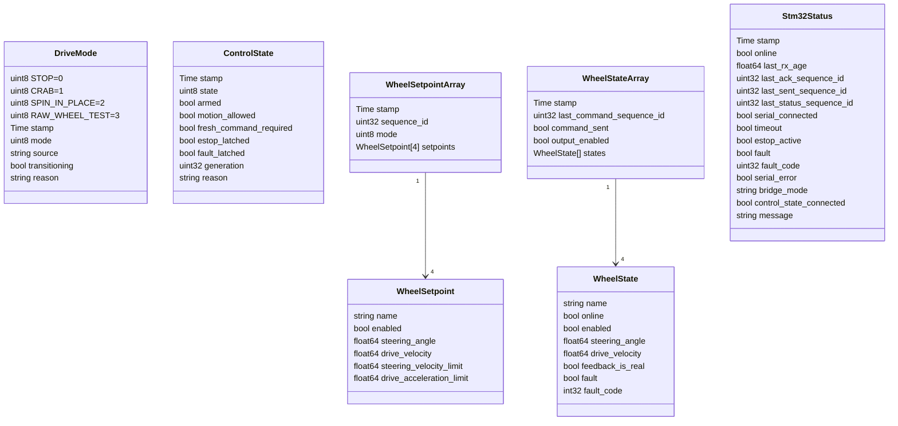

# MARS Rover ROS 2 架构与节点图

> 版本：2026-05-30  
> 文件用途：用图说明本项目 ROS 2 高层控制架构、节点划分、话题流向和 Pi-STM32 边界  
> 图表格式：Markdown + Mermaid，可在支持 Mermaid 的 Markdown 预览器、GitHub、部分 IDE 中直接渲染  

---

## 0. 读图约定

本文档中的图统一使用下面的视觉约定，避免把“节点、话题、硬件、文件”混在一起理解。

| 类型 | 图中标记 | 含义 |
|---|---|---|
| ROS 2 节点 / 软件模块 | `[节点]`，蓝色 | 可运行的 ROS 2 node 或项目 Python 模块 |
| ROS 2 话题 / 消息流 | `[话题]`，橙色 | ROS 2 topic 或 topic 上传输的消息 |
| 串口帧 / 通信帧 | `[串口帧]`，紫色 | Pi 与 STM32 之间的 JSON line / ACK / STATUS |
| 启动文件 / 配置 | `[launch]`、`[配置]`，灰色 | launch 文件、参数或运行模式配置 |
| STM32 / 驱动器 / 电机 | `[硬件]`，绿色 | ROS 2 之外的底层硬件或嵌入式控制对象 |
| 可视化 / 调试工具 | `[工具]`，黄色 | RViz、命令行发布工具、调试工具 |

---

## 1. 总体部署架构

这张图表达“电脑端、局域网、Pi、STM32、驱动器、电机”之间的关系。



关键边界：

- 电脑端只负责键盘输入、RViz 和调试。
- Pi 负责 ROS 2 节点、运动学、安全门、串口桥接。
- STM32 负责解析 Pi 命令，把 `rad` 和 `m/s` 转成 MKS SERVO57D / BLD-305S 的具体命令。
- ROS 2 不直接写 Modbus，不直接控制 BLD-305S 或 MKS SERVO57D。

---

## 2. ROS 2 节点与话题总图

这张图是本项目最核心的 ROS 2 节点/话题关系。



说明：

- `/cmd_vel` 是控制端键盘输出。
- `/mars_rover/safe_cmd_vel` 是经过安全门后的速度命令。
- `/mars_rover/control_state` 是真实输出授权的唯一结构化状态；bridge 不再读取动态使能参数。
- `/mars_rover/wheel_setpoints` 是 Pi 高层运动学算出的四轮目标。
- `/mars_rover/wheel_states` 当前可以是目标值回显，不一定是真实硬件反馈。
- `/joint_states` 用于 RViz 显示四个转向关节和四个驱动关节。

---

## 3. Pi 侧核心数据流

这张图只看 Pi 内部从速度命令到串口帧的链路。



Pi 发给 STM32 的核心语义：

```text
v=1, t=W, q, m, e, s
w[0..3] 固定为 FL / FR / RL / RR
每轮：[enabled, angle_rad, velocity_mps,
      steering_limit_radps, acceleration_limit_mps2]
```

---

## 4. 运行模式架构

本项目不是只有真实硬件模式。它同时保留了无硬件验证、串口 echo、真实单轮测试和真实四轮控制入口。



模式解释：

| 启动文件 | 用途 | 是否需要 STM32 | 是否允许真实电机执行 |
|---|---|---|---|
| `pc_teleop.launch.py` | 电脑端键盘和 RViz | 否 | 否 |
| `pi_bringup_dry_run.launch.py` | 无硬件跑通 ROS 2 框架 | 否 | 否 |
| `pi_bringup_serial_echo.launch.py` | 验证 Pi-STM32 串口 ACK | 是 | 否 |
| `pi_bringup_real_single_wheel.launch.py` | 单轮真实测试 | 是 | 需要 `/mars_rover/set_armed` 服务成功 |
| `pi_bringup_real_full_vehicle.launch.py` | 四轮真实手动控制 | 是 | 需要 `/mars_rover/set_armed` 服务成功 |

---

## 5. `real_serial` 硬件输出策略

`real_serial` 不是单一模式，它通过 `hardware_output_mode` 区分单轮测试和四轮整车控制。



关键规则：

- 未 arm、ControlState 不新鲜或 `motion_allowed=false` 时，串口帧中的 `enabled=false`。
- `estop=true` 时，串口帧中的 `enabled=false`，STM32 必须 stop all。
- `STOP` 在所有 profile 中都合法；`single_wheel` 的运动模式只允许 `RAW_WHEEL_TEST`。
- `full_vehicle` 允许 `STOP`、`CRAB`、`SPIN_IN_PLACE`。
- `serial_echo` 在代码层无条件强制 `enabled=false`。

---

## 6. Pi 到 STM32 串口边界

这张图说明 Pi 和 STM32 的接口责任。



Pi 发给 STM32 的不是寄存器值，而是高层目标。STM32 负责具体寄存器、驱动器 ID、CRC、fault、超时和急停。

---

## 7. 包与文件结构表

这一节不用图，直接用表格列出包、文件和职责。

| 包 / 路径 | 类型 | 关键文件 | 职责 |
|---|---|---|---|
| `mars_rover_ws` | ROS 2 workspace | `src/` | 整个项目的 ROS 2 工作空间 |
| `mars_rover_msgs` | 自定义消息包 | `msg/*.msg` | 定义 drive mode、wheel setpoint、wheel state、STM32 status 等消息 |
| `mars_rover_control` | Python 控制节点包 | `drive_mode_manager.py` | 接收模式请求，发布当前驾驶模式 |
| `mars_rover_control` | Python 控制节点包 | `safety_gate.py` | 对 `/cmd_vel` 做超时、限速、急停、STM32 online 检查 |
| `mars_rover_control` | Python 控制节点包 | `four_wheel_kinematics.py` | 把安全后的速度和当前模式转换成四轮目标 |
| `mars_rover_control` | Python 控制节点包 | `stm32_bridge.py` | 把四轮目标编码成 Pi->STM32 串口帧，并发布 STM32 状态和 wheel states |
| `mars_rover_control` | Python 控制节点包 | `joint_state_republisher.py` | 把 wheel states 转成 `/joint_states`，供 RViz 显示 |
| `mars_rover_control` | Python 工具模块 | `serial_codec.py` | 编码/解码 JSON line 串口帧和 checksum |
| `mars_rover_control` | Python 工具模块 | `hardware_policy.py` | 判断 `real_serial` 下 single wheel / full vehicle 输出策略是否允许 |
| `mars_rover_description` | 机器人描述包 | `urdf/mars_rover.urdf.xacro` | 提供 RViz 使用的简化四轮模型 |
| `mars_rover_bringup` | 启动与配置包 | `launch/*.launch.py` | 定义电脑端、dry-run、serial echo、真实单轮、真实四轮启动入口 |
| `mars_rover_bringup` | 参数配置包 | `config/*.yaml` | 定义几何参数、安全限制、STM32 bridge 参数、单轮测试参数 |
| `mars_rover_bringup` | RViz 配置 | `rviz/mars_rover.rviz` | RViz 显示配置 |
| `mars_rover_tests` | 测试说明包 | `README.md` | 记录无硬件测试和硬件相关启动入口说明 |

---

## 8. 主要消息关系

本节只描述 **消息类型**，不是节点图。下面的类图表示消息字段和消息之间的包含关系。



消息用途解释：

| 消息类型 | 主要发布者 | 主要订阅者 | 作用 |
|---|---|---|---|
| `DriveMode` | `drive_mode_manager` | `four_wheel_kinematics` | 表示当前驾驶模式，例如 `STOP`、`CRAB`、`SPIN_IN_PLACE`、`RAW_WHEEL_TEST` |
| `ControlState` | `safety_gate` | `stm32_bridge`、调试工具 | 表示 arm、运动许可、急停/故障锁存、新命令门槛和恢复代次 |
| `WheelSetpoint` | `four_wheel_kinematics` | 作为 `WheelSetpointArray` 的内部元素 | 表示单个轮组的目标，包括是否启用、目标转向角、目标驱动速度和底层限速参考 |
| `WheelSetpointArray` | `four_wheel_kinematics` | `stm32_bridge` | 表示四个轮组的完整目标，是 Pi 发给 STM32 前的核心 ROS 2 高层目标 |
| `WheelState` | `stm32_bridge` | 作为 `WheelStateArray` 的内部元素 | 表示单个轮组的状态；当前可为目标值回显，未来可接入 STM32 真实反馈 |
| `WheelStateArray` | `stm32_bridge` | `joint_state_republisher`、调试工具、RViz 间接使用 | 表示四个轮组状态，用于生成 `/joint_states` 和观察反馈是否真实 |
| `Stm32Status` | `stm32_bridge` | `safety_gate`、调试工具、RViz 间接使用 | 表示 STM32 串口连接、在线状态、ACK 序号、timeout、estop、fault 和错误信息 |

需要特别注意：

- `WheelSetpointArray` 是“目标”，不是反馈。
- `WheelStateArray` 当前是目标值回显；`command_sent` 和 `output_enabled` 分别说明是否写串口、是否允许执行。
- 是否是真实反馈要看 `feedback_is_real`。
- `Stm32Status.last_ack_sequence_id` 用来判断 STM32 是否收到了 Pi 发出的命令。

---

## 9. 推荐阅读顺序

如果把本文档给后续开发 AI 或组员，建议按下面顺序阅读：

1. 先看“总体部署架构”。
2. 再看“ROS 2 节点与话题总图”。
3. 如果写 Pi 侧代码，看“Pi 侧核心数据流”和“运行模式架构”。
4. 如果写 STM32 固件，看“Pi 到 STM32 串口边界”。
5. 如果改消息或 launch，看“包与文件结构表”和“主要消息关系”。
