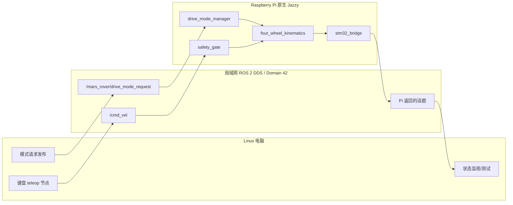

# 后续 Linux 电脑端与 Raspberry Pi 部署联调 Codex 交接说明

## 1. 文档用途

本文件用于把当前 MARS Rover ROS 2 项目交接给后续在 Linux 电脑上工作的 Codex。

后续 Codex 的目标不是重新设计项目，而是在现有实现基础上完成：

1. 整理并固定当前源码版本。
2. 在 Linux 电脑部署电脑端 ROS 2 节点。
3. 在 Raspberry Pi 原生部署 Pi 端必要节点。
4. 验证真正的 `Linux 电脑 ROS 2 -> 局域网 DDS -> Pi ROS 2` 双向通信。
5. 验证电脑端键盘控制到 Pi 四轮目标输出的完整 dry-run 链路。
6. 在上述工作通过后，再准备 Pi 到 STM32 的串口联调。

本文件是接手工作的入口。开始操作前，还应阅读：

- `docs/火星车Pi部署与SSH联调实施报告.md`
- `docs/火星车ROS2开发需求文档.md`
- `docs/火星车ROS2高层实现方案.md`
- `docs/火星车ROS2实现规格说明.md`
- `docs/Pi与STM32接口对接说明.md`
- `docs/火星车硬件部署与联调操作手册.md`

## 2. 必须先理解的结论

### 2.1 已经完成的内容

当前已经完成：

- Pi 原生 Ubuntu 24.04.4 arm64 + ROS 2 Jazzy 环境检查。
- 当前本地 `mars_rover_ws` 到 Pi 的版本化部署。
- Pi 上 5 个 ROS 2 包的 `colcon build`。
- 51 项测试，0 错误、0 失败、0 跳过。
- Pi 内部 dry-run 控制链路。
- 通过 PowerShell SSH 终端运行键盘节点并控制 Pi 内部 ROS 2 链路。
- CRAB 模式四轮目标输出。
- 命令停止后约 0.5 秒归零。
- ROS 节点 SIGINT 干净关闭。

### 2.2 尚未完成的核心内容

当前没有完成：

- Linux 电脑端 ROS 2 环境部署。
- Linux 电脑 ROS 2 与 Pi ROS 2 的跨主机 DDS 通信。
- 电脑端节点发布 `/cmd_vel`，Pi 端节点返回四轮目标的真实局域网测试。
- 网络断开后的跨主机安全归零测试。
- Pi 最小运行集部署。
- Pi 到 STM32 串口联调。
- STM32、电机驱动器和电机测试。

### 2.3 不能错误声称的结果

此前通过的是：

```text
Windows PowerShell
  -> SSH
  -> Pi 上的键盘 ROS 2 节点
  -> Pi 上的控制节点
```

此前没有通过：

```text
Linux/Windows 电脑上的 ROS 2 节点
  -> 局域网 DDS
  -> Pi 上的 ROS 2 节点
```

后续报告必须继续区分这两种链路。

## 3. 当前源码状态

### 3.1 本地来源

当前主要工作区：

```text
D:\rover\mars_rover_ws
```

本地 Git 状态：

```text
branch: main
local HEAD: 70b00f5eaa4ef1aba962f88394f2f29842a1a14b
remote HEAD: 2d3d35c3172c2054575f98a20b3e385fe47e5b8b
remote: git@github.com:lixiang-moss/rover.git
```

重要：本地工作树存在大量未提交修改和新增文件。Pi 当前运行版本来自这个未提交工作树，
不是远端 GitHub HEAD。

因此，后续 Linux Codex不能直接执行下面的操作后就认为拿到了最新代码：

```bash
git clone git@github.com:lixiang-moss/rover.git
```

如果远端尚未同步，这样得到的是旧代码。

### 3.2 后续接手前必须固定源码

后续 Codex 的第一个源码任务必须是：

1. 检查当前 Windows 工作树的全部 diff 和未跟踪文件。
2. 保留用户已做的中文文档重命名，不恢复旧英文文件名。
3. 确认本次部署新增的代码和文档均存在。
4. 运行静态检查和 Pi 测试。
5. 创建明确的 Git commit。
6. 推送到用户的 GitHub 仓库。
7. 在 Linux 电脑 clone 后核对 commit SHA。

在没有完成上述步骤前，可以使用带 SHA256 的部署压缩包临时传输，但不能把它当作
团队长期源码管理方案。

### 3.3 当前 ROS 2 包

当前 `mars_rover_ws/src` 包含：

| 包 | 当前作用 | 角色 |
|---|---|---|
| `mars_rover_msgs` | 自定义 ROS 2 消息 | 电脑和 Pi 共享 |
| `mars_rover_control` | 安全门、运动学、bridge、状态和键盘适配 | 当前混合电脑与 Pi 代码 |
| `mars_rover_bringup` | 电脑与 Pi 的 launch/config/RViz | 当前混合电脑与 Pi 内容 |
| `mars_rover_description` | URDF/Xacro | 可视化/robot_state_publisher |
| `mars_rover_tests` | 测试说明和测试资源 | 仅开发阶段 |

## 4. 当前 Pi 状态

### 4.1 系统信息

```text
hostname: mars-rover-pi
OS: Ubuntu 24.04.4 LTS
architecture: aarch64
ROS 2: Jazzy
Pi address at last check: 192.168.137.171
ROS_DOMAIN_ID: 42
ROS_AUTOMATIC_DISCOVERY_RANGE: SUBNET
```

Pi 的 IP 由 DHCP 分配。后续测试前必须重新查询，不能假设仍为
`192.168.137.171`。

### 4.2 当前活动部署

```text
/home/rover/rover/current
  -> /home/rover/rover/releases/20260702T002051/mars_rover_ws
```

最终部署包：

```text
archive: mars_rover_ws_20260702T002051.tar.gz
SHA256: eb6a56312a659a770d9f357c2afcee5da174cd3170478db19aca3109bdc7b451
```

Pi 环境入口：

```bash
source /home/rover/rover/env.sh
```

该脚本会加载：

- `/opt/ros/jazzy/setup.bash`
- `/home/rover/rover/current/install/setup.bash`
- `ROS_DOMAIN_ID=42`
- `ROS_AUTOMATIC_DISCOVERY_RANGE=SUBNET`

### 4.3 当前运行状态

交接文件建立时：

- Pi 上没有 rover 控制进程运行。
- 没有 systemd rover 服务。
- 没有打开 STM32 串口。
- 没有电机输出。
- 没有设置 `hardware_enable=true`。

### 4.4 Pi 已做的系统修改

已安装：

- `python3-rosdep`
- `ros-jazzy-teleop-twist-keyboard`
- `build-essential`
- `bzip2`

Ubuntu 软件源原先遗漏 `noble-updates`，已经修复为：

```text
Suites: noble noble-updates
Suites: noble-security
```

原软件源备份：

```text
/etc/apt/sources.list.d/ubuntu.sources.pre-rover-20260701T235016
```

### 4.5 Pi UART 当前仍不可用于 STM32

当前检查结果：

```text
/dev/serial0: MISSING
kernel command line: console=serial0,115200
```

因此，任何后续 Codex 都不能直接启动 `real_serial` 并声称 Pi 到 STM32 已经可用。

在 STM32 联调前必须：

1. 从 `/boot/firmware/cmdline.txt` 移除 `console=serial0,115200`。
2. 禁用对应 serial getty。
3. 重启 Pi。
4. 验证 `/dev/serial0`。
5. 先做 UART 回环。
6. 再连接 STM32 TX/RX/GND。

该任务晚于电脑到 Pi 的 DDS 验收，不要混在第一轮网络测试中。

## 5. 当前代码已经具备的功能

### 5.1 Pi 侧节点

| 节点 | 输入 | 输出 | 作用 |
|---|---|---|---|
| `drive_mode_manager` | `/mars_rover/drive_mode_request` | `/mars_rover/drive_mode` | 维护 STOP/CRAB/SPIN/RAW 模式 |
| `safety_gate` | `/cmd_vel`、急停、STM32 状态 | `/mars_rover/safe_cmd_vel` | 超时、急停、状态检查和限幅 |
| `four_wheel_kinematics` | 安全速度、驱动模式 | `/mars_rover/wheel_setpoints` | 计算四轮转向角和线速度 |
| `stm32_bridge` | 四轮目标、急停 | STM32 串口帧、状态和目标回显 | ROS 2 与 STM32 的边界 |
| `joint_state_republisher` | `/mars_rover/wheel_states` | `/joint_states` | 目标状态可视化，不是硬件必需 |
| `robot_state_publisher` | URDF、joint states | TF | 可视化，不是电机控制必需 |

### 5.2 电脑端节点

当前电脑端入口：

```bash
ros2 launch mars_rover_bringup pc_teleop.launch.py with_rviz:=false
```

该 launch 使用 `keyboard_teleop` 终端适配入口，再调用官方
`teleop_twist_keyboard`。

必须从带 TTY 的终端运行，例如：

- 原生 Linux 终端。
- `docker run -it`。
- `docker exec -it`。
- `ssh -t`。

### 5.3 驱动模式

当前支持：

```text
STOP = 0
CRAB = 1
SPIN_IN_PLACE = 2
RAW_WHEEL_TEST = 3
```

四轮固定顺序：

```text
front_left
front_right
rear_left
rear_right
```

### 5.4 当前安全行为

- `/cmd_vel` 超时阈值约 0.5 秒。
- dry-run 不访问串口。
- 所有真实硬件 launch 默认 `hardware_enable=false`。
- `/wheel_states` 当前是目标值回显。
- `feedback_is_real=false` 表示不是真实传感器反馈。
- 软件急停、STM32 急停、故障和超时可强制零输出。

### 5.5 Pi 到 STM32 协议

当前协议不是自由文本，而是：

```text
紧凑 JSON * 8 位大写十六进制 CRC32 \n
```

包含：

- 固定四轮顺序。
- 序号。
- 全局使能。
- 急停。
- ACK。
- STATUS。
- CRC 校验。
- 最大帧长限制。
- 分片和粘包重组。

后续 Linux 部署不得改动该串口协议，除非同时更新 STM32 对接文档、测试和固件合同。

## 6. 当前测试基线

Pi 上最终结果：

```text
5 packages built
51 tests
0 errors
0 failures
0 skipped
```

最终 dry-run 验证：

- 6 个当前 launch 节点全部启动。
- CRAB 请求被接受。
- 四轮产生非零目标。
- 四轮顺序正确。
- 目标回显不是硬件反馈。
- 停止发送命令后约 0.476 秒归零。
- 恢复发送后重新产生非零目标。
- SIGINT 后无残留进程和关闭错误。

SSH 键盘测试验证：

```text
mode: CRAB
/cmd_vel nonzero: true
front_left velocity: 0.02 m/s
front_right velocity: 0.02 m/s
rear_left velocity: 0.02 m/s
rear_right velocity: 0.02 m/s
zero_after: true
```

这些结果是后续修改后的回归基线。

## 7. 当前 Pi 部署并不是最小运行集

这是后续接手时必须处理的边界。

Pi 当前部署的是完整 `mars_rover_ws`，其中包含：

- Pi 必需节点。
- 电脑端 `pc_teleop.launch.py`。
- `keyboard_teleop`。
- RViz 配置。
- 测试源码。
- Dockerfile、README。
- `mars_rover_tests`。

这些额外文件当前没有运行，不会主动控制硬件，但它们不属于严格的 Pi 最小运行集。

Pi 没有部署：

- 仓库根目录的 `docs`。
- STM32 工程目录。
- 上一届项目代码。
- CAD、图片和其他输出目录。
- Nav2。
- `ros2_control`。

## 8. 推荐的电脑端与 Pi 端代码边界

后续 Codex 应保留一个统一 Git 仓库，但建立清晰的角色包和部署产物。

### 8.1 Linux 电脑端需要

- 键盘 teleop。
- `pc_teleop.launch.py`。
- `/cmd_vel` 发布。
- 驱动模式请求发布。
- `mars_rover_msgs`，用于读取 Pi 自定义状态。
- 可选 RViz、URDF、robot_state_publisher 和 joint state 转换。
- 开发测试工具。

### 8.2 Pi 硬件最小控制需要

最小控制节点应为：

- `drive_mode_manager`
- `safety_gate`
- `four_wheel_kinematics`
- `stm32_bridge`

共享接口：

- `mars_rover_msgs`

Pi launch/config：

- dry-run launch。
- serial echo launch。
- real single-wheel launch。
- real full-vehicle launch。
- 机器人几何参数。
- 安全限幅。
- STM32 bridge 参数。

### 8.3 Pi 可选而非硬件控制必需

- `joint_state_republisher`
- `robot_state_publisher`
- `mars_rover_description`
- RViz 配置

如果后续不使用 RViz，这些内容不应出现在正式硬件最小 launch 中。

### 8.4 仅开发阶段需要

- `mars_rover_tests`
- `test/`
- README
- Dockerfile
- pytest 缓存
- build/install/log 历史目录

### 8.5 推荐的代码整理方式

不要在 Pi 活动版本中手动零散删除文件。应先在源码中完成角色拆分，再重新构建和部署。

推荐结构：

```text
mars_rover_msgs                 共享消息
mars_rover_control              Pi 核心控制节点
mars_rover_pi_bringup           Pi launch/config
mars_rover_pc_bringup           电脑键盘、可选 RViz
mars_rover_description          可选模型
mars_rover_tests                开发测试
```

至少应完成：

1. 把 `keyboard_teleop.py` 移到电脑端包。
2. 把 `pc_teleop.launch.py` 移到电脑端包。
3. 从 Pi 包清单移除 `teleop_twist_keyboard` 和 `rviz2` 依赖。
4. 为真实硬件建立只启动 4 个核心节点的最小 launch。
5. 保留当前包含可视化节点的 dry-run launch，供开发测试使用。
6. 分别生成电脑端和 Pi 端部署清单。

## 9. Linux 电脑环境选择

后续 Codex 必须先读取 Linux 电脑实际系统版本，再选择一种路径。

### 9.1 Linux 电脑是 Ubuntu 24.04

推荐原生安装 ROS 2 Jazzy。

优点：

- DDS 网络最直接。
- 键盘 TTY 最简单。
- RViz 和调试工具最简单。
- 不需要容器网络转换。

### 9.2 Linux 电脑是 Ubuntu 26.04

如果必须继续使用 Jazzy，推荐在 Linux 原生 Docker Engine 中运行 Ubuntu 24.04/
ROS 2 Jazzy 容器，并使用：

```bash
--network host
-it
```

Linux Docker 的 host network 比 Windows Docker Desktop 更适合 DDS。

需要验证：

- Docker daemon 正常。
- 容器能使用物理网卡的 UDP 组播/单播。
- 容器与 Pi 的 ROS_DOMAIN_ID 一致。
- 防火墙允许 DDS。
- 键盘容器具有 TTY。

### 9.3 不推荐事项

- 不要在 Pi 上使用 Docker。
- 不要在 ROS 发行版不一致时直接复制 `install/` 目录。
- 不要把 x86_64 电脑构建产物复制到 arm64 Pi。
- 不要使用 Windows WSL 作为本项目后续默认硬件联调路径。

## 10. 后续实施顺序

后续 Codex 应严格按以下顺序执行。

### 步骤 1：固定可复现源码

验收标准：

- 当前本地改动已审核。
- 最新代码已 commit。
- GitHub 已推送。
- Linux clone 的 SHA 与计划部署 SHA 一致。
- `git status --short` 为空，或未提交内容得到明确解释。

### 步骤 2：完成电脑/Pi 角色拆分

验收标准：

- 电脑端包不被部署到 Pi 正式最小版本。
- Pi 包不依赖 RViz 或键盘包。
- Pi 最小 launch 只启动硬件控制需要的节点。
- 开发用完整 dry-run launch 仍可使用。
- 单元测试继续通过。

### 步骤 3：部署 Linux 电脑端

原生 Jazzy 或 Linux Docker Jazzy 中执行：

```bash
cd <repo>/mars_rover_ws
source /opt/ros/jazzy/setup.bash
rosdep install --from-paths src --ignore-src -r -y --rosdistro jazzy
colcon build --symlink-install
source install/setup.bash
colcon test
colcon test-result --verbose
```

Docker 路径应在容器内部构建，不要把 x86_64 `build/install/log` 提交到 Git。

### 步骤 4：重新部署 Pi 最小版本

要求：

- Pi 继续原生 ROS 2 Jazzy。
- 使用版本化 release 目录。
- 部署包记录 Git SHA 和 SHA256。
- 先 build/test，成功后再原子更新 `current`。
- 不覆盖当前稳定版本。
- 不批量删除旧版本。

建议结构：

```text
/home/rover/rover/releases/<timestamp>/mars_rover_ws
/home/rover/rover/current -> <new release>
```

### 步骤 5：验证标准 ROS 2 双向 DDS

电脑和 Pi 均设置：

```bash
export ROS_DOMAIN_ID=42
export ROS_AUTOMATIC_DISCOVERY_RANGE=SUBNET
export ROS2CLI_NO_DAEMON=1
```

如果组播不稳定，双方设置对方当前 IP：

```bash
export ROS_STATIC_PEERS='<peer-ip>'
```

电脑到 Pi：

1. Pi 订阅 `/pc_to_pi_test`。
2. 电脑发布 3 条不同 String。
3. Pi 必须完整收到 3 条。

Pi 到电脑：

1. 电脑订阅 `/pi_to_pc_test`。
2. Pi 发布 3 条不同 String。
3. 电脑必须完整收到 3 条。

必须记录：

- 两端 IP。
- 两端 ROS 发行版。
- 两端 RMW implementation。
- ROS_DOMAIN_ID。
- 是否使用静态 peers。
- 防火墙状态。
- 每个方向的实际消息。

### 步骤 6：验证项目 dry-run 跨主机链路

Pi 启动 dry-run：

```bash
source /home/rover/rover/env.sh
ros2 launch <pi_bringup_package> <pi_dry_run_launch>
```

电脑端：

1. `ros2 node list` 能看到 Pi 节点。
2. 发布 `CRAB`：

```bash
ros2 topic pub --once \
  /mars_rover/drive_mode_request \
  std_msgs/msg/String \
  "{data: CRAB}"
```

3. 启动电脑端键盘：

```bash
ros2 launch <pc_bringup_package> <pc_teleop_launch> with_rviz:=false
```

4. 按 `i`，再按 `k`。
5. 电脑必须能读取 Pi 返回的：

```text
/mars_rover/drive_mode
/mars_rover/safe_cmd_vel
/mars_rover/wheel_setpoints
/mars_rover/wheel_states
/mars_rover/stm32/status
```

验收标准：

- CRAB 被接受。
- `/cmd_vel.linear.x` 非零。
- 四轮顺序正确。
- 四轮目标速度非零。
- 默认低速测试约 `0.02 m/s`。
- `/wheel_states.feedback_is_real=false`。
- dry-run `serial_connected=false`。
- 不访问 `/dev/serial0`。

### 步骤 7：验证超时和断网

必须自动化记录时间，不只人工观察。

测试：

1. 电脑持续发布前进命令。
2. 停止 teleop 进程。
3. Pi 四轮目标应在约 0.5 秒内归零。
4. 恢复 teleop 后应能再次产生目标。
5. 电脑发送命令期间断开网络。
6. Pi 应独立归零并保持运行。
7. 网络恢复后重新发送模式和命令，链路应恢复。

建议验收阈值：

```text
目标值归零 <= 0.55 s
```

如果实际测试受调度影响略高，必须报告实测值和原因，不能只写“通过”。

### 步骤 8：形成 Linux 跨主机测试报告

报告必须包括：

- Linux 电脑系统和 ROS 版本。
- Pi 系统和 ROS 版本。
- Git commit SHA。
- 部署包 SHA256。
- 两端 IP 和网络结构。
- 电脑端运行节点。
- Pi 端运行节点。
- 双向标准 topic 结果。
- 键盘到四轮目标结果。
- 超时和断网实测时间。
- 失败、重试和最终结论。
- 明确写出 STM32 是否参与。

## 11. Linux 电脑与 Pi 的最终目标拓扑



dry-run 阶段，`stm32_bridge` 只回显目标，不打开串口。

## 12. Pi 到 STM32 的后续边界

只有电脑到 Pi 的跨主机 DDS 全部通过后，才进入该部分。

### 12.1 必须先完成

- Pi UART 从 Linux 控制台释放。
- `/dev/serial0` 可用。
- Pi 和 STM32 只连接 TX、RX、GND。
- 双方使用 115200、8N1、无流控。
- STM32 固件实现当前紧凑 JSON + CRC32 协议。
- STM32 回 ACK 和 STATUS。
- STM32 0.5 秒有效命令超时停止。

### 12.2 第一轮硬件测试

- 只使用 `single_wheel`。
- `active_test_wheel=front_left`。
- `hardware_enable=false` 启动。
- 确认状态后再显式使能。
- 先架空、低速、可断电。
- 不直接进入四轮落地运行。

### 12.3 不允许的替代方案

- ROS 2 不直接写 BLD-305S Modbus。
- ROS 2 不绕过 STM32 控制电机。
- 不引入 Nav2。
- 不引入 `ros2_control`。
- 不使用上一届 STM32 代码作为默认实现。

## 13. 已知风险与改进项

### 13.1 源码尚未同步到 GitHub

这是当前最高优先级风险。Pi 上的有效版本无法仅通过远端 commit 复现。

### 13.2 Pi 部署内容不够最小

当前无运行风险，但不符合用户期望的角色最小化。应先拆包，再重新部署。

### 13.3 电脑/Pi 包依赖混合

当前 Pi rosdep 需要跳过 RViz 和 `joint_state_publisher`，说明包边界仍不清楚。

### 13.4 Pi IP 动态变化

静态 peers 和 SSH 脚本必须在每次测试前重新确认 IP，或由网络管理员设置 DHCP 保留。

### 13.5 当前没有真实反馈

`/wheel_states` 是目标回显。任何 UI 或报告都不得把它写成编码器/电机真实状态。

### 13.6 凭据安全

不要把 Pi 密码写入仓库、部署脚本、报告或终端日志。推荐配置 SSH key 并轮换密码。

### 13.7 Windows Docker Desktop

Windows 上曾安装 Docker Desktop 4.80.0，但 WSL 未安装，Docker 已停止。
该状态与后续原生 Linux 工作无关。不要以此判断 Linux Docker 是否可用。

## 14. 后续 Codex 不应做的事情

- 不要直接从旧 GitHub HEAD 部署。
- 不要把当前 SSH 测试写成跨主机 DDS 通过。
- 不要在 Pi 上安装 Docker。
- 不要把电脑端 x86_64 `install/` 复制给 Pi arm64。
- 不要在 dry-run 测试中打开串口。
- 不要默认设置 `hardware_enable=true`。
- 不要把目标回显称为真实反馈。
- 不要为了“最小化”直接删除 Pi 当前活动版本中的零散文件。
- 不要批量删除旧 release；需要清理时先让用户确认并手动处理。
- 不要恢复用户已经完成的中文文档重命名。
- 不要引入自动驾驶、Nav2 或 `ros2_control`。

## 15. 推荐给后续 Codex 的首轮检查命令

### 15.1 Linux 电脑

```bash
uname -a
cat /etc/os-release
git --version
docker --version || true
source /opt/ros/jazzy/setup.bash 2>/dev/null || true
ros2 doctor --report 2>/dev/null || true
ip -brief address
git status --short
git rev-parse HEAD
git remote -v
```

### 15.2 Pi

```bash
ssh rover@mars-rover-pi.local
hostname
cat /etc/os-release
uname -m
hostname -I
readlink -f /home/rover/rover/current
source /home/rover/rover/env.sh
ros2 doctor --report
ros2 node list
test -e /dev/serial0 && readlink -f /dev/serial0 || echo MISSING
grep -o 'console=serial0,[^ ]*' /boot/firmware/cmdline.txt || true
```

## 16. 完成交接的最终验收表

后续 Codex 只有在以下项目全部有证据时，才能宣布“电脑端控制 Pi 链路完成”：

| 项目 | 当前状态 | 后续目标 |
|---|---|---|
| 最新源码有 Git commit | 未完成 | 必须完成 |
| Linux 电脑构建和测试 | 未完成 | 必须通过 |
| Pi 最小部署包 | 未完成 | 必须完成 |
| Pi 原生构建和测试 | 已通过旧完整工作区 | 最小包需重测 |
| 电脑到 Pi 标准 topic | 未完成 | 3/3 收到 |
| Pi 到电脑标准 topic | 未完成 | 3/3 收到 |
| 电脑键盘到 Pi `/cmd_vel` | 未完成跨主机 | 必须通过 |
| Pi 返回四轮目标到电脑 | 未完成跨主机 | 必须通过 |
| 停止 teleop 后归零 | Pi 内部已通过 | 跨主机重测 |
| 断网归零 | 未完成 | 必须通过 |
| 恢复连接 | 未完成 | 必须通过 |
| STM32/电机 | 不在本轮 | 不得误报 |

## 17. 当前交接状态总结

当前项目不是“从零开始”，也不是“已经全部部署完成”。准确状态是：

1. ROS 2 高层代码已经在 Pi 原生 Jazzy 上编译、测试并通过 Pi 内部 dry-run。
2. 当前 Pi 部署版本可作为回退和行为基线。
3. 电脑端与 Pi 端还没有完成角色最小化拆分。
4. 最新源码还没有形成可由 Linux 电脑直接 clone 的 Git commit。
5. 真正的 Linux 电脑到 Pi DDS 控制链路仍是下一阶段的核心工作。
6. STM32 串口和实体电机测试必须晚于上述网络链路。

后续 Codex 应先保证源码可复现和部署边界正确，再进行跨主机测试。不要为了快速看到
topic 而跳过版本固定、角色拆分和安全归零验收。
