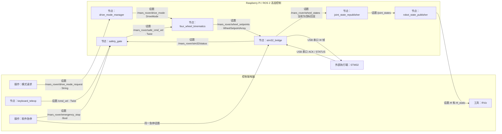

# MARS Rover ROS 2 改进前逻辑流与设计审计基线

> 文档性质：2026-07-03 改进实施前的只读审计快照，不再代表当前代码
> 审计范围：`D:\rover\mars_rover_ws` 中的 ROS 2 代码、消息、配置、launch、URDF 和 ROS 2 技术文档
> 不审计：STM32 固件内部实现、电机驱动器寄存器和电气接线
> 审计日期：2026-07-03

> 后续状态：本文提出的推荐方案 A 已获确认并实施。当前行为和完成项以《火星车ROS2控制逻辑改进记录_2026-07-03.md》及当前源码为准；本文保留用于展示问题发现、方案论证和改进前后对比。

## 1. 使用方式

后续开发者或 AI 应先阅读本文，再阅读需求文档和代码。

原因是当前项目同时存在三类信息：

1. 已经在代码中实现的行为。
2. 技术文档要求实现、但代码尚未实现的行为。
3. 仍需要项目成员做决定的设计问题。

本文严格区分这三类信息，不把“文档写过”当成“代码已经做到”。

## 2. 已确认的 ROS 2 项目边界

- 控制目标是键盘手动控制四轮独立转向、四轮独立驱动机器人。
- 控制端电脑和 Raspberry Pi 使用 ROS 2 Jazzy，通过局域网 DDS 通信。
- 电脑端产生人工驾驶意图；Pi 执行模式、安全、运动学和串口桥接。
- 第一版支持 `STOP`、`CRAB`、`SPIN_IN_PLACE`、`RAW_WHEEL_TEST`。
- 同一工程同时保留 dry-run、串口联调、真实单轮和真实四轮入口。
- 当前不使用 `ros2_control`，不做 Nav2、路径规划或自动驾驶。
- ROS 2 高层单位固定为转向角 `rad`、车轮线速度 `m/s`。
- STM32 被视为遵守双方接口合同的外部执行端，本文不评价其现有代码。

## 3. 当前实际部署和数据流



## 4. 当前节点职责

| 节点 | 当前实际职责 | 当前不具备的能力 |
|---|---|---|
| `keyboard_teleop` | 封装 `teleop_twist_keyboard`，发布 `/cmd_vel` | 不切换模式、不管理 arm、不锁存急停 |
| `drive_mode_manager` | 接收字符串模式请求，保存并周期发布当前模式 | 不执行安全过渡、不限制 launch profile 允许的模式 |
| `safety_gate` | 检查命令超时、软件急停和底层状态，限幅并发布安全速度 | 不锁存急停、不要求解除后收到新命令、不检测状态发布节点失联时间 |
| `four_wheel_kinematics` | 以 20 Hz 生成四轮角度和线速度目标 | 未实现完整等效角度优化，未实现 steer-before-drive |
| `stm32_bridge` | 编解码串口帧、执行硬件输出策略、发布状态和目标回显 | 没有正式 arm 状态机、没有上游 setpoint 超时、策略拒绝时不主动发停止帧 |
| `joint_state_republisher` | 将轮组状态转换为 `/joint_states` 并积分车轮位置 | 当前把 `m/s` 直接当成关节 `rad/s` |

## 5. 当前运行入口

| launch | 默认 drive mode | bridge mode | 硬件策略 | 默认真实使能 |
|---|---|---|---|---:|
| `pi_bringup_dry_run.launch.py` | `STOP` | `dry_run` | 配置默认值 | false |
| `pi_bringup_serial_echo.launch.py` | `STOP` | `serial_echo` | 配置默认值 | false |
| `pi_bringup_real_single_wheel.launch.py` | `RAW_WHEEL_TEST` | `real_serial` | `single_wheel` | false |
| `pi_bringup_real_full_vehicle.launch.py` | `STOP` | `real_serial` | `full_vehicle` | false |
| `pc_teleop.launch.py` | 不管理模式 | 不适用 | 不适用 | 不适用 |

## 6. 当前安全判定逻辑

### 6.1 `safety_gate`

当前安全原因优先级为：

```text
software_estop
> stm32_estop
> stm32_fault
> stm32_timeout
> cmd_timeout
> stm32_offline
> ok
```

只有结果为 `ok` 时，`safety_gate` 才转发限幅后的速度；其余情况发布零 `Twist`。

### 6.2 `stm32_bridge`

在 `real_serial` 中，当前串口帧的全局执行使能近似为：

```text
command_enabled =
    hardware_enable
    AND 软件急停未激活
    AND STM32 STATUS 新鲜
    AND STM32 online
    AND STM32 未报告 estop / timeout / fault
```

随后，每个轮组的最终使能还要与该轮组 `WheelSetpoint.enabled` 相与。

这形成了双层检查，但两层没有共享一个统一的“已武装、允许运动、必须重新授权”状态机。

## 7. 当前运动模式的真实行为

### 7.1 `STOP`

- 四轮速度为 0。
- 四轮 `enabled=false`。
- 保持最近一次转向目标角。

### 7.2 `RAW_WHEEL_TEST`

- 仅 `active_test_wheel` 被启用。
- `linear.x` 直接作为该轮线速度，保留正负号。
- `angular.z` 被当作该轮目标转向角，不是角速度。
- 其余三轮禁用且速度为 0。

### 7.3 `CRAB`

当前代码执行：

```text
angle = clamp(atan2(vy, vx), -max_steering_angle, +max_steering_angle)
speed = hypot(vx, vy)
```

因此速度始终为非负数。当前实现没有把超出转向范围的方向转换为“等效角度 + 负轮速”。

后果：`vx < 0, vy = 0` 时，期望后退，但当前结果接近“转向 +90 度并向左行驶”。

### 7.4 `SPIN_IN_PLACE`

代码先正确计算每个轮组的切向速度向量，但随后直接裁剪角度，并始终使用正的速度模长。

当某个目标方向超出 `[-max_steering_angle, +max_steering_angle]` 时，裁剪后的轮速向量不再等于期望切向向量。当前正反两个旋转方向都各有两个轮组存在方向误差。

## 8. 审计发现

### P0：真实四轮控制前必须解决

#### P0-1 运动学不是完整的可执行四轮运动学

问题：

- 反向 `CRAB` 错误。
- `SPIN_IN_PLACE` 的部分轮组方向错误。
- 文档要求的“选择最近等效角度，并在需要时反转轮速”没有实现。

建议：

1. 先计算期望二维轮速向量。
2. 生成 `(angle, +speed)` 和 `(angle ± pi, -speed)` 两种等效解。
3. 在机械角度范围内选择距离当前转向角最近的解。
4. 如果不存在合法解，整条命令应拒绝或停止，不能直接裁剪角度后继续驱动。
5. 测试应重构实际向量：

```text
realized_vx = drive_velocity * cos(steering_angle)
realized_vy = drive_velocity * sin(steering_angle)
```

并验证它与期望轮速向量一致，而不是只检查角度正负号。

#### P0-2 缺少“故障后不得自动恢复运动”的控制状态

当前代码可能在以下情况恢复后自动继续旧运动：

- 软件急停从 true 改回 false。
- STM32 状态从故障恢复为正常。
- USB 断开后重新连接。
- `hardware_enable` 从 false 改为 true。
- 模式切换后仍保留上一条未超时速度命令。

根因是系统只有若干布尔条件，没有“控制周期代次”和“必须收到恢复后的新人工命令”概念。

建议至少定义以下状态：

```text
DISARMED
ARMED_IDLE
ACTIVE
ESTOP_LATCHED / FAULT_LATCHED
```

任何急停、故障、串口断开或底层超时都应进入锁存状态。恢复通信本身不能重新 arm；解除锁存并重新 arm 后，还必须收到一条新的人工命令才能运动。

#### P0-3 模式切换没有执行文档要求的安全过渡

文档要求模式切换时先归零，再调整转向。当前 `DriveMode.transitioning` 永远为 false，运动学节点收到新模式后会立即用旧的 `_safe_cmd` 计算新模式目标。

建议：

- 模式切换先发布零速状态。
- 清除旧速度命令。
- 标记 `transitioning=true`。
- 完成允许的转向准备后，再进入目标模式。
- 新模式只接受切换完成后收到的新人工命令。

#### P0-4 单轮策略不能接受 `STOP`，策略拒绝时也不主动发送停止

当前 `single_wheel` 只允许 `RAW_WHEEL_TEST`。如果操作者请求 `STOP`，bridge 会拒绝消息并直接返回，不发送新的禁用帧，只能依赖 STM32 watchdog 最终停止。

建议：

- `STOP` 应在所有硬件输出策略中无条件合法。
- 任何非法模式、非法轮组组合或越界命令都应触发立即发送全局禁用帧，而不是静默丢弃。
- 单轮 profile 的模式管理器只应接受 `STOP` 和 `RAW_WHEEL_TEST`。
- 四轮 profile 的模式管理器只应接受 `STOP`、`CRAB`、`SPIN_IN_PLACE`。

#### P0-5 `serial_echo` 没有从代码层强制禁止执行

当前 `serial_echo` 依赖默认 `hardware_enable=false`。如果该参数被改为 true，现有 bridge 逻辑可以生成 `enabled=true`。未知 `bridge_mode` 也没有在启动时被拒绝。

建议：

- `dry_run`、`serial_echo`、`real_serial` 必须作为严格枚举校验。
- `serial_echo` 无论参数如何都必须强制全局 `enabled=false`。
- 只有 `real_serial` 才能进入 arm 流程。

#### P0-6 缺少“转向到位后才驱动”的明确执行合同

当前 ROS 2 会在同一帧中同时给出新转向角和非零驱动速度。对于 30:1 转向减速器，转向可能明显慢于行走响应。

项目必须明确二选一：

1. STM32 在低层强制执行 steer-before-drive，并保证角度未到容差内时驱动速度为 0。
2. STM32 回传真实转向角和到位状态，由 ROS 2 根据反馈允许驱动。

在没有真实反馈的当前版本中，推荐把 steer-before-drive 作为 STM32 必须保证的低层安全合同；ROS 2 文档必须明确这一假设。

### P1：建议在真实整车测试前解决

#### P1-1 上游和下游状态缺少独立的新鲜度检查

- `safety_gate` 收到一次 `online=true` 后，不检查该 ROS 状态消息多久没有更新。
- `stm32_bridge` 不检查 `/wheel_setpoints` 是否停止更新。
- 当前最终安全依赖 STM32 watchdog，但 ROS 2 自身不能完整判断节点失联。

建议在两处增加本地接收时间检查，并在超时后锁存 disarm。

#### P1-2 软件急停只是普通 Bool，不是锁存安全状态

`/mars_rover/emergency_stop` 当前是普通、非持久化的 `Bool` 话题。节点重启会把急停状态恢复为 false，解除急停也会立即使用最近的速度命令。

可选方案：

- 推荐：增加 Pi 侧锁存的软件停止管理，使用明确的触发和复位接口。
- 最小方案：继续使用 Bool，但把它称为“软件停止请求”，不要把它描述成可替代物理急停的安全装置。

#### P1-3 `hardware_enable` 不适合作为完整的运行时 arm 接口

ROS 参数适合配置，不适合表达有前置条件、失败原因和锁存规则的操作动作。

建议使用明确的 arm/disarm 服务或动作，并检查：

- 当前模式为 STOP。
- 当前命令为零。
- 串口与状态健康。
- 没有急停或故障锁存。
- arm 后仍需新的人工命令。

#### P1-4 bridge 缺少最终数值边界检查

串口编码器会拒绝 NaN、Inf 和错误字段，但 bridge 没有在最终边界再次检查绝对角度、速度、限速值和消息时间。

错误数据当前可能导致编码异常并使节点退出；超大但有限的数值也可能通过编码。

建议 bridge 使用独立的硬上限做最终验证，不能只信任上游节点。

#### P1-5 远程控制命令没有防止旧样本恢复后重新生效

`/cmd_vel` 使用无时间戳 `Twist` 和默认 QoS。网络恢复后到达的旧样本会被当成新命令。

建议选择一种明确方案：

- 使用带时间戳的控制消息，并在 Pi 检查消息年龄。
- 或为控制命令设置 Keep Last 1、短 lifespan，并在断链恢复后要求重新 arm 和新按键。

### P2：不会直接驱动错误，但会误导测试或增加维护风险

#### P2-1 `/joint_states` 单位错误

`WheelState.drive_velocity` 的单位是 `m/s`，`JointState.velocity` 对旋转关节应为 `rad/s`。当前代码直接赋值并积分，RViz 轮子旋转速度相差一个车轮半径系数。

正确显示应使用：

```text
wheel_angular_velocity = wheel_linear_velocity / wheel_radius
```

#### P2-2 电脑和 Pi 可能重复发布同一套 TF

Pi 的所有 bringup 都启动 `robot_state_publisher`。`pc_teleop.launch.py` 在 `with_rviz=true` 时又启动一个 `robot_state_publisher`，会在同一 DDS 域中出现两个相同 TF 发布者。

建议真实跨主机运行时只在 Pi 启动 `robot_state_publisher`，电脑只启动 RViz。另保留一个“电脑单机 dry-run”入口用于无 Pi 测试。

#### P2-3 `/wheel_states` 混合了“目标回显”和“执行状态”语义

即使命令被策略拒绝、串口不可用或硬件未使能，bridge 仍会把目标发布为 `WheelState`，并使用目标中的 `enabled` 和序号。

虽然 `feedback_is_real=false`，但 `enabled` 和 `last_command_sequence_id` 容易被误读为已经执行或已经发送。

建议至少区分：

- `target_echo`：运动学目标。
- `command_sent`：bridge 是否实际发送。
- `output_enabled`：串口帧是否允许执行。
- `feedback_is_real`：是否来自真实硬件。

#### P2-4 ACK 与 STATUS 序号语义混合

当前 bridge 在收到 ACK 或 STATUS 时都会更新 `last_ack_sequence_id`。该字段名要求它只表示 ACK。

建议分别记录：

- `last_sent_sequence_id`
- `last_ack_sequence_id`
- `last_status_sequence_id`

#### P2-5 参数和配置缺少启动时校验

当前没有统一验证：

- `publish_rate_hz > 0`
- timeout 和速度限制为正数
- `active_test_wheel` 合法
- `bridge_mode` 和 `hardware_output_mode` 合法
- 几何尺寸和车轮半径为正数

建议在节点启动时失败并给出明确错误，而不是运行后产生异常行为。

## 9. 技术文档与代码不一致

| 项目 | 文档描述 | 当前代码 | 需要决定 |
|---|---|---|---|
| 模式切换 | 先归零、再转向，`transitioning` 表示切换 | 立即切换，字段始终 false | 实现过渡状态，或删除该承诺 |
| 等效角度优化 | 角度超过 90 度时可反向轮速 | 未实现 | 必须实现 |
| STOP | 超时、急停、通信故障进入 STOP | 多数情况只是当前模式下速度归零 | 明确 STOP 是模式还是安全输出状态 |
| 单轮策略 | 只允许 RAW | STOP 也被拒绝 | 建议所有 profile 都允许 STOP |
| serial echo | 不驱动电机 | 依赖参数默认 false | 应由代码强制禁用 |
| W 发送频率 | bridge 有 `send_rate_hz=20` | 没有该参数；由运动学 20 Hz 发布间接驱动发送 | 明确发送节拍归谁负责 |
| 车轮半径 | 是运动学/显示参数 | YAML 有值，但运动学节点未声明或使用 | 在 ROS 侧仅用于 JointState 显示，底层换算由 STM32 负责 |
| 关节名 | 一处使用 `fl_steer_joint`，其他位置使用完整名称 | 使用 `front_left_steering_joint` 等完整名称 | 文档统一到实际完整名称 |
| 转向范围 | 一处写 `[-pi,+pi]`，一处写 ±90 度 | 默认 ±90 度 | 以实测机械范围和等效角度算法收束 |
| 驱动关节速度 | 应为角速度 | 当前填线速度 m/s | 代码除以 wheel radius |
| 状态回显 | 明确不是真实反馈 | 已标记 false，但发送/执行语义仍混合 | 扩展状态字段或拆分话题 |
| USB 物理说明 | 个别 ROS 文档仍写“USB、双方 3.3 V TTL” | ROS 代码只看到虚拟串口 | 删除 USB 与 TTL 混写，避免概念错误 |

## 10. 两种收束方案

### 方案 A：最小改动收束

保持现有节点划分，只补齐关键逻辑：

1. 修正运动学等效角度和正负轮速。
2. 所有 profile 允许 STOP，并限制各 profile 的模式集合。
3. `serial_echo` 硬编码禁用输出，严格校验 bridge mode。
4. bridge 在拒绝命令、上游超时和串口断开时立即发送禁用帧并锁存 disarm。
5. 软件急停解除、重新连接、模式切换和 arm 后要求新的 `/cmd_vel`。
6. 把动态 `hardware_enable` 参数替换为有条件的 arm/disarm 服务。
7. 修正 JointState 单位和重复 TF 发布。
8. 补充纯逻辑、节点和 launch 测试。

优点：代码改动范围较小，适合近期联调。
缺点：模式、arm、急停和恢复逻辑仍分散在多个节点中，需要严格维护跨节点合同。

### 方案 B：建立统一控制监督状态

新增或重构一个 Pi 侧 `control_supervisor`，统一管理：

- 当前请求模式和实际生效模式。
- `DISARMED / ARMED_IDLE / ACTIVE / LATCHED` 状态。
- 软件停止锁存与复位。
- 底层健康状态。
- 模式切换过渡。
- 是否要求新的人工命令。

监督节点发布结构化 `ControlState`，`safety_gate` 只做命令年龄和数值限幅，bridge 只在 `ControlState.motion_allowed=true` 时允许串口执行。

优点：状态唯一、容易测试、不会由多个布尔值组合出互相矛盾的状态。
缺点：消息和节点边界需要调整，现有文档、launch 和测试都要同步更新。

## 11. 当前建议

如果近期目标是尽快完成台架和单轮联调，先采用方案 A，但必须完成全部 P0 项，不能只修反向运动学。

如果还没有形成稳定的外部接口，也没有大量代码依赖当前消息，方案 B 的长期逻辑更清楚。它不是为了增加功能，而是把当前分散在模式管理器、安全门和 bridge 中的控制状态收束成一个唯一事实来源。

## 12. 需要项目负责人决定的问题

1. 软件停止解除后，是否必须人工重新 arm？建议：必须。
2. USB 或底层状态恢复后，是否允许自动恢复运动？建议：禁止。
3. 模式切换后，是否必须重新按键才运动？建议：必须。
4. `STOP` 是否允许出现在单轮和四轮所有 profile？建议：允许。
5. `serial_echo` 是否无条件强制 `enabled=false`？建议：是。
6. 真实 arm 是否继续使用动态参数，还是改为有前置条件的服务？建议：改为服务。
7. steer-before-drive 由 STM32 保证，还是 ROS 2 等真实角度反馈后再放行？当前建议：先由 STM32 强制保证。
8. 机械允许的最终车轮转向范围是多少？当前 ±90 度只是软件假设。
9. 实测车轮半径是多少？它影响 RViz 车轮角速度显示，也影响底层速度换算合同。
10. 是否接受新增统一 `ControlState` 和监督状态机？该决定影响采用方案 A 还是 B。

## 13. 后续 AI 审视清单

任何后续 AI 在声明“可以控制真实四轮车”前，必须逐项确认：

- [ ] 负向 CRAB 的实际轮速向量正确。
- [ ] 正负 SPIN 的四个实际轮速向量正确。
- [ ] 不使用简单角度裁剪代替等效角度求解。
- [ ] 模式切换期间输出为零，旧速度不会复用。
- [ ] 急停、故障、超时和串口重连不会自动恢复旧运动。
- [ ] 所有 profile 都能立即执行 STOP。
- [ ] 策略拒绝会主动发送禁用输出，而不是只等待 watchdog。
- [ ] `serial_echo` 在任何参数组合下都不能使能电机。
- [ ] arm 有前置条件、失败原因和明确复位流程。
- [ ] bridge 对上游 setpoint 做新鲜度和最终边界检查。
- [ ] `/joint_states` 使用 rad 和 rad/s，不把 m/s 当 rad/s。
- [ ] 同一 DDS 域中只有一个 `robot_state_publisher` 发布该机器人 TF。
- [ ] 目标回显、已发送命令和真实反馈在消息语义上可区分。
- [ ] 代码、参数、测试手册和架构图使用同一套模式和安全语义。

在这些项目没有完成前，准确表述应为：

> 当前 ROS 2 工程具备完整节点框架、dry-run、串口桥接入口、单轮/四轮运行入口和基本安全检查，但真实四轮运动学与恢复状态机仍需收束，不能仅凭 launch 存在就认定整车控制逻辑已经完成。
