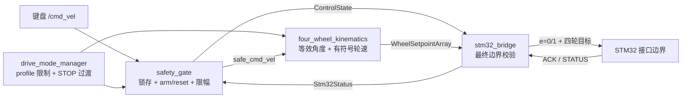

# MARS Rover ROS 2 控制逻辑改进记录

> 日期：2026-07-03
> 范围：只修改 ROS 2 高层控制代码、消息、launch、参数和技术文档
> 未修改：STM32 固件、电机驱动器代码和电气实现
> 目标：把“存在单轮/四轮 launch”提升为逻辑一致、可解释、默认不自动恢复运动的手动控制架构

## 1. 本次改进的背景

改进前的 ROS 2 工程已经具备：

- 键盘 `/cmd_vel` 输入。
- drive mode、安全门、四轮运动学、串口 bridge 和 RViz 链路。
- dry-run、serial echo、真实单轮和真实四轮启动入口。
- 紧凑 JSON + CRC32 串口协议。

但代码审计发现：

1. 反向 CRAB 会被错误转换为侧向运动。
2. 正反 SPIN 各有两个轮组的实际速度向量错误。
3. 急停解除、USB 重连或重新使能后可能自动继续旧命令。
4. 模式切换没有 STOP 过渡，`transitioning` 没有实际作用。
5. single-wheel profile 不接受 STOP，策略拒绝时只丢弃命令。
6. serial echo 依赖参数默认值，代码层没有无条件禁止执行。
7. JointState 把车轮线速度 `m/s` 当成旋转关节角速度 `rad/s`。
8. PC 和 Pi 可能重复启动 robot_state_publisher。

本轮采用“保留现有节点结构、补齐控制状态和最终安全门”的方案，没有引入 Nav2、`ros2_control` 或自动驾驶功能。

## 2. 改进后的总体逻辑



真实执行必须同时满足：

```text
bridge_mode == real_serial
AND ControlState 新鲜
AND ControlState.armed == true
AND ControlState.motion_allowed == true
AND STM32 STATUS 新鲜、online、无 estop/timeout/fault
AND 当前模式和轮组组合符合 launch profile
AND 所有数值在 bridge 独立硬上限内
```

任一条件不满足，协议顶层 `e=0`，所有轮组执行标志为 0。

## 3. 关键改动

### 3.1 修正四轮运动学

旧逻辑：

```text
angle = clamp(atan2(vy, vx))
speed = hypot(vx, vy)
```

该做法会改变超出转向范围的轮速方向。

新逻辑：

1. 先计算期望二维轮速向量。
2. 生成 `(angle, +speed)` 和 `(angle ± pi, -speed)` 等效解。
3. 只保留机械角度范围内的解。
4. 选择距离当前转向目标最近的候选。
5. 如果没有合法候选，拒绝运动并输出停止，不再用裁剪后的错误方向继续驱动。

结果：

- 反向 CRAB 使用负轮速实现真正倒车。
- 正反 SPIN 的四轮重构速度均与刚体切向速度一致。
- CRAB 保持四轮共同转向角，同时允许共同轮速反向。

### 3.2 建立条件 arm 和恢复锁存

删除运行时动态 `hardware_enable` 控制方式，新增：

```text
/mars_rover/set_armed   std_srvs/srv/SetBool
/mars_rover/reset_safety std_srvs/srv/Trigger
```

arm 只在以下条件同时满足时成功：

- `bridge_mode=real_serial`。
- 当前模式稳定为 STOP。
- teleop 正在发送新鲜的明确零命令。
- STM32 STATUS 新鲜且健康。
- 没有软件急停或故障锁存。

以下事件会锁存并 disarm：

- 软件急停。
- 已 arm 时 STM32 offline、fault、timeout 或串口错误。
- 已 arm 时 `/cmd_vel` 数据流中断。
- 非有限控制数值。

恢复顺序固定为：

```text
回到 STOP
-> 保持新鲜零命令
-> 排除故障、急停输入恢复 false
-> reset_safety
-> set_armed true
-> 请求目标模式
-> 等待模式过渡完成
-> 输入新的人工运动命令
```

通信恢复本身不会自动恢复旧运动。

### 3.3 增加结构化 ControlState

新增 `mars_rover_msgs/msg/ControlState`，包含：

- SAFE_STOP、ARMED_IDLE、ACTIVE、TRANSITIONING、ESTOP_LATCHED、FAULT_LATCHED。
- `armed`、`motion_allowed`。
- `fresh_command_required`。
- 急停和故障锁存。
- 每次旧命令失效时递增的 `generation`。
- 人可读原因。

`stm32_bridge` 只接受新鲜 ControlState 的授权，不再自行猜测上层是否允许运动。

### 3.4 模式 profile 和 STOP 过渡

- 所有真实 launch 从 STOP 启动。
- single-wheel profile 只接受 STOP、RAW_WHEEL_TEST。
- full-vehicle profile 只接受 STOP、CRAB、SPIN_IN_PLACE。
- STOP 在所有 profile 中无条件合法。
- 非 STOP 模式请求先发布 `STOP + transitioning=true`，保持短暂零输出后再进入目标模式。
- 模式变化会使旧速度命令失效；必须先看到新的零命令。

### 3.5 强化串口最终边界

bridge 新增：

- 严格校验 `dry_run / serial_echo / real_serial`。
- `serial_echo` 无条件强制 `enabled=false`。
- ControlState 新鲜度检查。
- 上游 wheel setpoint 断流检查。
- 固定轮序和 NaN/Inf 检查。
- 转向角、轮速、转向速度和驱动加速度独立硬上限。
- 策略拒绝、目标断流和急停时主动发送全局禁用 STOP。
- USB 断线自动重连后仍保持 disarmed。

### 3.6 改善状态可解释性

`Stm32Status` 新增：

- `last_sent_sequence_id`
- `last_status_sequence_id`
- `bridge_mode`
- `control_state_connected`

ACK 和 STATUS 不再共同覆盖 `last_ack_sequence_id`。

`WheelStateArray` 新增：

- `command_sent`
- `output_enabled`

因此可以区分：运动学算出了什么、bridge 是否实际写串口、写入时是否允许执行、是否为真实反馈。

### 3.7 修正 RViz 链路

- `WheelState.drive_velocity` 继续使用车轮线速度 `m/s`。
- `joint_state_republisher` 使用 `velocity_mps / wheel_radius` 转换为驱动关节 `rad/s`。
- wheel radius 从统一几何 YAML 传入。
- `robot_state_publisher` 只在 Pi bringup 中启动；电脑端 RViz 订阅 Pi 的 TF，不再重复发布同一机器人 TF。

## 4. 公共接口变化

| 类型 | 旧接口 | 新接口 |
|---|---|---|
| 真实授权 | 动态 `hardware_enable` 参数 | `/mars_rover/set_armed` 服务 |
| 锁存复位 | 发布急停 false 后自动恢复条件 | `/mars_rover/reset_safety` 服务 |
| 统一状态 | `/safety_state` 字符串 | 字符串保留，同时新增结构化 `/mars_rover/control_state` |
| 单轮启动 | 默认 RAW | 默认 STOP，允许 STOP/RAW |
| 四轮启动 | 默认 STOP | 默认 STOP，允许 STOP/CRAB/SPIN |
| 状态序号 | ACK/STATUS 混合 | sent、ACK、STATUS 分别记录 |
| 目标回显 | 只看 `feedback_is_real` | 另有 `command_sent`、`output_enabled` |

部署时电脑和 Pi 必须重新构建 `mars_rover_msgs`，不能复用旧 `install/` 目录或只更新某一个节点。

## 5. 代码工作量归类

本轮改动覆盖四个 ROS 2 包：

| 范围 | 主要工作 |
|---|---|
| `mars_rover_msgs` | 新增 ControlState，扩展 STM32 和轮组状态消息 |
| `mars_rover_control` | 模式过渡、安全锁存、arm/reset、运动学、bridge、JointState 单位和纯逻辑测试 |
| `mars_rover_bringup` | 四种 Pi profile、允许模式、STOP/disarmed 默认值、统一几何参数 |
| `mars_rover_description`/可视化链路 | 保持模型接口，消除 PC/Pi 重复 TF 发布 |

涉及的核心逻辑包括：

- 5 个运行节点的行为调整。
- 3 类自定义消息接口调整。
- 5 个 launch 的运行边界调整。
- 4 组纯逻辑测试扩展。
- ROS 2 架构、需求、实现规格、部署和硬件联调文档同步。

## 6. 验证结果

当前 Windows 审计环境完成：

- 23 个 Python 文件内存静态编译：通过。
- 纯 Python 测试：61 项通过，0 项失败。
- 反向 CRAB 二维速度重构：通过。
- 正反 SPIN 四轮切向速度重构：通过。
- single-wheel STOP 策略：通过。
- serial echo 永不使能：通过。
- 急停/故障后不自动恢复 arm：通过。
- 固定 W/A/S CRC32 协议向量：保持兼容。

尚未在当前 Windows 环境完成：

- ROS 2 Jazzy `colcon build`。
- 正式 `colcon test` 和 ament lint。
- launch 运行测试。
- Pi USB 串口和真实电机测试。

因此当前成果可以表述为“ROS 2 控制逻辑和纯逻辑测试完成”，不能表述为“实体四轮车已经验收”。

## 7. 仍然保留的系统边界

- steer-before-drive 必须由 STM32 在低层保证：转向未进入允许误差时，行走驱动保持 0。当前 ROS 2 只有目标回显，没有真实转向反馈，不能单独证明转向已经到位。
- `/wheel_states` 当前仍不是传感器反馈，`feedback_is_real=false`。
- 车轮半径、机械转向范围和四轮安装方向仍需实测确认。
- 物理急停仍是最终安全措施，ROS 2 软件急停不能替代物理断电链。

## 8. 展示时可使用的成果表述

### 简短版本

> We kept the existing ROS 2 node structure, but corrected the control logic around it. Reverse crab and both spin directions now use equivalent steering angles with signed wheel speeds. We also replaced a simple enable parameter with a checked arm/reset workflow. After an emergency stop, communication fault, command timeout, or USB reconnect, the rover remains disarmed and cannot automatically continue an old command. The serial bridge now validates the final command independently and serial echo is permanently non-actuating.

### 中文版本

> 我们没有增加自动驾驶功能，而是把手动控制链路做完整。运动学现在能够正确处理倒车和两个方向的原地旋转；真实输出从普通参数改成了带前置检查的 arm/reset 流程。急停、通信故障、命令断流或 USB 重连之后，系统会锁存为 disarmed，必须人工复位、重新 arm 并输入新命令，旧运动不会自动恢复。串口 bridge 还会再次检查轮组顺序、模式和数值边界，serial echo 在代码层永久禁止驱动电机。

## 9. 后续验收步骤

1. 在 Ubuntu 24.04 + ROS 2 Jazzy 环境执行 `colcon build --symlink-install`。
2. 执行 `colcon test` 和 `colcon test-result --verbose`。
3. 运行 dry-run，检查 ControlState、模式过渡和 RViz。
4. 运行 serial echo，抓取并确认所有 W 帧 `e=0`。
5. 在 real single-wheel 中验证 STOP、reset、arm、RAW 和急停锁存。
6. 断开并重新连接 USB，确认恢复后仍为 FAULT_LATCHED/disarmed。
7. 四轮架空验证反向 CRAB 和正反 SPIN 的实际安装方向。
