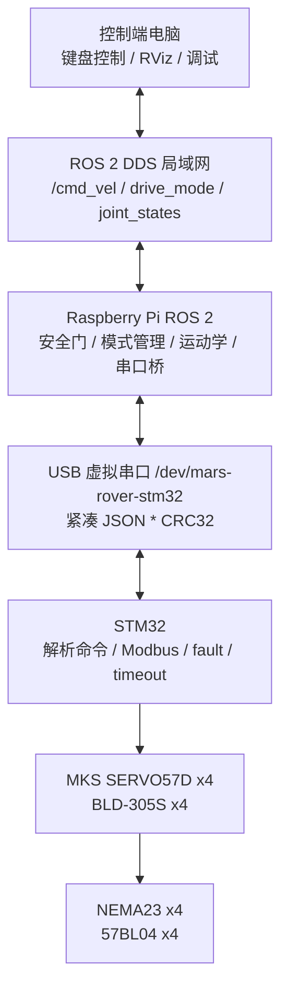
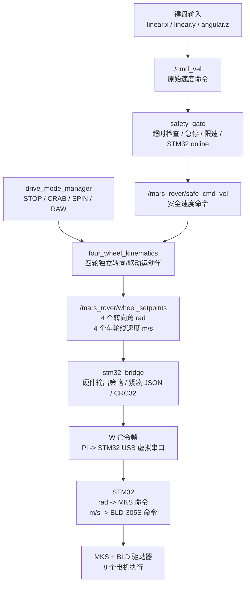

# MARS Rover 项目汇报 PPT 大纲（ROS 2 偏重点）

> 版本：2026-06-05  
> 语言：中文  
> 预计展示时长：总体约 18 分钟，其中 ROS 2 部分约 7-10 分钟  
> 汇报定位：完整项目汇报，但重点突出本人负责的 ROS 2 高层控制部分  
> 当前交付物：PPT 内容大纲，不是最终 PPTX  

---

## 0. 汇报主线

本次汇报的核心叙事是：

上一组已经完成了项目概念、部分硬件设计、电子舱设计以及单个转向电机和单个 BLDC 电机的台架测试，但没有完成整车四轮集成和真实行驶验证。本次 ROS 2 部分的工作目标，是把控制方案收束为一个可测试、可扩展、可交给 STM32 继续联调的高层控制架构：

```text
控制端电脑
-> ROS 2 DDS 局域网通信
-> Raspberry Pi 4 高层控制节点
-> Pi 到 STM32 串口协议
-> STM32 低层实时控制
-> MKS SERVO57D / BLD-305S 电机驱动器
-> 四轮独立转向与驱动
```

本 PPT 是完整项目汇报，因此会覆盖项目背景、需求、进度、设计迭代、组件测试、硬件设计和软件逻辑概念。但本人负责 ROS 2 部分，所以 ROS 2 架构、节点、话题、Pi-STM32 接口和测试策略会作为 7-10 分钟的重点段落展开。

---

## 1. 建议页数与时间分配

| 页码 | 标题 | 预计时间 | 重点 |
|---:|---|---:|---|
| 1 | 项目背景与目标 | 1.0 min | 说明项目是什么 |
| 2 | 项目需求与系统边界 | 1.2 min | 说明系统需要做到什么 |
| 3 | 项目进度：计划 vs. 现实 | 1.5 min | 说明为什么当前要收束方案 |
| 4 | 设计过程与方案迭代 | 1.8 min | 说明为什么选择 Pi + STM32 + ROS 2 |
| 5 | 初步组件测试结果 | 1.5 min | 说明上一组已经验证和未验证的内容 |
| 6 | 最终硬件设计概览 | 1.2 min | 简述 8 电机、8 驱动器和硬件链路 |
| 7 | ROS 2 总体软件架构 | 1.8 min | 进入本人重点 |
| 8 | ROS 2 节点与话题设计 | 2.2 min | 详细讲节点职责 |
| 9 | Software Logic Concept Flow Chart | 2.3 min | 重点讲控制逻辑流程 |
| 10 | Pi 到 STM32 接口设计 | 1.8 min | 讲清楚 ROS 2 与 STM32 的边界 |
| 11 | 测试策略与当前能力 | 1.5 min | 说明如何从无硬件到真实四轮测试 |
| 12 | 结论与下一步 | 1.2 min | 收束风险与后续工作 |

总时长约 18 分钟。其中第 7-10 页是 ROS 2 核心段落，合计约 8 分钟；第 11 页虽然是测试策略，也会继续承接 ROS 2 运行模式，因此可视为 ROS 2 重点的延伸。

如果现场时间被压缩：

- 保留第 7-10 页完整讲述。
- 第 3、5、6 页可以各压缩到 45 秒。
- 第 4 页只讲最终选择 Pi + STM32 + ROS 2 的原因，不展开所有失败方案。

---

## 2. 课程要求对齐

| 课程要求 | 对应页 |
|---|---|
| introduction and short review | 1-2 |
| group, project goals + requirements | 1-3 |
| update of project schedule incl. resources | 3 |
| current status: plan vs. reality | 3、5、12 |
| description of design process | 4 |
| iterations of failed attempts till working solutions | 4、5、6 |
| preliminary component test results | 5 |
| requirement definition and design specification | 2、5、10 |
| final hardware design and parts | 6 |
| software logic concept flow chart | 7-10，尤其第 9 页 |

---

## 3. Slide 1 - 项目背景与目标

### 页面主张

本项目的目标是把已有的四轮独立转向/驱动机械平台，升级为可远程手动控制的 drive-by-wire 移动机器人。

### 页面内容

- 平台名称：MARS Rover / Mobile Working Robotic System。
- 应用背景：农业环境、越野地面、未来扩展到自主移动。
- 机械基础：四个独立轮组，刚性铝型材框架，具备全向运动潜力。
- 本次控制目标：
  - 控制端电脑远程发送命令。
  - Raspberry Pi 运行 ROS 2 高层控制。
  - STM32 负责低层实时电机控制。
  - 四个轮组支持独立转向和独立驱动。

### 建议图示

左侧放机器人/底盘示意图，右侧放 3 层目标：

```text
Remote control
ROS 2 high-level control
STM32 motor control
```

### 讲述要点

先说明这不是普通小车，而是四轮独立转向和四轮独立驱动的平台。每个轮组都有一个转向电机和一个行走电机，因此系统控制复杂度比普通差速小车高。本人负责的是 ROS 2 高层控制部分，因此汇报会重点讲电脑、Pi、STM32 之间的软件架构。

### 资料依据

- `Group 3.1 - Final Submission/Final Documentation.pdf`
  - Introduction
  - Overall Project Goal
  - Existing components overview

---

## 4. Slide 2 - 项目需求与系统边界

### 页面主张

项目需要控制 8 个执行电机，但 ROS 2 不直接控制电机驱动器，而是负责高层目标生成和系统协同。

### 页面内容

| 层级 | 负责内容 | 不负责内容 |
|---|---|---|
| 控制端电脑 | 键盘控制、RViz、调试 | 不直接访问 STM32 串口 |
| Raspberry Pi / ROS 2 | 模式管理、安全检查、运动学、串口桥接 | 不直接写 MKS / BLD 寄存器 |
| STM32 | 串口解析、Modbus、驱动器 ID、超时保护、fault 处理 | 不做 ROS 2 节点 |
| 电机驱动器 | 把控制命令转换为电机电流 | 不理解机器人运动学 |

### 关键需求

- 四个转向角，单位 `rad`。
- 四个车轮线速度，单位 `m/s`。
- 支持手动控制，不做自动驾驶。
- 支持 `STOP`、`CRAB`、`SPIN_IN_PLACE`、`RAW_WHEEL_TEST`。
- 不使用 `ros2_control`。
- 不做 Nav2 / path tracking。

### 建议图示

用四层横向架构图：

```text
PC -> ROS 2 DDS -> Pi ROS 2 -> STM32 -> Motor drivers -> Motors
```

### 讲述要点

重点说明边界：ROS 2 不是去直接操作电机驱动器，而是把用户输入转换成标准化轮组目标。这样 STM32 负责人只需要关心如何把这些目标换算成 MKS SERVO57D 和 BLD-305S 的底层命令。

---

## 5. Slide 3 - 项目进度：计划 vs. 现实

### 页面主张

上一组的原计划是完成可行驶全向机器人，但现实中只完成了组件级验证；因此当前工作重点转为建立可持续联调的 ROS 2 控制框架。

### 页面内容

| 项目项 | 原计划 | 实际状态 | 对当前工作的影响 |
|---|---|---|---|
| 整车可行驶 | 完成 drive-by-wire 全向机器人 | 未完成整车组装与实车行驶 | 需要先做分层测试 |
| 电机控制 | 控制全部 8 个电机 | 只测试 1 个转向电机 + 1 个 BLDC 电机 | 需要单轮测试模式 |
| 高层控制 | 手机 / Pi / ROS 2 通信 | HTTP / ROS 2 路径做过初步验证 | 当前改为 ROS 2 DDS 主链路 |
| 电子舱 | 容纳 Pi、STM32、驱动器 | 因 BLD-305S/405S 尺寸差异重做外壳 | 需要明确实际硬件 |
| 项目资源 | 机械、硬件、软件并行 | 机械交付和硬件缺失造成延迟 | 需要清晰接口和联调顺序 |

### 当前资源划分

- 软件资源：ROS 2 workspace、Raspberry Pi 4、控制端电脑。
- 低层资源：STM32、MAX485、RS-485、MKS SERVO57D、BLD-305S。
- 测试资源：dry-run、serial echo、单轮测试、四轮架空测试。

### 建议图示

用一个简单时间线：

```text
Previous group: concept + single motor tests
Current stage: ROS 2 architecture + Pi setup
Next stage: Pi-STM32 serial integration
Final stage: single wheel -> four wheels -> low-speed ground test
```

### 讲述要点

这里不要批评上一组，而是客观说明：他们在硬件不完整的情况下完成了基础通信和单组件验证。我们的工作是在这个基础上，把系统拆成可验证的阶段，避免一开始直接联调 8 个电机。

---

## 6. Slide 4 - 设计过程与方案迭代

### 页面主张

最终选择 Raspberry Pi + STM32 + ROS 2，是因为它在灵活性、实时性和可扩展性之间最平衡。

### 页面内容

| 方案 | 优点 | 问题 | 结论 |
|---|---|---|---|
| Pi-only | ROS 2 和网络开发简单 | Linux 非硬实时，直接控制电机风险高 | 不适合作为低层电机实时控制 |
| STM32-only | 实时性好，直接接驱动器 | 不适合复杂网络、RViz、ROS 2、后续扩展 | 不适合作为完整上层控制平台 |
| Pi + STM32 | Pi 做高层，STM32 做实时底层 | 需要定义清楚 Pi-STM32 协议 | 当前采用 |

### 旧方案到新方案

```text
旧方案：手机 App -> HTTP -> Raspberry Pi -> STM32
当前方案：控制端电脑 -> ROS 2 DDS -> Raspberry Pi ROS 2 -> STM32
```

### 为什么不用 HTTP 作为主控制链路

- HTTP 更适合网页请求，不适合持续机器人控制。
- ROS 2 DDS 原生支持 topic、自动发现、多节点协同。
- RViz、rosbag、`ros2 topic echo` 等调试工具可以直接使用。

### 建议图示

三列方案对比图，最终方案用高亮框标出。

### 讲述要点

强调这不是为了“技术更高级”，而是因为机器人控制天然是分布式、多节点、连续数据流。ROS 2 DDS 适合作为控制端和 Pi 之间的主通信机制，HTTP 未来可以作为网页 GUI 的外层接口，但不应该绕过 ROS 2 控制底盘。

---

## 7. Slide 5 - 初步组件测试结果

### 页面主张

上一组已经证明单组件通信链路可行，但没有证明四轮整车控制已经可用。

### 页面内容

### 已验证

- STM32 可以通过 UART/RS-485 与电机驱动器通信。
- 一个 MKS SERVO57D 转向驱动器可以响应命令。
- 一个 BLDC 驱动器可以响应 run/stop、speed、direction。
- Modbus ID 和基本寄存器读写做过手动验证。
- 通信链路在台架测试中稳定。

### 未验证

- 四个转向电机同步控制。
- 四个 BLDC 行走电机同步控制。
- 真实负载下电流、温度和驱动器报警。
- 整车运动学效果。
- 连续反馈轮询。
- BLD-305S 与当前 57BL04 的完整匹配验证。

### BLD-405S / BLD-305S 不一致说明

- 旧测试记录多处写 `BLD-405S`。
- 最终零件表和当前实物按 `BLD-305S` 收束。
- 因此 STM32 代码不能直接照搬旧 BLD-405S 寄存器，需要按 BLD-305S 手册重新确认。

### 建议图示

用双色表格：

```text
Validated: single stepper + single BLDC
Not yet validated: full 8-motor integration
```

### 讲述要点

这一页要避免夸大结果。可以说“单组件验证给了我们信心”，但不能说“整车已经验证”。这也是为什么 ROS 2 方案里保留 dry-run、serial echo、single-wheel、full-vehicle 四种入口。

---

## 8. Slide 6 - 最终硬件设计概览

### 页面主张

整车硬件可以理解为四个相同轮组，每个轮组包含一套转向执行链路和一套行走执行链路。

### 页面内容

| 子系统 | 数量 | 组件 | 作用 |
|---|---:|---|---|
| 转向电机 | 4 | NEMA23 / 23HE22-2804S | 控制轮组转向角 |
| 转向驱动器 | 4 | MKS SERVO57D | 控制转向步进电机 |
| 行走电机 | 4 | 57BL04 BLDC | 驱动车轮旋转 |
| BLDC 驱动器 | 4 | BLD-305S | 控制 BLDC 电机速度 |
| 控制器 | 1 | Raspberry Pi 4 | 运行 ROS 2 高层控制 |
| 低层控制器 | 1 | STM32G474RE | 实时控制驱动器 |
| 通信模块 | 2 | MAX485 | UART 到 RS-485 |

### 两条底层链路

```text
转向链路：
STM32 -> USART1 -> RS-485 -> MKS SERVO57D -> NEMA23

行走链路：
STM32 -> UART3 -> MAX485 -> RS-485 -> BLD-305S -> 57BL04
```

### 建议图示

画一个轮组模块：

```text
Wheel module
|-- steering motor + MKS Servo57D
|-- drive motor + BLD-305S
```

四个轮组复制成 `front_left`、`front_right`、`rear_left`、`rear_right`。

### 讲述要点

硬件部分只要讲够支撑软件设计即可。重点是解释为什么 ROS 2 输出必须包含 4 个转向角和 4 个速度：因为每个轮组都有独立转向和独立驱动。

---

## 9. Slide 7 - ROS 2 总体软件架构

### 页面主张

ROS 2 层把控制端、Pi、高层运动学、STM32 状态和 RViz 调试组织成一个统一的机器人控制系统。

### 页面内容



### 架构说明

- 控制端电脑只发布高层控制命令。
- Pi 接收 ROS 2 topic，计算轮组目标。
- Pi 不直接控制电机驱动器。
- STM32 接收高层目标并转成 Modbus 命令。
- RViz 和调试工具可以直接订阅 ROS 2 状态话题。

### 建议图示

这一页直接使用系统部署图，不要放太多文字。

### 讲述要点

这是 ROS 2 部分的总入口。先让听众明白：电脑和 Pi 之间不是 HTTP，而是 ROS 2 DDS；Pi 和 STM32 之间不是 ROS 2，而是串口协议；STM32 到驱动器才是 Modbus/RS-485。

---

## 10. Slide 8 - ROS 2 节点与话题设计

### 页面主张

ROS 2 控制链路被拆成多个职责清晰的节点，避免一个节点同时处理键盘、运动学、安全和硬件串口。

### 页面内容

| 节点 | 运行位置 | 输入 | 输出 | 职责 |
|---|---|---|---|---|
| `teleop_twist_keyboard` | 控制端电脑 | 键盘 | `/cmd_vel` | 产生手动速度命令 |
| `drive_mode_manager` | Pi | 模式请求 | `/mars_rover/drive_mode` | 管理 STOP / CRAB / SPIN / RAW |
| `safety_gate` | Pi | `/cmd_vel`、急停、STM32 状态 | `/mars_rover/safe_cmd_vel` | 超时、限速、急停、STM32 online 检查 |
| `four_wheel_kinematics` | Pi | 安全速度、模式 | `/mars_rover/wheel_setpoints` | 计算四个轮组目标 |
| `stm32_bridge` | Pi | 四轮目标、急停 | 串口帧、STM32 状态 | 编码命令并和 STM32 通信 |
| `joint_state_republisher` | Pi | `/mars_rover/wheel_states` | `/joint_states` | 给 RViz 显示关节状态 |

### 核心话题

- `/cmd_vel`：控制端原始速度命令。
- `/mars_rover/safe_cmd_vel`：安全过滤后的速度。
- `/mars_rover/drive_mode`：当前驾驶模式。
- `/mars_rover/wheel_setpoints`：四轮目标。
- `/mars_rover/stm32/status`：STM32 连接和故障状态。
- `/joint_states`：RViz 可视化关节状态。

### 建议图示

用节点/话题关系图，节点用蓝色，话题用橙色，工具用黄色。

### 讲述要点

强调两个边界：

1. 键盘节点不直接控制 STM32。
2. `stm32_bridge` 不直接写 MKS/BLD 的寄存器，而是发高层轮组目标给 STM32。

---

## 11. Slide 9 - Software Logic Concept Flow Chart

### 页面主张

从键盘输入到电机执行，中间每一步都有明确的安全检查、模式判断和数据转换。

### 页面内容



### 四种驱动模式

| 模式 | 作用 | 输出特点 |
|---|---|---|
| `STOP` | 停止 | 四轮速度为 0，不启用运动 |
| `CRAB` | 平移 | 四轮同向转向 |
| `SPIN_IN_PLACE` | 原地旋转 | 四轮指向切向方向 |
| `RAW_WHEEL_TEST` | 单轮测试 | 只启用指定轮组 |

### 建议图示

这一页必须是全 PPT 的重点页。建议用流程图占据 70% 版面，右侧放四种模式小表。

### 讲述要点

讲这一页时按数据流走：

先有键盘速度，再过安全门，再结合驾驶模式，运动学节点算出四个轮组目标，最后桥接节点发给 STM32。这样可以说明 ROS 2 不是一堆散乱节点，而是一条可验证的控制链。

---

## 12. Slide 10 - Pi 到 STM32 接口设计

### 页面主张

Pi 和 STM32 之间的接口必须保持抽象：Pi 发机器人语义，STM32 负责驱动器语义。

### 页面内容

### Pi 发送给 STM32 的核心命令

```text
<紧凑JSON>*<8位大写十六进制CRC32>\n

W: v,t,q,m,e,s,w
w[0..3]: front_left, front_right, rear_left, rear_right
每轮: [enabled, angle_rad, velocity_mps,
      steering_limit_radps, acceleration_limit_mps2]
```

### STM32 需要回传的核心状态

```text
A: v,t=A,q,ok,fc
S: v,t=S,q,on,es,to,fc
```

### 职责边界

| Pi / ROS 2 | STM32 |
|---|---|
| 输出 `rad` 和 `m/s` | 转换为 MKS / BLD-305S 命令 |
| 管理 ROS 2 话题 | 管理 Modbus RTU |
| 判断高层模式 | 判断驱动器 fault |
| 发布 STM32 状态话题 | 回传 ACK / STATUS |

### 建议图示

用左右分栏：

```text
Pi / ROS 2 side
WheelSetpointArray
JSON line + CRC32

STM32 side
Parse
Safety
Unit conversion
Modbus
```

### 讲述要点

这一页要讲清楚为什么 Pi 不发寄存器：如果 Pi 直接写寄存器，ROS 2 代码会和具体驱动器型号强绑定。现在采用高层目标协议，BLD-305S 的寄存器、极对数、速度单位、fault 解释都留给 STM32 固件处理。

---

## 13. Slide 11 - 测试策略与当前能力

### 页面主张

系统不是只等硬件全部完成后才能测试，而是从无硬件到真实四轮分层验证。

### 页面内容

| 运行入口 | 是否需要 STM32 | 是否驱动电机 | 目的 |
|---|---|---|---|
| `dry_run` | 否 | 否 | 验证 ROS 2 节点、话题、运动学、RViz |
| `serial_echo` | 是 | 否 | 验证 Pi-STM32 串口和 ACK |
| `real_serial + single_wheel` | 是 | 是，单轮 | 验证一个轮组的真实硬件 |
| `real_serial + full_vehicle` | 是 | 是，四轮 | 四轮真实手动控制 |

### 当前代码能力

- 已有统一 ROS 2 workspace。
- 已有自定义消息包。
- 已有 Pi 侧核心节点。
- 已有 launch 文件：
  - dry-run
  - serial echo
  - real single wheel
  - real full vehicle
- 真实硬件输出默认 `STOP + disarmed`，只有带前置检查的 arm 服务成功后才允许执行。

### 推荐测试顺序

```text
1. dry-run
2. serial echo
3. 单轮架空测试
4. 四轮架空测试
5. 低速落地测试
```

### 讲述要点

强调“测试顺序不是功能限制”。代码设计上同时支持单轮测试和四轮控制，但真实硬件联调必须逐步来，原因是 8 个电机同时误动作会有机械和人员风险。

---

## 14. Slide 12 - 结论与下一步

### 页面主张

当前 ROS 2 方案已经把项目从单组件验证推进到可联调的整车高层控制架构，但真实四轮控制仍需要硬件和 STM32 继续验证。

### 页面内容

### 当前成果

- 明确了控制端、Pi、STM32、驱动器的职责边界。
- 设计了 ROS 2 节点、话题和自定义消息。
- 设计了 Pi 到 STM32 的高层目标协议。
- 支持无硬件测试、串口联调、单轮测试和四轮真实控制入口。
- 统一了 ROS 2 Jazzy workspace。

### 下一步

1. 烧录 Raspberry Pi 4：Ubuntu Server 24.04 LTS arm64 + raspi。
2. 在 Pi 上安装 ROS 2 Jazzy。
3. 部署并测试 `mars_rover_ws`。
4. 与 STM32 做 `serial_echo` 联调。
5. 按 BLD-305S 手册确认寄存器和速度单位。
6. 先单轮，再四轮架空，最后低速落地测试。

### 主要风险

- BLD-305S 寄存器和旧 BLD-405S 资料不一致。
- 四轮转向方向和速度符号可能需要实测修正。
- STM32 是否能稳定回传真实状态仍需确认。
- 硬件急停、电源限流、架空测试工装必须准备好。

### 结束句

本项目的关键不是一次性让 8 个电机同时运行，而是建立一条可测试、可扩展、边界清晰的 ROS 2 控制链路。

---

## 15. 建议视觉风格

### 总体风格

- 技术汇报风格，避免花哨。
- 深色文字、浅色背景、少量强调色。
- 每页只表达一个主张。
- ROS 2 相关图统一颜色：
  - 节点：蓝色。
  - 话题：橙色。
  - 串口帧：紫色。
  - 硬件：绿色。
  - 工具：黄色。

### 图表优先级

优先使用：

1. 系统部署图。
2. ROS 2 节点/话题图。
3. 软件逻辑流程图。
4. 测试模式表。
5. 计划 vs. 现实表。

不建议使用：

- 大段论文式文字。
- 复杂 3D 渲染图作为主要解释。
- 没有标签的硬件照片。
- 把全部节点、话题、字段塞到一张图里。

---

## 16. 可直接用于 PPT 的术语表

| 中文 | 英文 / 符号 | 说明 |
|---|---|---|
| 控制端电脑 | Control PC | 键盘控制和 RViz 所在设备 |
| 树莓派 | Raspberry Pi 4 | ROS 2 高层控制节点运行设备 |
| 低层控制器 | STM32 | 实时电机控制和 Modbus 通信 |
| 发布/订阅 | Publish / Subscribe | ROS 2 topic 通信模式 |
| DDS | Data Distribution Service | ROS 2 底层通信机制 |
| 安全门 | Safety Gate | 超时、急停、限速和在线检查节点 |
| 四轮运动学 | Four-wheel Kinematics | 把整车速度转换成四轮目标 |
| 轮组目标 | Wheel Setpoint | 单个轮子的转向角和驱动速度 |
| 目标值回显 | Target Echo | 无真实反馈时用目标值模拟状态 |
| 硬件使能 | Hardware Enable | 真实输出总开关 |

---

## 17. 资料来源

### 原始资料

- `Group 3.1 - Final Submission/Final Documentation.pdf`
  - 项目背景、目标、需求、设计过程、测试结果、结论。
- `Group 3.1 - Final Submission/Parts-List-Final.pdf`
  - 电机和驱动器数量。
- `Group 3.1 - Final Submission/Antriebskomponenten.xlsx`
  - 原始驱动组件表。
- `Group 3.1 - Final Submission/Data Sheets/BLD-305S_Manual (1).pdf`
  - BLD-305S 驱动器资料。
- `Group 3.1 - Final Submission/Data Sheets/BLD-405S_manual.pdf`
  - 旧资料中 BLD-405S 参考手册。

### 当前 ROS 2 资料

- `mars_rover_ws/README.md`
  - 当前 ROS 2 workspace 能力说明。
- `mars_rover_ws/src/mars_rover_control`
  - ROS 2 高层控制节点。
- `mars_rover_ws/src/mars_rover_msgs/msg`
  - 自定义消息定义。
- `mars_rover_ws/src/mars_rover_bringup`
  - launch 和参数配置。
- `docs/ROS2架构与节点关系图.md`
  - ROS 2 架构图、节点图、接口图。
- `docs/Pi与STM32接口对接说明.md`
  - Pi 到 STM32 接口说明。

---

## 18. 最终 PPTX 制作建议

如果后续根据本大纲生成 PPTX，建议遵循以下顺序：

1. 先制作第 7、8、9、10 页，因为它们是 ROS 2 核心。
2. 再制作第 1、2、3 页，用来承接课程要求。
3. 然后制作第 4、5、6 页，作为项目背景和硬件上下文。
4. 最后制作第 11、12 页，收束测试策略和下一步。

PPTX 中每页建议保留简短讲稿备注，尤其是第 7-10 页，避免现场讲 ROS 2 时只看到图但忘记说明边界和数据流。
