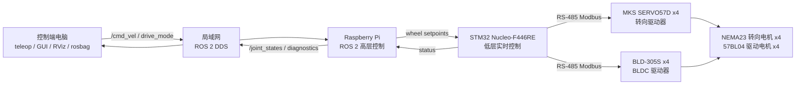

# MARS Rover 机器人项目实施方案说明书

> 版本：2026-05-23  
> 重点：ROS 2 高层控制方案、Pi 与 STM32 的职责边界、后续代码生成所需的信息对齐  
> 约束：本文档不提供具体代码工程，不编写 ROS 2 节点代码，不编写 STM32 固件代码，不编写 Modbus 寄存器操作代码。

---

## 0. 文档用途与总判断

本文档面向三类读者：

1. 你本人：项目组内负责软件和 ROS 2 高层控制的新手开发者。
2. 项目组其他成员：负责 STM32、接线、电机、机械或测试的人。
3. 后续根据本方案继续生成 ROS 2 代码的人或 AI。

本文档的核心目标不是“把所有代码写出来”，而是把以下信息一次性写清楚：

- 已知硬件是什么。
- Raspberry Pi、STM32、电机驱动器分别应该做什么。
- 控制端电脑和树莓派之间如何通过 ROS 2 局域网协同。
- 树莓派给 STM32 发送什么抽象命令。
- 四轮独立转向/独立驱动底盘在 ROS 2 中应如何拆节点、拆话题、拆消息。
- 如何先抽取“一组车轮”做测试，避免一开始就调 8 个电机。

总判断：

- 本项目应继续采用 **Raspberry Pi + STM32** 的分层控制架构。
- 你当前负责高层控制，工作重点是 **ROS 2 节点、话题、消息、运动学、测试链路和 Pi/STM32 接口**。
- STM32 和电机驱动器部分暂时只需要约定清楚接口，不要让 ROS 2 代码直接处理 Modbus 寄存器细节。
- 本项目使用自定义 ROS 2 高层节点。
- 仍建议使用标准单位、标准关节命名和 `/joint_states`，因为这有利于 RViz 可视化和调试。

---

## 1. 信息来源与事实对齐

本章非常重要。后续如果把本文档交给其他 AI 或开发者，本章可以避免“只有当前聊天上下文知道事实，文档本身没写”的信息不对称。

### 1.1 已阅读的本地文件

已阅读并用于制定本文档的本地文件如下：

1. `D:\Downloads\final_documentation_motor_control (1).pdf`
2. `D:\Document\CESENDLESS\MWRS\2026SoSe_MWRS_2-1\2026SoSe_MWRS_2_1_Concept_Documentation.pdf`
3. `D:\Document\CESENDLESS\MWRS\2026SoSe_MWRS_2-1\2026SoSe_MWRS_2_1.pdf`
4. `D:\Document\CESENDLESS\MWRS\2026SoSe_MWRS_2-1\02_Documentation\Overleaf_Document.md`
5. `D:\Document\CESENDLESS\MWRS\2026SoSe_MWRS_2-1\02_Documentation\03_Created_Diagramms\01_Hardware\02_Electrical\2026SoSe_MWRS_2-1_EPlan.xlsx`

注意：用户原始路径写的是 `D:\Document\CESENDLESS\MWRS\2026SoSe_MWRS_2-1/2026SoSe_MWRS_2_1_Concept_Documentation`，实际本地存在的是 PDF 文件：

`D:\Document\CESENDLESS\MWRS\2026SoSe_MWRS_2-1\2026SoSe_MWRS_2_1_Concept_Documentation.pdf`

### 1.2 从 2026 概念文档中抽取到的事实

项目目标：

- 项目是继续开发 TU Berlin 的 MARS Rover。
- 机器人机械结构来自前期工作或之前的 thesis。
- 当前任务是补齐 Motor Control Unit / 控制系统。
- 控制系统需要运行 ROS 2。
- 系统需要支持不同 Drive Modes / different drive kinematics。
- 至少需要一个 Drive Mode；多个 Drive Modes 是 bonus。
- 文档强调可靠性、真实场景可用性和后续项目可维护的文档。

2026 概念文档比较过的架构方案：

- 继续使用上一届的 Raspberry Pi + STM32。
- Raspberry Pi + 2 个 STM32。
- Arduino Uno Q。
- Raspberry Pi + Arduino Uno Q。

概念文档给出的结论倾向：

- 最佳方案是使用已有的 **Raspberry Pi + STM32**。
- 替代方案可以是 Arduino Uno Q，但不是优先路线。

从前期工作继承的问题：

- 上一届存在一套非 ROS 2 的上层控制入口。
- 上一届方案是 High-Level / Low-Level 分层控制。
- 曾经文档中存在 **BLD305 与 BLD405 型号不一致** 的问题；当前已由用户确认实际 BLDC 驱动器为 **BLD-305S**。
- 8 个电机和步进驱动板被认为是固定硬件。
- BLD-305S 是否已经在当前实物上稳定驱动 57BL04，仍需由 STM32 / 硬件负责人做实测确认。

这些事实会直接影响你的 ROS 2 方案：ROS 2 不应该绑定前一届的非 ROS 2 控制入口，而应该以标准 ROS 2 话题作为上层接口；同时 ROS 2 不应该直接依赖 BLD-305S 的寄存器细节，应该通过 Pi 到 STM32 的抽象协议把驱动器寄存器、单位换算和故障处理留在 STM32 层。

### 1.3 从 2025 final_documentation_motor_control 中抽取到的事实

底盘结构：

- 机器人是四轮结构。
- 四个轮组安装在刚性铝型材车架上。
- 每个轮组包含：
  - 一个转向电机。
  - 一个驱动电机。
  - 对应减速器。
  - 对应电机驱动器。
- 目标是实现 drive-by-wire 控制和多种运动模式。

已知硬件表：

| 类别 | 型号 / 参数 | 用途 | 对 ROS 2 方案的影响 |
|---|---|---|---|
| 转向电机 | NEMA 23，两相，1.8 度步距角 | 控制每个轮子的转向角 | ROS 2 应输出每个轮子的目标转向角 |
| 转向减速器 | NMRVS30，蜗轮蜗杆，30:1 | 转向减速和增矩 | 转向响应不会特别快，ROS 2 需要限速和等待转向到位 |
| 转向驱动器 | MKS SERVO57D | 数字步进驱动器 | STM32 通过 RS-485/Modbus 控制，不由 Pi 直接控制 |
| 驱动电机 | 57BL04，三相 BLDC，69 W，3000 RPM | 车轮驱动 | ROS 2 应输出每个轮子的目标驱动速度 |
| 驱动减速器 | EG23-G20-D8 | 与 BLDC 电机配套 | 需要确认最终车轮半径和减速比后换算速度 |
| BLDC 驱动器 | BLD-305S，Modbus interface | BLDC 电机控制 | STM32 通过 RS-485/Modbus 控制 |
| 电池 | LiTime LiFePO4，24 V，25 Ah，50 A discharge | 电机供电 | 大功率侧和逻辑侧必须分清，急停应切断 24 V 驱动器电源 |

上一届架构：

- Raspberry Pi 4 用于 ROS 2 高层导航和中间控制。
- STM32 Nucleo-F446RE 用于低层实时电机控制。
- STM32 使用 STM32CubeIDE + HAL 开发。
- STM32 管理两条 RS-485 总线。

当前通信结构：

| 接口 | 连接 | 功能 | 备注 |
|---|---|---|---|
| USART1 PA9/PA10 | Raspberry Pi GPIO UART 到 STM32 | `/dev/serial0`，紧凑 JSON + CRC32 | 115200 bps，8N1 |
| USART3 + MAX485 | STM32 到 MKS SERVO57D，ID 1-4 | 转向电机 Modbus RTU 控制 | 115200 bps，8N1 |
| USART6 + MAX485 | STM32 到 BLD-305S，ID 1-4 | 行走电机 Modbus RTU 控制 | 115200 bps，8N1 |
| Shared GND | 所有电子设备 | 通信参考地 | 应采用良好接地策略 |
| 24 V Power Bus | 电池到电机驱动器 | 电机功率供电 | 急停应切断驱动器 24 V |
| 5 V DC Bus | DC-DC 到 Pi / STM32 | 逻辑供电 | 逻辑电源应与电机功率噪声隔离 |

上一届测试状态：

- 只测试过一个步进转向电机和一个 BLDC/DC 驱动电机。
- MKS SERVO57D ID 1 通过 UART2 + RS-485 + MAX485 测试。
- 旧资料中记录 BLD-405S ID 5 通过 UART3 + RS-485 + MAX485 测试；当前实际型号已确认为 BLD-305S，需要按 BLD-305S 重新验证寄存器和通信参数。
- 从开发电脑或 Raspberry Pi 通过 UART 向 STM32 发送高层命令。
- STM32 将高层命令转换成 Modbus register writes。
- run/stop、speed、direction 命令被验证过。
- 没有完成四轮完整集成。
- 没有完成多电机同步、负载下测试、整体运动学验证。
- 没有完成连续反馈轮询和 ROS 2 完整反馈集成。

上一届已有运动模式概念：

- Drive mode 1：Holonomic，所有车轮同向，车辆可以平移。
- Drive mode 2：Spin-in-place，原地旋转。

上一届文档中给出的几何参数：

- 轴距 `L = 706 mm = 0.706 m`。
- 轮距 `W = 288 mm = 0.288 m`。

这些参数必须在真实机器人上重新测量确认。本文档后续会把它们作为初始参数，但不能当作最终机械定值。

### 1.4 从电气图表 xlsx 中抽取到的事实

`2026SoSe_MWRS_2-1_EPlan.xlsx` 中包含两个 sheet：

- `01_Diagramm`
- `02_Functional_Blocks`

可读出的功能块信息有限，主要出现：

- `Steppermotor`
- `Steppermotor Driver`
- `Brushless Direct Current Motor (BLDC-Motor)`
- `BLDC - Driver`

该文件目前更像电气功能图或图形化草图，不包含足够详细的 ROS 2 接口信息。因此 ROS 2 方案仍主要依据 2025 final documentation 与 2026 concept documentation 制定。

### 1.5 在线资料对齐

本文档参考了以下在线资料，用于确认 ROS 2 基础通信、消息类型和 Raspberry Pi 部署资料：

- ROS 2 Jazzy installation：`https://docs.ros.org/en/jazzy/Installation.html`
- ROS 2 on Raspberry Pi：`https://docs.ros.org/en/jazzy/How-To-Guides/Installing-on-Raspberry-Pi.html`
- ROS 2 Discovery：`https://docs.ros.org/en/jazzy/Concepts/Basic/About-Discovery.html`
- ROS 2 `geometry_msgs/msg/Twist`：`https://docs.ros.org/en/ros2_packages/jazzy/api/geometry_msgs/msg/Twist.html`
- ROS 2 `joint_state_publisher` and `/joint_states`：`https://docs.ros.org/en/jazzy/p/joint_state_publisher/`

本项目当前已经收束为 ROS 2 Jazzy + Ubuntu 24.04 开发环境。控制端电脑和 Pi 端必须使用同一 ROS 2 发行版，不要跨发行版混用。

根据后续需求收束，当前开发环境策略更新为：

- 开发电脑宿主机可以使用 Ubuntu 26。
- 在 Ubuntu 26 中使用 Docker 创建 Ubuntu 24.04 + ROS 2 Jazzy 开发容器。
- 在一个 Docker 开发容器中开发完整统一 ROS 2 workspace。
- 不把电脑端和 Pi 端拆成两个开发容器。
- 不把电脑端和 Pi 端拆成两个代码工程。
- Pi 端使用 Ubuntu Server 24.04 arm64 和原生 ROS 2 Jazzy，部署细节见硬件部署联调手册。

---

## 2. 总体系统目标与实体测试边界

### 2.1 当前版本目标

当前版本跑通完整高层手动控制链路：

控制端电脑发布控制命令，Raspberry Pi 在 ROS 2 中接收命令，计算四个轮组目标，Pi 通过串口把抽象轮组目标发给 STM32，STM32 至少能回传状态或在测试模式中确认收到。

当前版本应同时完成：

- 控制端电脑与 Raspberry Pi 在同一局域网内运行 ROS 2。
- 控制端电脑可以发布 `/cmd_vel` 或项目命名空间下的速度命令。
- Raspberry Pi 可以运行高层控制节点。
- 高层控制节点可以根据模式输出 4 个轮子的转向角和驱动速度。
- 系统支持 dry-run，即不接电机也能打印、记录、可视化目标值。
- 系统支持 single-wheel test，即只启用一组车轮，其他轮组保持禁用或零目标。
- Pi 到 STM32 的紧凑 JSON + CRC32 协议。
- STM32 能收到并解析 Pi 发来的抽象目标，逐条回 ACK 并周期回 STATUS。
- single_wheel 和 full_vehicle 软件输出入口同时存在。
- `/joint_states`、TF 和目标值回显链路可用。

本次正式实体硬件验收范围为 `front_left` 单轮组。软件具备四轮输出不等于实体四轮已经通过测试。

### 2.2 硬件测试建议顺序

以下是建议测试顺序，不是代码功能限制。代码应同时支持单轮测试和四轮真实手动控制：

- 只接一个轮组，例如 front_left。
- 先只测转向，不测驱动。
- 再只测驱动，不测转向。
- 然后测转向 + 驱动组合。
- 确认角度方向、速度方向、零位、限位、急停和超时停止。
- 再扩展到四个轮组，但机器人仍应架空或车轮离地测试。

### 2.3 低速地面测试建议

以下仍是测试顺序建议，不是功能范围限制：

- 在空旷区域低速测试。
- 先测试 STOP。
- 再测试 CRAB 平移。
- 再测试 SPIN 原地旋转。
- 记录 rosbag，并用 ROS 2 CLI 或可选 RViz 检查目标值和反馈标志。

### 2.4 后续硬件扩展目标

- 更稳定的四轮低速地面测试。
- 更完整的硬件反馈。
- 更可靠的故障诊断。
- 更完善的实车验收流程。

---

## 3. 核心硬件基础配置与职责划分

### 3.1 控制端电脑需要做什么

控制端电脑可以是你的笔记本或实验室电脑。它的职责不是直接控制电机，而是作为人机交互、调试和可视化终端。

控制端电脑建议承担：

- 运行 ROS 2 teleop 节点，例如键盘、手柄或自定义 GUI。
- 发布速度命令。
- 发布驱动模式切换命令。
- 运行 RViz，用于查看机器人模型、TF、轮子转向角和状态。
- 运行 `ros2 topic list`、`ros2 topic echo`、`ros2 node list` 等诊断工具。
- 记录 rosbag。
- 通过 SSH 登录 Raspberry Pi 进行远程启动、查看日志和调试。

控制端电脑不应该承担：

- 直接通过 USB 控制 STM32。
- 直接向电机驱动器发送 Modbus。
- 直接控制 24 V 电机供电。

原因是：控制端电脑不在机器人本体上，Wi-Fi 可能中断。如果它直接控制底层硬件，一旦无线网络卡顿，安全性会很差。正确做法是把安全超时、低层停止和电机驱动通信放在机器人本体上的 Pi / STM32 中。

### 3.2 Raspberry Pi 层面需要做什么

Raspberry Pi 是机器人本体上的高层控制计算机。它不是电机驱动器，也不应该直接产生大电流控制电机。它主要运行 Linux 和 ROS 2。

#### 3.2.1 操作系统建议

当前 Pi 平台：

- Raspberry Pi 4 或更高。
- 64-bit Ubuntu Server 24.04。
- ROS 2 Jazzy。

理由：

- ROS 2 官方文档说明 Jazzy 支持 Ubuntu 24.04 的 amd64 和 aarch64。
- Raspberry Pi 使用 64-bit Ubuntu 可以走 ROS 2 binary packages，安装和维护比源码编译简单。
- 对新手来说，Ubuntu Server + SSH + ROS 2 是最清晰的机器人部署方式。

电脑端使用 Ubuntu 26 宿主机和 Ubuntu 24.04 + ROS 2 Jazzy 开发容器；Pi 端原生运行 Ubuntu Server 24.04 arm64 + ROS 2 Jazzy。两端使用同一 workspace 源码和消息定义。

#### 3.2.2 Raspberry Pi 基础环境配置

Pi 上至少要完成：

- 安装 64-bit Ubuntu。
- 配置 SSH。
- 配置固定主机名，例如 `mars-rover-pi`。
- 接入与控制端电脑相同的局域网。
- 尽量在路由器中给 Pi 做 DHCP reservation，让它每次拿到固定 IP。
- 安装 ROS 2。
- 创建 ROS 2 workspace。
- 关闭 Linux 串口登录控制台并启用 GPIO UART。
- 确认 `/dev/serial0` 指向 Pi 4 的主 UART，运行用户属于 `dialout` 组。
- 使用 GPIO14/TX、GPIO15/RX 和 GND，以 115200 8N1 连接 STM32 USART1。
- 配置系统时间同步。没有准确时间，ROS 2 日志、rosbag 和状态超时判断都会变得混乱。

Pi 上应运行的 ROS 2 功能：

- `drive_mode_manager`：维护 STOP、CRAB、SPIN_IN_PLACE、RAW_WHEEL_TEST 模式。
- `safety_gate`：执行命令超时、限速、急停和 STM32 状态联锁。
- `four_wheel_kinematics`：把安全速度和模式转换为四轮目标。
- `stm32_bridge`：把轮组目标转换成紧凑串口帧，并发布 STM32 状态和目标回显。
- `robot_state_publisher`：根据 URDF 发布机器人 TF。
- `joint_state_republisher`：发布 8 个关节目标状态，便于可选 RViz 显示。

### 3.3 STM32 层面需要做什么

STM32 是低层实时控制器。它更接近电机硬件，负责稳定、确定、快速地和电机驱动器通信。

STM32 需要完成：

- 使用 STM32CubeIDE 创建固件工程。
- 配置 USART1 PA9/PA10，用于接收 Raspberry Pi 的高层命令。
- 保留 USART2 PA2/PA3 作为 ST-LINK Virtual COM 调试日志。
- 配置 USART3 PC10/PC11 + MAX485，用于控制 4 个 MKS SERVO57D 转向驱动器。
- 配置 USART6 PC6/PC7 + MAX485，用于控制 4 个 BLD-305S。
- 实现 Modbus RTU 主站逻辑。
- 管理转向电机驱动器 ID 1-4。
- 在独立的行走总线上管理 BLD-305S ID 1-4。
- 接收 Pi 发来的抽象命令：4 个目标转向角 + 4 个目标驱动速度 + enable / mode / heartbeat。
- 把抽象命令翻译成具体驱动器指令。
- 周期性回传状态，例如通信是否正常、驱动器是否 fault、当前目标是否已应用。
- 实现通信超时停止：如果一段时间没有收到 Pi 的新命令，停止所有驱动电机，并进入安全状态。
- 实现急停输入或急停状态读取。如果硬件急停触发，STM32 必须回传 fault。

STM32 不应该负责：

- ROS 2 话题设计。
- 高层运动学。
- 多驱动模式决策。
- 用户界面。

原因是 STM32 的优势是实时、稳定、靠近硬件；它不适合承担复杂 ROS 2 软件架构。

### 3.4 Raspberry Pi 与 STM32 职责边界

| 层级 | 设备 | 负责什么 | 不负责什么 |
|---|---|---|---|
| 人机交互层 | 控制端电脑 | 键盘、RViz、调试、rosbag | 直接控制电机 |
| ROS 2 高层控制 | Raspberry Pi | ROS 2 节点、模式管理、运动学、轮组目标、串口桥接 | Modbus 细节、大电流驱动 |
| 实时低层控制 | STM32 | 串口解析、Modbus、驱动器 ID、超时停止、底层 fault | ROS 2 节点和高层运动学 |
| 电机驱动层 | MKS SERVO57D / BLD-305S | 把控制信号转换成电机电流 | 运动学、ROS 2 |
| 执行机构 | NEMA23 / 57BL04 | 真实运动 | 通信和控制逻辑 |

最关键的原则：

Raspberry Pi 发送“我要每个轮子达到什么角度和速度”，STM32 决定“如何通过具体驱动器命令让电机执行”。

---

## 4. 大功率电机驱动方案

本章重点是帮助你理解：STM32 为什么不能直接驱动大电机，以及它实际上如何通过电机驱动器控制电机。

### 4.1 为什么 STM32 不能直接驱动这些电机

STM32 的 GPIO 引脚只能输出很小的电流，通常是毫安级。它的引脚适合输出逻辑信号，例如高电平、低电平、UART、SPI、PWM，而不是直接给电机供电。

本项目的驱动电机是 57BL04 三相 BLDC，文档给出的功率是 69 W。以 24 V 系统粗略估算，单个电机正常工作电流就可能达到数安培，启动、堵转或负载变化时还可能更高。STM32 引脚无法承受这种电流，也无法直接生成三相 BLDC 所需的换相信号和电流闭环。

所以正确链路是：

STM32 输出通信命令，电机驱动器接收命令，电机驱动器从 24 V 电池取电，内部功率 MOSFET 产生电机电流，最终驱动电机。

一句话理解：

STM32 是“大脑的一部分”，电机驱动器是“肌肉放大器”，电池是“能量来源”，电机是“执行机构”。

### 4.2 转向电机驱动链路

转向链路如下：

Raspberry Pi -> STM32 -> UART2 -> MAX485 -> RS-485 总线 -> MKS SERVO57D -> NEMA23 转向步进电机 -> NMRVS30 蜗轮蜗杆减速器 -> 轮组转向轴。

每个轮组有一个转向电机。因此共有 4 个转向电机。

建议 ID 映射：

| 轮组 | 转向驱动器 ID | 转向关节名 |
|---|---:|---|
| front_left | 1 | `front_left_steering_joint` |
| front_right | 2 | `front_right_steering_joint` |
| rear_left | 3 | `rear_left_steering_joint` |
| rear_right | 4 | `rear_right_steering_joint` |

转向电机控制的本质：

- ROS 2 高层希望某个轮子指向某个角度，例如 `0 rad` 表示轮子朝机器人前方。
- Pi 把这个目标角度发给 STM32。
- STM32 根据零位、减速比、驱动器配置，把角度转换成驱动器能理解的位置或速度命令。
- MKS SERVO57D 控制 NEMA23 步进电机转动。
- 蜗轮蜗杆减速器把电机转动转换成轮组转向轴的转动。

需要注意：

- NEMA23 的 1.8 度步距角是电机本体的步距，不是轮组最终转向角分辨率。
- 有 30:1 减速器后，轮组转向轴的角度变化会比电机轴慢 30 倍，但扭矩更大。
- 真实系统必须定义“零位”：每个轮子机械上指向正前方时，驱动器计数值是多少。
- 如果没有绝对编码器或限位开关，上电后 STM32 并不知道轮子真实角度，只知道上次命令或相对步数。这是很大的风险。
- 如果没有滑环，转向角不能无限旋转，否则会扭断电机线、编码器线或驱动器线。

### 4.3 驱动电机链路

驱动链路如下：

Raspberry Pi -> STM32 -> UART3 -> MAX485 -> RS-485 总线 -> BLD-305S -> 57BL04 三相 BLDC 电机 -> EG23-G20-D8 减速器 -> 车轮转动。

每个轮组有一个驱动电机。因此共有 4 个驱动电机。

建议 ID 映射：

| 轮组 | BLDC 驱动器 ID | 驱动关节名 |
|---|---:|---|
| front_left | 5 | `front_left_drive_joint` |
| front_right | 6 | `front_right_drive_joint` |
| rear_left | 7 | `rear_left_drive_joint` |
| rear_right | 8 | `rear_right_drive_joint` |

驱动电机控制的本质：

- ROS 2 高层希望某个轮子的地面线速度是 `v m/s`。
- Pi 可以把线速度直接发给 STM32，也可以换算成车轮角速度 `rad/s` 后发给 STM32。
- STM32 根据车轮半径、减速比、驱动器单位，把目标速度转换成 BLDC 驱动器寄存器命令。
- BLDC 驱动器控制三相电机换相和电流输出。
- 电机通过减速器驱动车轮。

本文档建议 Pi 到 STM32 优先使用“物理意义清楚”的单位：

- 转向角：`rad`。
- 车轮地面线速度：`m/s`。
- 如果 STM32 同学更愿意处理角速度，也可以用车轮角速度：`rad/s`。

更推荐在 Pi 侧输出 `m/s`，STM32 根据最终实测车轮半径换算到底层驱动器速度单位。原因是 ROS 2 运动学天然使用机器人线速度，代码和测试更直观。

### 4.4 电源与信号接线逻辑

高层理解接线时，先区分两类线路：

- 功率线：给电机驱动器和电机供电，电流大，噪声大，危险性高。
- 信号线：UART、RS-485、USB、GND，电流小，用于传递命令和状态。

建议接线逻辑：

| 线路 | 作用 | 注意事项 |
|---|---|---|
| 24 V 电池到电机驱动器 | 给 MKS / BLDC 驱动器供电 | 必须有保险、急停和合理线径 |
| 5 V DC-DC 到 Raspberry Pi | 给 Pi 供电 | 电流能力要足够，Pi 低电压会导致随机故障 |
| 5 V 或 USB 到 STM32 | 给 STM32 供电 | 可由 Pi USB 或单独 DC-DC 提供 |
| Pi GPIO UART 到 STM32 USART1 | `/dev/serial0`，115200 8N1，TX/RX/GND | 两端 3.3 V，只交叉连接 TX/RX |
| STM32 USART3 到 MAX485 | 转向 RS-485 总线，ID 1-4 | A/B 线不要接反，建议双绞线 |
| STM32 USART6 到 MAX485 | BLD-305S RS-485 总线，ID 1-4 | 与转向总线分开，便于调试 |
| 所有逻辑 GND | 通信参考地 | 必须共地，但要注意地环路和电机噪声 |
| 急停开关 | 切断 24 V 驱动器供电 | Pi 和 STM32 最好不断电，以便记录 fault |

### 4.5 Pi 给 STM32 发送什么

Pi 直接发送已经计算好的轮组目标，而不是“左转”“右转”一类模糊命令。

建议 Pi 每个周期发送：

- 帧序号。
- 时间戳或相对时间。
- 全局 enable。
- 急停状态。
- 当前 drive mode。
- 4 个轮组目标。

每个轮组目标包含：

- 轮组名称或固定顺序索引。
- 是否启用该轮组。
- 目标转向角，单位 `rad`。
- 目标驱动线速度，单位 `m/s`。
- 可选：目标驱动角速度，单位 `rad/s`。
- 可选：最大转向速度限制。
- 可选：最大驱动加速度限制。

STM32 回传：

- STM32 当前状态。
- 最近收到的帧序号。
- 是否通信超时。
- 是否急停。
- 每个转向驱动器是否在线。
- 每个 BLDC 驱动器是否在线。
- 每个驱动器 fault code。
- 如果能读取反馈，则回传当前转向角和当前驱动速度。

这样做的好处：

- ROS 2 高层负责运动学，结构清晰。
- STM32 不需要理解复杂驱动模式。
- 后续换驱动模式时不需要改 STM32。
- 单轮测试可以只启用一个轮组。
- 手动控制链路中的单位和接口语义清晰，便于 STM32 负责人调试。

---

## 5. 局域网控制与多端通信架构

### 5.1 ROS 2 局域网通信的基本理解

ROS 2 没有 ROS 1 那种固定的 `roscore`。ROS 2 节点之间通过 DDS 中间件自动发现。

控制端电脑和 Raspberry Pi 只要满足以下条件，就可以在同一个 ROS 2 网络中看到对方：

- 在同一个局域网内。
- 网络允许 UDP 通信和 multicast/discovery。
- 使用相同或兼容的 ROS 2 发行版。
- 设置相同的 `ROS_DOMAIN_ID`。
- QoS 设置兼容。
- 防火墙没有阻止 ROS 2 DDS 通信。

ROS 2 官方 Discovery 文档说明：节点启动后，会在相同 ROS domain 中发布自身存在信息，其他节点响应后建立通信。因此本项目不需要自己写 TCP socket 或 HTTP server 来实现电脑和 Pi 的基本控制链路。

### 5.2 控制端电脑与 Raspberry Pi 的协同机制

推荐逻辑：

控制端电脑运行键盘 teleop 和可选 RViz，Raspberry Pi 运行机器人本体控制节点。电脑只发布高层命令，Pi 负责把这些命令落实成轮组目标。

数据流：

```text
控制端电脑
  -> ROS 2 /cmd_vel
  -> 局域网 DDS
  -> Raspberry Pi safety_gate
  -> four_wheel_kinematics
  -> /mars_rover/wheel_setpoints
  -> stm32_bridge
  -> /dev/serial0 GPIO UART
  -> STM32
  -> RS-485/Modbus
  -> 电机驱动器
  -> 电机
```

状态流：

```text
STM32
  -> GPIO UART
  -> Raspberry Pi stm32_bridge
  -> /mars_rover/wheel_states
  -> /mars_rover/stm32/status
  -> /joint_states
  -> 局域网 DDS
  -> 控制端电脑 RViz / ros2 topic echo
```

### 5.3 为什么不建议继续使用 HTTP 作为主控制链路

上一届的 HTTP GET 控制方式可以快速原型验证，但不适合作为本项目 ROS 2 主控制链路。

原因：

- HTTP GET 更像网页请求，不适合持续实时控制。
- HTTP 控制链路很难天然接入 ROS 2 工具链。
- ROS 2 已经有 topic、QoS、rosbag、RViz、参数、launch 等工具。
- 继续保留 Webserver 会让系统出现两套控制入口，增加安全风险。
- ROS 2 topic 是键盘手动控制、状态显示和调试的自然接口。

建议：

- 控制端使用 ROS 2 原生键盘 teleop。
- 如果以后确实需要网页或手机控制，也应该让网页端发布 ROS 2 命令，或者通过一个明确的桥接节点转换到 ROS 2 topic，而不是让 Webserver 绕过 ROS 2 直接控制 STM32。

### 5.4 Raspberry Pi 如何控制 STM32

Pi 和 STM32 之间不建议跑 ROS 2。原因是：

- STM32 Nucleo-F446RE 资源有限。
- micro-ROS 会增加学习成本和调试成本。
- 现有上一届链路已经验证过 USB/UART 到 STM32。
- 本项目当前重点是 ROS 2 高层方案，不是嵌入式通信框架研究。

当前部署使用：

- Pi GPIO14/15 连接 STM32 USART1 PA10/PA9，并共地。
- Pi 上的 `stm32_bridge_node` 打开 `/dev/serial0`。
- `stm32_bridge_node` 周期性发送轮组目标。
- STM32 逐条回 ACK，并以约 5 Hz 回传 STATUS。

发送频率建议：

- 运动目标发送频率：20 Hz 起步。
- 状态回传频率：10-20 Hz 起步。
- `/joint_states` 发布频率：20-50 Hz。
- 超时停止阈值：建议 200-500 ms，实际由 STM32 同学根据驱动器响应时间和安全要求确定。

为什么不一开始就 100 Hz：

- 新手阶段更重要的是可观察、可调试、稳定。
- 串口帧、STM32 解析、Modbus 总线都有延迟。
- 过高频率会让问题更难定位。

---

## 6. 坐标系、单位、命名规范

### 6.1 机器人坐标系

建议采用 ROS 常用坐标系：

- `base_link` 原点在机器人几何中心或底盘中心。
- `+x` 指向机器人前方。
- `+y` 指向机器人左侧。
- `+z` 指向上方。
- 正向 yaw / `angular.z` 按右手定则，逆时针为正。

控制命令 `geometry_msgs/msg/Twist` 的语义：

- `linear.x`：机器人前后速度，单位 `m/s`，正值向前。
- `linear.y`：机器人左右速度，单位 `m/s`，正值向左。
- `angular.z`：机器人绕 z 轴角速度，单位 `rad/s`，正值逆时针。

其他分量：

- `linear.z` 暂不使用。
- `angular.x` 暂不使用。
- `angular.y` 暂不使用。

### 6.2 四个轮组命名

统一命名：

| 轮组 | 英文名 | 位置 |
|---|---|---|
| 左前 | `front_left` | 前方、左侧 |
| 右前 | `front_right` | 前方、右侧 |
| 左后 | `rear_left` | 后方、左侧 |
| 右后 | `rear_right` | 后方、右侧 |

不要混用：

- `fl` / `frontLeft` / `Front_Left` / `left_front` 等不同风格。

建议所有 ROS 2 topic、message、参数和日志都使用 `front_left` 这种 snake_case。

### 6.3 关节命名

每个轮组有两个关节：

- 一个转向关节。
- 一个驱动关节。

建议 8 个关节名：

| 轮组 | 转向关节 | 驱动关节 |
|---|---|---|
| front_left | `front_left_steering_joint` | `front_left_drive_joint` |
| front_right | `front_right_steering_joint` | `front_right_drive_joint` |
| rear_left | `rear_left_steering_joint` | `rear_left_drive_joint` |
| rear_right | `rear_right_steering_joint` | `rear_right_drive_joint` |

这些名字应同时用于：

- URDF。
- `/joint_states`。
- wheel setpoint message。
- STM32 协议映射文档。
- 参数文件。
- RViz。

### 6.4 几何参数初始值

从上一届文档得到的初始值：

- 轴距 `wheelbase = 0.706 m`。
- 轮距 `track_width = 0.288 m`。

轮组位置建议定义为：

| 轮组 | `x` | `y` |
|---|---:|---:|
| front_left | `+wheelbase / 2` | `+track_width / 2` |
| front_right | `+wheelbase / 2` | `-track_width / 2` |
| rear_left | `-wheelbase / 2` | `+track_width / 2` |
| rear_right | `-wheelbase / 2` | `-track_width / 2` |

代入初始值：

| 轮组 | `x` m | `y` m |
|---|---:|---:|
| front_left | `+0.353` | `+0.144` |
| front_right | `+0.353` | `-0.144` |
| rear_left | `-0.353` | `+0.144` |
| rear_right | `-0.353` | `-0.144` |

必须补充测量：

- 车轮半径 `wheel_radius`。
- 转向轴是否穿过车轮接地点中心。
- 转向零位。
- 左右轮实际安装方向是否完全对称。
- 驱动电机正方向与机器人前进方向是否一致。

### 6.5 单位规范

强制统一：

| 物理量 | 单位 |
|---|---|
| 长度 | `m` |
| 角度 | `rad` |
| 线速度 | `m/s` |
| 角速度 | `rad/s` |
| 时间 | `s` |
| 电压 | `V` |
| 电流 | `A` |

不要在 ROS 2 话题里使用：

- 角度 degree。
- 长度 mm。
- 电机 RPM。
- 驱动器寄存器原始单位。

这些单位可以在 STM32 或驱动器层使用，但不能作为 ROS 2 高层接口的主要单位。

---

## 7. 四轮独立转向/驱动的 ROS 2 整体架构

本章是重点。它只描述逻辑和架构，不提供具体代码。

### 7.1 总体拓扑



### 7.2 推荐 ROS 2 包划分

当前代码使用以下包划分：

| 包名 | 作用 |
|---|---|
| `mars_rover_description` | URDF/Xacro、网格模型、机器人几何参数 |
| `mars_rover_msgs` | 自定义 message / service / action |
| `mars_rover_bringup` | launch 文件和参数文件 |
| `mars_rover_control` | 高层运动学、模式管理、安全门、STM32 bridge |
| `mars_rover_tests` | dry-run、单轮测试、集成测试脚本或 launch |

上述五个包都属于当前 workspace；关节命名和 `/joint_states` 保持统一。

### 7.3 推荐节点划分

#### 7.3.1 `teleop_twist_keyboard`

运行位置：控制端电脑。

功能：

- 接收键盘输入。
- 发布机器人期望速度。

输出话题：

- `/cmd_vel`

消息类型：

- `geometry_msgs/msg/Twist`

说明：

- 使用现成 `teleop_twist_keyboard`，不另写键盘节点。
- 键盘 teleop 适合桌面 dry-run。
- 本项目第一版只要求键盘 teleop。

#### 7.3.2 `drive_mode_manager`

运行位置：控制端电脑或 Raspberry Pi。推荐在 Pi 上运行，电脑只发送模式请求。

功能：

- 管理当前 Drive Mode。
- 接收模式切换请求。
- 模式切换或异常状态下优先进入 STOP，避免轮子还没转到安全角度就开始驱动。

输入话题：

- `/mars_rover/drive_mode_request`

输出话题：

- `/mars_rover/drive_mode`

建议模式：

| 模式 | 含义 |
|---|---|
| `STOP` | 所有目标速度为 0，保持或回到安全状态 |
| `CRAB` | 四轮同向平移，也可称 holonomic translation |
| `SPIN_IN_PLACE` | 原地旋转 |
| `RAW_WHEEL_TEST` | 单轮组/指定轮组测试模式 |

#### 7.3.3 `safety_gate`

运行位置：Raspberry Pi。

功能：

- 检查急停。
- 检查控制命令是否超时。
- 检查 STM32 是否在线。
- 限制最大速度。
- 在不安全时把输出强制改成 STOP。

输入：

- `/cmd_vel`
- `/mars_rover/emergency_stop`
- `/mars_rover/stm32/status`

输出：

- `/mars_rover/safe_cmd_vel`
- `/mars_rover/safety_state`

说明：

- 安全门是软件层保护，不替代硬件急停。
- 真实机器人测试时，硬件急停必须优先于所有软件逻辑。

#### 7.3.4 `four_wheel_kinematics`

运行位置：Raspberry Pi。

功能：

- 接收安全后的速度命令和当前 drive mode。
- 根据四轮独立转向/驱动运动学计算每个轮组的目标角度和目标速度。
- 处理 CRAB、SPIN_IN_PLACE、RAW_WHEEL_TEST 等模式。
- 输出 4 个轮组的目标。

输入：

- `/mars_rover/safe_cmd_vel`
- `/mars_rover/drive_mode`
- 参数：轴距、轮距、车轮半径、角度限制、速度限制。

输出：

- `/mars_rover/wheel_setpoints`

消息类型：

- 自定义 `mars_rover_msgs/msg/WheelSetpointArray`

#### 7.3.5 `stm32_bridge`

运行位置：Raspberry Pi。

功能：

- 订阅轮组目标。
- 将轮组目标转换成 Pi -> STM32 串口帧。
- 通过 `/dev/serial0` GPIO UART 发送给 STM32。
- 读取 STM32 回传帧。
- 发布 STM32 状态、轮组反馈、驱动器 fault。

输入：

- `/mars_rover/wheel_setpoints`
- `/mars_rover/emergency_stop`

输出：

- `/mars_rover/wheel_states`
- `/mars_rover/stm32/status`

说明：

- 这个节点是 ROS 2 世界和 STM32 世界的边界。
- 这个节点不应该做复杂运动学。
- 这个节点可以做单位检查、范围检查和最后一道软件限幅。

#### 7.3.6 `joint_state_republisher`

运行位置：Raspberry Pi。

功能：

- 根据 `/mars_rover/wheel_states` 发布 `/joint_states`。
- 当前发布目标值回显，并设置 `feedback_is_real=false`。

输出：

- `/joint_states`

消息类型：

- `sensor_msgs/msg/JointState`

关节顺序建议：

1. `front_left_steering_joint`
2. `front_left_drive_joint`
3. `front_right_steering_joint`
4. `front_right_drive_joint`
5. `rear_left_steering_joint`
6. `rear_left_drive_joint`
7. `rear_right_steering_joint`
8. `rear_right_drive_joint`

#### 7.3.7 `robot_state_publisher`

运行位置：Raspberry Pi。

功能：

- 读取 URDF。
- 根据 `/joint_states` 发布 TF。
- 让 RViz 能看到轮子是否按目标角度转动。

说明：

- RViz 是可选调试工具，不是实体单轮验收前置条件。
- 当前 `/joint_states` 来自目标值回显，不是真实硬件反馈。

---

## 8. ROS 2 话题与消息规格

本章是给后续代码生成 AI 的接口规格。尽量不要随意改名。

### 8.1 话题总表

| 话题 | 发布者 | 订阅者 | 消息类型 | 作用 |
|---|---|---|---|---|
| `/cmd_vel` | 键盘 teleop | safety gate | `geometry_msgs/msg/Twist` | 机器人期望速度 |
| `/mars_rover/drive_mode_request` | 控制端 | drive mode node | 自定义或 `std_msgs/msg/String` | 请求切换驱动模式 |
| `/mars_rover/drive_mode` | drive mode node | kinematics node | 自定义 `DriveMode` | 当前已生效模式 |
| `/mars_rover/emergency_stop` | 急停输入节点 | safety / bridge | `std_msgs/msg/Bool` | 软件急停状态 |
| `/mars_rover/safe_cmd_vel` | safety gate | kinematics node | `geometry_msgs/msg/Twist` | 已通过安全检查的速度 |
| `/mars_rover/wheel_setpoints` | kinematics node | stm32 bridge | `WheelSetpointArray` | 四轮目标角度和速度 |
| `/mars_rover/wheel_states` | stm32 bridge | joint state / diagnostics | `WheelStateArray` | 四轮反馈状态 |
| `/mars_rover/stm32/status` | stm32 bridge | diagnostics / control PC | `Stm32Status` 或 diagnostic | STM32 通信和底层状态 |
| `/mars_rover/driver_faults` | stm32 bridge | diagnostics | 自定义或 diagnostic | 驱动器 fault |
| `/joint_states` | joint state node | robot_state_publisher / RViz | `sensor_msgs/msg/JointState` | 机器人关节状态 |
| `/tf` | robot_state_publisher | RViz / tools | `tf2_msgs/msg/TFMessage` | 动态坐标变换 |
| `/tf_static` | robot_state_publisher | RViz / tools | `tf2_msgs/msg/TFMessage` | 静态坐标变换 |

### 8.2 为什么 `/cmd_vel` 不够直接控制机器人

`geometry_msgs/msg/Twist` 很适合表达机器人整体速度：

- `linear.x`
- `linear.y`
- `angular.z`

但是它不能表达四轮独立转向/驱动机器人真正要发给硬件的内容。

原因：

- 一个 Twist 只有机器人整体速度。
- 本项目硬件需要 4 个转向角和 4 个驱动速度。
- 不同 drive mode 下，同一个 Twist 可能对应不同轮组策略。
- 单轮测试时，需要只启用一个轮组，而 Twist 无法表达“只启用 front_left”。

因此设计应分两层：

- 上层控制接口使用 `/cmd_vel`。
- 中间运动学输出使用 `/mars_rover/wheel_setpoints`。

### 8.3 自定义消息：`DriveMode`

建议字段语义：

| 字段 | 类型 | 说明 |
|---|---|---|
| `stamp` | time | 模式发布时间 |
| `mode` | uint8 或 string | 当前模式 |
| `source` | string | 来源，例如 keyboard、joystick、test |
| `transitioning` | bool | 是否处于模式切换中 |
| `reason` | string | 切换原因或安全原因 |

建议枚举：

| 名称 | 值 |
|---|---:|
| `STOP` | 0 |
| `CRAB` | 1 |
| `SPIN_IN_PLACE` | 2 |
| `RAW_WHEEL_TEST` | 3 |

当前使用自定义 `mars_rover_msgs/msg/DriveMode`，模式请求使用 `std_msgs/msg/String`。

### 8.4 自定义消息：`WheelSetpoint`

建议字段语义：

| 字段 | 类型 | 单位 | 说明 |
|---|---|---|---|
| `name` | string | 无 | 轮组名，例如 `front_left` |
| `enabled` | bool | 无 | 是否启用该轮组 |
| `steering_angle` | float64 | rad | 目标转向角 |
| `drive_velocity` | float64 | m/s | 目标车轮地面线速度 |
| `drive_angular_velocity` | float64 | rad/s | 可选，目标车轮角速度 |
| `steering_velocity_limit` | float64 | rad/s | 可选，转向速度限制 |
| `drive_acceleration_limit` | float64 | m/s^2 | 可选，驱动加速度限制 |
| `hold_steering` | bool | 无 | 速度为 0 时是否保持当前转向角 |

说明：

- `drive_velocity` 正值表示轮子沿自身朝向向前滚动。
- 如果某个轮组 `enabled=false`，STM32 应对该轮组发送停止或忽略命令。
- `steering_angle` 必须是轮组相对于机器人坐标系的目标角。

### 8.5 自定义消息：`WheelSetpointArray`

建议字段语义：

| 字段 | 类型 | 说明 |
|---|---|---|
| `stamp` | time | 生成时间 |
| `mode` | uint8 或 string | 当前 drive mode |
| `sequence_id` | uint32 | 递增序号，便于和 STM32 ACK 对齐 |
| `setpoints` | WheelSetpoint[4] | 四个轮组目标 |

约束：

- 必须包含 4 个轮组。
- 顺序固定为 front_left、front_right、rear_left、rear_right。
- 即使某些轮组禁用，也应该在数组中出现，并设置 `enabled=false`。

### 8.6 自定义消息：`WheelState`

建议字段语义：

| 字段 | 类型 | 单位 | 说明 |
|---|---|---|---|
| `name` | string | 无 | 轮组名 |
| `online` | bool | 无 | 该轮组底层驱动是否在线 |
| `enabled` | bool | 无 | 当前是否启用 |
| `steering_angle` | float64 | rad | 当前转向角，如果没有真实反馈则为估计值或目标回显 |
| `drive_velocity` | float64 | m/s | 当前车轮线速度，如果没有真实反馈则为估计值或目标回显 |
| `steering_fault` | bool | 无 | 转向驱动器 fault |
| `drive_fault` | bool | 无 | 驱动电机驱动器 fault |
| `fault_code` | int32 | 无 | 底层 fault code |
| `feedback_is_real` | bool | 无 | true 表示来自真实硬件反馈，false 表示只是目标回显或估计 |

`feedback_is_real` 非常重要。没有真实传感器时，不要把目标值伪装成真实反馈。

### 8.7 自定义消息：`WheelStateArray`

建议字段语义：

| 字段 | 类型 | 说明 |
|---|---|---|
| `stamp` | time | 状态时间 |
| `last_command_sequence_id` | uint32 | STM32 最近处理的命令序号 |
| `states` | WheelState[4] | 四个轮组状态 |

### 8.8 STM32 状态消息

当前使用自定义 `mars_rover_msgs/msg/Stm32Status`。

当前字段：

| 字段 | 类型 | 说明 |
|---|---|---|
| `stamp` | time | 状态时间 |
| `online` | bool | Pi 是否认为 STM32 在线 |
| `last_rx_age` | float64 | 距离上次收到 STM32 状态的时间 |
| `last_ack_sequence_id` | uint32 | 最近 ACK 的 Pi 命令序号 |
| `serial_connected` | bool | Pi 串口是否成功打开 |
| `timeout` | bool | Pi 接收或 STM32 watchdog 是否超时 |
| `estop_active` | bool | 急停是否触发 |
| `fault` | bool | STM32 fault 或 ACK 拒绝 |
| `fault_code` | uint32 | STM32 故障码 |
| `serial_error` | bool | 串口是否错误 |
| `message` | string | 人可读状态 |

---

## 9. 四轮独立转向/驱动运动学方案

### 9.1 通用思路

四轮独立转向/驱动机器人可以理解为每个轮组都是一个“小模块”：

- 转向电机决定这个轮子朝哪个方向滚。
- 驱动电机决定这个轮子沿当前方向滚多快。

高层控制输入是机器人整体速度：

- 前后速度 `vx`。
- 左右速度 `vy`。
- 旋转角速度 `wz`。

对每个轮组，根据轮组相对机器人中心的位置 `(x_i, y_i)`，计算该轮子接地点应具有的速度向量。

逻辑公式：

```text
wheel_velocity_vector_i =
    robot_translation_velocity
    +
    robot_rotation_velocity_at_that_wheel_position
```

展开成平面表达：

```text
v_ix = vx - wz * y_i
v_iy = vy + wz * x_i
```

然后：

```text
steering_angle_i = atan2(v_iy, v_ix)
drive_speed_i = sqrt(v_ix^2 + v_iy^2)
```

这套公式可以统一解释：

- 纯前进。
- 纯横移。
- 斜向平移。
- 原地旋转。
- 平移 + 旋转组合。

### 9.2 CRAB / Holonomic Translation 模式

CRAB 模式下，机器人不旋转，只平移。

输入：

- `vx`
- `vy`
- `wz = 0`

结果：

- 四个轮子转向角相同。
- 四个轮子速度相同。
- 机器人整体沿某个方向平移。

典型例子：

| 输入 | 结果 |
|---|---|
| `vx > 0, vy = 0` | 四轮朝前，向前走 |
| `vx = 0, vy > 0` | 四轮朝左，向左横移 |
| `vx > 0, vy > 0` | 四轮朝左前方，斜向走 |

这个模式适合：

- 在狭窄空间内平移。
- 在农田行间微调位置。
- 初期测试，因为逻辑最简单。

### 9.3 SPIN_IN_PLACE 模式

SPIN_IN_PLACE 模式下，机器人中心不平移，只绕自身旋转。

输入：

- `vx = 0`
- `vy = 0`
- `wz != 0`

每个轮子的方向应该与以机器人中心为圆心的圆相切。

直观理解：

- 左前轮和右后轮方向类似一条对角线。
- 右前轮和左后轮方向类似另一条对角线。
- 四个轮子共同让机器人绕中心旋转。

这个模式适合：

- 原地掉头。
- 测试四个轮子方向是否正确。
- 检查速度符号和角度符号。

### 9.4 RAW_WHEEL_TEST 模式

RAW_WHEEL_TEST 是测试模式，不是正常驾驶模式。

它的目的：

- 只启用一个轮组。
- 单独测试转向。
- 单独测试驱动。
- 测试某个角度和速度是否正确。
- 不让其他轮组参与，降低风险。

RAW_WHEEL_TEST 应允许参数指定：

- active wheel：例如 `front_left`。
- steering target：例如某个角度。
- drive velocity：例如很小的速度。
- enable steering。
- enable drive。

安全要求：

- 默认所有轮组 disabled。
- 必须显式选择一个轮组才允许输出。
- 默认速度限制很小。
- 默认驱动速度为 0。
- 必须支持随时 STOP。

### 9.6 转向角反向优化

四轮独立转向系统的一个关键技巧：

如果当前轮子朝向是 0 度，而目标朝向是 170 度，直接转 170 度很慢，还可能扭线。更好的做法是让轮子转到 -10 度，同时把驱动速度反向。轮子滚动方向反过来后，地面速度效果等价。

规则：

- 计算目标角与当前角差值。
- 如果角差大于 90 度，则目标角加或减 pi。
- 同时驱动速度乘以 -1。
- 再把目标角归一化到允许范围内。

这对本项目特别重要，因为文档提到线缆可能限制转向角，之前也考虑过 slip ring 但认为当前不合适。

### 9.7 零速度时的转向策略

当 `/cmd_vel` 全部为 0 时，不要让轮子乱动。

建议：

- 如果进入 STOP：驱动速度为 0，转向角保持当前角度或回到预设安全角。
- 如果只是 teleop 摇杆松开：保持最近一次合理转向角，避免轮子反复回正导致机械磨损。

当前代码采用：STOP 时速度为 0、轮组 disabled，并保持最近一次转向角；CRAB/SPIN 中零速度同样保持最近角度，避免反复回正。

---

## 10. Pi 到 STM32 的串口协议

本项目已经冻结协议 `v=1`。完整字段、故障码和接线见 `Pi与STM32接口对接说明.md`。

### 10.1 物理层

- Pi `/dev/serial0`，STM32 USART1 PA9/PA10。
- 115200、8N1、无流控。
- Pi TX 接 STM32 RX，Pi RX 接 STM32 TX，并连接 GND。
- 两端只使用 3.3 V TTL，不连接 5 V/3.3 V 电源脚。

### 10.2 帧格式

```text
<紧凑JSON>*<8位大写十六进制CRC32>\n
```

- CRC32 覆盖星号前的原始 UTF-8 JSON 字节。
- 完整帧最大 512 字节。
- Pi 以 20 Hz 发送 W 命令。
- STM32 每条有效命令回 A 帧，并以约 5 Hz 主动回 S 帧。
- STM32 超过 0.5 秒未收到有效 W 命令时停止全部输出。

### 10.3 W 命令

W 帧固定键为 `v,t,q,m,e,s,w`。四轮顺序固定为：

1. front_left
2. front_right
3. rear_left
4. rear_right

每轮数组固定为：

```text
[enabled, angle_rad, velocity_mps, steering_limit_radps, acceleration_limit_mps2]
```

### 10.4 ACK 和 STATUS

- ACK 固定键：`v,t=A,q,ok,fc`。
- STATUS 固定键：`v,t=S,q,on,es,to,fc`。
- `q` 用于命令序号对齐。
- `fc` 非 0、`es=1`、`to=1` 或底层离线时，ROS 2 safety_gate 强制输出零目标。

### 10.5 安全规则

- `e=0` 或 `s=1` 时，所有轮组不得执行。
- CRC、JSON、版本、字段或范围错误时不执行该帧。
- STM32 watchdog、硬件急停和任一底层故障都必须停止输出。
- `/wheel_states` 当前只做目标值回显，保持 `feedback_is_real=false`。

---

## 11. 单轮组测试策略

### 11.1 为什么必须先测试一组车轮

本项目有 8 个电机、8 个驱动器、两条 RS-485 总线、一个 Pi、一个 STM32、多个 ROS 2 节点。任何一个方向、ID、接线、零位、单位出错，都会导致机器人行为异常。

如果一开始直接四轮落地测试，问题会叠加：

- 不知道是 ROS 2 算错。
- 不知道是 STM32 解析错。
- 不知道是 Modbus ID 错。
- 不知道是电机方向反。
- 不知道是轮子零位错。
- 不知道是机械阻力或负载问题。

所以必须先把一个轮组拆出来测试。

### 11.2 推荐单轮组测试对象

建议先测试 `front_left`。

原因：

- 它在坐标系中是 `x>0, y>0`，符号最容易推导。
- 后续可以按顺序扩展到 front_right、rear_left、rear_right。
- 文档和调试时最容易描述。

如果机械或接线更方便，也可以选择别的轮组，但必须在测试记录中明确写清楚。

### 11.3 ROS 2 如何支持单轮测试

必须从架构上支持，而不是临时在代码里注释掉其他轮子。

建议参数：

| 参数 | 含义 |
|---|---|
| `test_mode` | 是否启用测试模式 |
| `active_wheels` | 启用的轮组列表，例如 `[front_left]` |
| `dry_run` | 是否只发布目标，不发给 STM32 |
| `max_test_drive_velocity` | 测试最大驱动速度 |
| `max_test_steering_angle` | 测试最大转向角 |
| `require_manual_enable` | 是否需要手动 enable 后才输出 |

在 `RAW_WHEEL_TEST` 模式下：

- `four_wheel_kinematics_node` 只对 active wheel 生成 enabled=true。
- 其他轮组仍出现在 `WheelSetpointArray` 中，但 `enabled=false` 且速度为 0。
- `stm32_bridge_node` 仍发送完整 4 轮目标，这样 STM32 协议不用变。
- STM32 对 disabled 的轮组执行 stop 或保持禁用。

### 11.4 单轮测试顺序

#### Step 1：ROS 2 dry-run

不连接 STM32 或者 bridge 设置为 dry-run。

验收：

- 控制端电脑能看到 Pi。
- `/cmd_vel` 能被 Pi 收到。
- `/mars_rover/wheel_setpoints` 能输出。
- 只启用 `front_left`，其他轮组 disabled。
- RViz 中对应轮组转向角变化合理。

#### Step 2：Pi -> STM32 串口 echo

STM32 不控制电机，只回显收到的目标。

验收：

- Pi 发送 sequence id。
- STM32 回传相同 sequence id。
- 串口无明显丢帧。
- ROS 2 中能看到 `/mars_rover/stm32/status`。

#### Step 3：单转向电机空载测试

只接 front_left 转向电机和 MKS SERVO57D。

验收：

- 发送小角度目标，电机方向符合预期。
- 发送正角度和负角度，方向可解释。
- STOP 时电机停止。
- 超时后 STM32 停止或保持安全状态。
- 不允许转向超过线缆安全范围。

#### Step 4：单驱动电机悬空测试

只接 front_left 驱动电机和 BLDC 驱动器，车轮必须离地。

验收：

- 正速度时轮子沿定义方向转。
- 负速度时轮子反向转。
- 速度为 0 时停止。
- 急停切断 24 V 后驱动器停机。
- ROS 2 能看到 fault 或 estop 状态。

#### Step 5：单完整轮组组合测试

front_left 转向和驱动一起接。

验收：

- 轮子先转到目标方向，再允许低速驱动。
- 角度未到位时可以降低驱动速度或保持 0。
- 反向优化逻辑不会导致线缆过度扭转。
- ROS 2 目标、STM32 ACK、物理动作三者一致。

#### Step 6：四轮悬空测试

四个轮组都接上，但机器人架空。

验收：

- CRAB 模式四个轮子同向。
- SPIN 模式四个轮子切向布置。
- 任一 STOP / estop / timeout 都能停止全部驱动。

#### Step 7：低速地面测试

只有前面步骤全部通过后才能落地。

验收：

- 低速前进不明显跑偏。
- 低速横移方向正确。
- 原地旋转方向正确。
- 机器人没有突然加速、反向或持续执行旧命令。

---

## 12. 可复用开源项目与工具建议

| 项目 / 工具 | 用途 | 建议 |
|---|---|---|
| `teleop_twist_keyboard` | 键盘发布 `/cmd_vel` | 当前控制端直接使用 |
| `robot_state_publisher` | URDF 到 TF | 强烈建议使用 |
| RViz | 可视化 TF、模型、目标回显 | 可选调试 |

最现实的复用方式：

- 复用 `teleop_twist_keyboard` 作为输入。
- 复用 `robot_state_publisher` 和 RViz 作为可视化。

---

## 13. 推荐实施步骤

### 14.1 第 0 步：全组统一关键决定

在写代码前，项目组必须统一：

- ROS 2 发行版：建议 Jazzy。
- Ubuntu 版本：建议 24.04。
- 轮组命名。
- 坐标系。
- 轴距和轮距初始参数。
- Pi -> STM32 协议语义。
- STM32 是否接受“4 个转向角 + 4 个驱动速度”的目标格式。

### 14.2 第 1 步：ROS 2 网络 dry-run

目标：

- 控制端电脑和 Pi 能互相发现 ROS 2 节点。
- 控制端发布 `/cmd_vel`。
- Pi 收到 `/cmd_vel`。

验收：

- 控制端能看到 Pi 上的节点。
- Pi 能看到控制端的 teleop 节点。
- `/cmd_vel` 数据能在 Pi 上 echo 出来。
- 断开 teleop 后，Pi 能检测命令超时。

### 14.3 第 2 步：运动学 dry-run

目标：

- 不连接 STM32。
- Pi 根据 `/cmd_vel` 和 drive mode 输出 `/mars_rover/wheel_setpoints`。

验收：

- 前进命令时四轮角度约为 0。
- 左横移时四轮角度约为 +pi/2。
- 原地旋转时四轮角度呈切向分布。
- STOP 时速度为 0。
- RAW_WHEEL_TEST 时只启用一个轮组。

### 14.4 第 3 步：URDF 和 RViz

目标：

- 建立最小机器人模型。
- RViz 能看到四个轮组随 `/joint_states` 改变方向。

验收：

- `/joint_states` 有 8 个关节。
- `robot_state_publisher` 正常发布 TF。
- RViz 中轮子不会乱飞、坐标方向合理。

### 14.5 第 4 步：Pi -> STM32 bridge dry-run

目标：

- `stm32_bridge_node` 能订阅 wheel setpoints。
- 可以在不连接 STM32 时打印或记录将要发送的串口帧语义。

验收：

- 每条 setpoint 都有 sequence id。
- 四轮顺序固定。
- disabled wheel 不会被误当成 enabled。
- 超限目标会被拒绝或限幅。

### 14.6 第 5 步：STM32 echo 测试

目标：

- 连接 STM32。
- STM32 只回显，不控制电机。

验收：

- Pi 能打开串口。
- STM32 能 ACK sequence id。
- ROS 2 能发布 STM32 online。
- 拔掉 STM32 后，ROS 2 能显示 offline。

### 14.7 第 6 步：单轮组硬件测试

目标：

- 只测试一个轮组。
- 从转向开始，再到驱动，再组合。

验收：

- 角度方向正确。
- 速度方向正确。
- STOP 正确。
- 超时正确。
- 急停正确。
- fault 能回传。

### 14.8 第 7 步：四轮架空测试

目标：

- 四轮都接，但机器人不落地。

验收：

- 三种主要 drive mode 的轮子角度肉眼可解释。
- 每个轮子方向和速度都符合预期。
- 单个驱动器 fault 不会被 ROS 2 忽略。

### 14.9 第 8 步：低速落地测试

目标：

- 在安全区域低速测试。

验收：

- 机器人前进方向正确。
- 横移方向正确。
- 原地旋转方向正确。
- 松开控制输入后能停止。
- 网络断开后能停止。
- 急停后能停止。

---

## 14. 给后续代码生成 AI 的明确要求

后续如果把本文档交给另一个 AI 写代码，应明确要求它遵守：

1. 不要直接控制 Modbus 驱动器。ROS 2 只和 STM32 bridge 通信。
2. 不要把 HTTP Webserver 作为主控制链路。
3. `/cmd_vel` 只表示整体速度，不直接发给 STM32。
4. 必须实现或预留 `/mars_rover/wheel_setpoints`。
5. 必须支持 `RAW_WHEEL_TEST`。
6. 必须支持 dry-run。
7. 必须支持命令超时停止。
8. 必须统一使用 rad、m、m/s、rad/s。
9. 必须统一 wheel name 和 joint name。
10. 必须发布 `/joint_states`，并明确当前是目标回显。
11. 如果反馈不是真实硬件反馈，必须在状态消息中标注。
12. 所有速度、角度和加速度都必须有限幅参数。
13. 所有硬件输出都必须经过 safety gate。

---

## 15. 反思与更优选择

### 16.1 你的原始方案中合理的部分

你提出 Raspberry Pi + STM32 + ROS 2 局域网控制，这个方向是合理的。

原因：

- Raspberry Pi 适合运行 Linux、ROS 2、网络通信和高层逻辑。
- STM32 适合实时控制、串口、RS-485、Modbus 和底层安全。
- 四轮独立转向/驱动需要较多运动学计算，放在 ROS 2 层更容易调试和可视化。
- 项目已有前期工作，继续沿用能降低硬件重做成本。

### 16.2 需要纠正的潜在误区

误区 1：认为 ROS 2 节点可以直接控制大电机。

纠正：ROS 2 只发高层命令。真正的大电流由电机驱动器输出。

误区 2：认为 STM32 可以直接驱动大一点的电机。

纠正：STM32 只能输出控制信号或通信命令，不能直接给 69 W BLDC 供电。

误区 3：认为 `/cmd_vel` 可以直接发给 STM32。

纠正：四轮独立转向/驱动需要先把 `/cmd_vel` 转成 4 个转向角和 4 个驱动速度。

误区 4：认为单轮测试和四轮真实控制必须二选一。

纠正：代码应同时支持单轮测试和四轮真实控制；单轮、悬空、低速落地只是建议的硬件调试顺序。

### 15.3 当前项目的收束架构

当前项目的收束架构是：

- ROS 2 中有清晰 URDF。
- Pi 上运行自定义高层控制节点。
- 使用 `/cmd_vel` 接收键盘手动控制。
- 自定义运动学节点输出四轮目标。
- `stm32_bridge_node` 把四轮目标发给 STM32。
- 使用 `/joint_states` 和 RViz 做目标状态显示。
- 低层 STM32 仍然只负责实时执行和驱动器通信。

这个架构已经足够支撑手动控制目标。

---

## 16. 关键未确认问题

请你和项目组尽快确认以下问题。确认后，本文档可以进一步收束成最终实现规格。

### 17.1 硬件问题

1. BLD-305S 是否已经验证能稳定驱动 57BL04？
2. 四个 MKS SERVO57D 是否都已到货、可通信、ID 可配置？
3. 四个 BLD-305S 是否都已到货、可通信、ID 可配置？
4. 每个转向轴是否有零位传感器、限位开关或绝对编码器？
5. 如果没有零位传感器，上电后如何 homing？
6. 轮组线缆允许的最大旋转角是多少？
7. 是否有滑环？如果没有，软件必须禁止无限旋转。
8. 车轮半径是多少？
10. 轴距和轮距是否仍为 `0.706 m` 和 `0.288 m`？
11. 驱动电机正转时，对应车轮是向前滚还是向后滚？
12. 急停是否已经能物理切断 24 V 电机驱动器供电？

### 17.2 STM32 与通信问题

1. STM32 同学是否接受 Pi 发送“4 个转向角 + 4 个驱动速度”的协议？
2. STM32 希望接收车轮线速度 `m/s`，还是车轮角速度 `rad/s`，还是驱动器原始单位？
3. STM32 能否回传真实转向角？
4. STM32 能否回传真实驱动速度？
5. STM32 能否读取驱动器 fault code？
6. STM32 的通信超时阈值计划是多少？
7. GPIO UART 接线和 `/dev/serial0` 是否已按部署手册验证？
8. 紧凑 JSON + CRC32 协议 `v=1` 是否通过双方测试向量？

### 17.3 ROS 2 问题

1. 全组是否统一使用 ROS 2 Jazzy？
2. 控制端电脑使用 Ubuntu、Windows WSL，还是其他环境？
3. 是否确认本项目只要求键盘 teleop？
4. 是否需要在课程展示中用 RViz 展示轮组角度？
5. 是否需要录制 rosbag 作为测试证据？

### 17.4 测试与安全问题

1. 是否有安全的架空测试支架？
2. 是否有可调限流电源用于单电机测试？
3. 是否有物理急停按钮？
4. 是否有保险丝和合理线径？
5. 是否有人负责测试时观察电流、温度和异常声音？
6. 是否有明确的“测试开始/停止”流程？

---

## 18. 最终收束建议

对你当前负责的 ROS 2 高层控制来说，最合适的第一版交付物是：

1. 一个能在控制端和 Pi 之间通信的 ROS 2 workspace。
2. 一个接收 `/cmd_vel` 和 drive mode 的高层运动学节点。
3. 一个输出 `/mars_rover/wheel_setpoints` 的自定义消息接口。
4. 一个支持 dry-run 和 RAW_WHEEL_TEST 的测试框架。
5. 一个同时支持 dry-run、serial_echo、真实单轮和真实四轮输出策略的 STM32 bridge。
6. 一个 `/joint_states` 发布器和可选 RViz 可视化。
7. 一份参数文件，包含轴距、轮距、轮半径、转向限位、速度限幅、轮组启用列表。

当前版本验收：控制端电脑发出速度命令，Pi 计算四轮目标；RAW_WHEEL_TEST 只启用指定轮组；full_vehicle 能生成四轮目标；STM32 接收紧凑帧并回 ACK/STATUS；安全门在超时、急停和底层故障时输出零目标。
