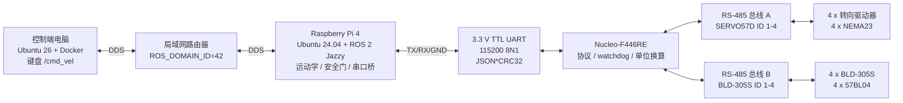
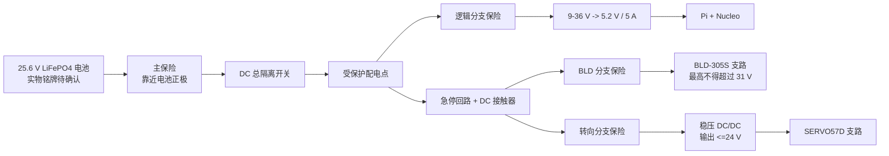

# MARS Rover 硬件部署与联调操作手册

> - 文档状态：实体部署基线，协议版本 `v=1`
> - 适用仓库：`https://github.com/lixiang-moss/rover.git`
> - 目标平台：电脑 Ubuntu 26.04 + Docker；Raspberry Pi 4 Ubuntu Server 24.04 arm64 + 原生 ROS 2 Jazzy
> - 本次正式验收范围：`front_left` 单轮组的真实转向、驱动、停止与故障联锁

## 1. 本手册解决什么问题

本手册从一台尚未配置的电脑、一块准备重装系统的 Raspberry Pi 4 和一个全新的 STM32CubeIDE 工程开始，说明如何完成以下工作：

1. 在电脑的 Docker 容器内编译、测试并运行 ROS 2 键盘控制端。
2. 在 Pi 上原生安装 ROS 2 Jazzy，部署机器人端节点。
3. 让电脑和 Pi 通过同一局域网中的 ROS 2 DDS 通信。
4. 让 Pi 通过 3.3 V TTL UART 向 Nucleo-F446RE 发送四轮目标帧。
5. 让 STM32 通过两条 RS-485 总线分别控制转向驱动器和行走驱动器。
6. 在所有硬件保护就绪后，完成 `front_left` 单轮组真实验收。
7. 为后续四轮、八电机接线预留明确接口，但不把“软件具备四轮输出”写成“实体四轮已经验证”。

当前工程只做键盘手动控制。本文不引入 `ros2_control`、Nav2、路径规划、自动驾驶或 GUI 控制端。

### 1.1 本次验收终点

满足以下全部条件，才可宣布本次部署完成：

- 电脑容器与 Pi 可以互相发现 ROS 2 节点并双向传输话题。
- Pi 能以 `20 Hz` 向 STM32 发送有效命令。
- STM32 能逐条返回 ACK，并以约 `5 Hz` 返回 STATUS。
- CRC 错误、非法 JSON 和越界目标不会进入电机执行状态。
- 超过 `0.5 s` 未收到有效 Pi 命令时，STM32 停止全部电机输出。
- `front_left` 转向机构完成可重复的 homing，并执行小角度正反向转向。
- `front_left` 行走电机完成短时低速正转、反转、停止和制动测试。
- 软件急停、硬件急停、串口断开和 STM32 watchdog 都能使输出停止。
- `/mars_rover/wheel_states` 仍明确显示 `feedback_is_real=false`，不得把目标值回显误认为真实传感器反馈。

### 1.2 四项硬性上电门槛

以下任意一项未完成时，只能做无功率软件测试，不得给电机驱动器上电：

- [ ] 电池铭牌、最高充电电压、BMS 最大持续/峰值电流已拍照并记录。
- [ ] 电池正极附近已安装合适的主保险和 DC 额定总隔离开关。
- [ ] 已安装能切断电机驱动器功率支路的硬件急停和接触器。
- [ ] SERVO57D 供电支路经稳压后实测不超过 `24 VDC`。

原点开关未选型、未安装或未验证时，不得执行自动 homing，也不能完成正式转向验收。

## 2. 已确认事实与待确认参数

### 2.1 当前系统基线

| 类别 | 当前基线 | 本次使用方式 |
|---|---|---|
| 控制端电脑 | Ubuntu 26.04 | Docker 中运行 Ubuntu 24.04 / ROS 2 Jazzy |
| 机器人计算机 | Raspberry Pi 4 | Ubuntu Server 24.04 arm64，原生 ROS 2 Jazzy |
| STM32 | Nucleo-F446RE | Windows + STM32CubeIDE，从新工程实现 |
| 转向电机 | NEMA 23，项目资料写作 `23HE22-2804S`，`1.8°`、`2.8 A/phase` | 每个轮组一台，共 4 台；实物铭牌必须复核 |
| 转向驱动器 | MKS SERVO57D RS-485 | 每个转向电机一块，共 4 块 |
| 转向减速器 | NMRVS30，暂按 `30:1` | 实物铭牌复核后用于角度换算 |
| 行走电机 | 57BL04，24 V、约 69 W、3000 rpm、4 极 | 每个轮组一台，共 4 台 |
| 行走驱动器 | BLD-305S | 每个行走电机一台，共 4 台 |
| 行走减速比 | 暂按 `20:1` | 实物铭牌复核后用于速度换算 |
| RS-485 收发器 | 现有 MAX485 或同类模块 | 两块，转向与行走总线分开 |
| 电池 | 原始资料暂指向 LiTime 25.6 V / 25 Ah / 50 A LiFePO4 | 只作识别线索，最终以实物铭牌为准 |
| 逻辑 DC/DC | APKLVSR 9-36 V -> 5.2 V / 5 A | 可用于 Pi/Nucleo，但必须先实测与负载验证 |

BLD-305S 原始手册位于：

`Group 3.1 - Final Submission/Data Sheets/BLD-305S_Manual (1).pdf`

Nucleo-F446RE 引脚必须以 [ST Nucleo-64 官方用户手册](https://www.st.com/resource/en/user_manual/dm00105823.pdf)和实际板卡丝印为准，不沿用上一届 STM32 工程、截图或引脚假设。

### 2.2 必须现场填写的参数

| 参数 | 暂定值 | 实测/确认值 | 确认人 | 日期 |
|---|---:|---:|---|---|
| 电池型号 | LiTime 25.6 V / 25 Ah / 50 A |  |  |  |
| 满充开路电压 | 约 29.2 V，仅为 8S LiFePO4 常见值 |  |  |  |
| 电池 BMS 持续电流 | 50 A，待核对 |  |  |  |
| 主正极线线径与允许电流 | 未定 |  |  |  |
| 主保险类型与额定电流 | 未定 |  |  |  |
| DC 总隔离开关额定值 | 未定 |  |  |  |
| 急停接触器额定值与线圈电压 | 未定 |  |  |  |
| MKS 稳压支路输出 | 不高于 24 V |  |  |  |
| 实际车轮有效半径 (r) | (0.09\,\mathrm{m}) |  |  |  |
| 行走减速比 (G_d) | (20) |  |  |  |
| 转向减速比 (G_s) | (30) |  |  |  |
| 轴距 (L) | (0.706\,\mathrm{m}) |  |  |  |
| 轮距 (W) | (0.288\,\mathrm{m}) |  |  |  |
| 转向原点开关型号 | 未定 |  |  |  |
| 57BL04 铭牌极数 | 4 极，即 2 对极，待核对 |  |  |  |

## 3. 系统结构与人员职责



### 3.1 Pi/ROS 2 负责人交付物

Pi 负责人应完成并能现场演示：

- 电脑 Docker 镜像构建、工作区编译和测试。
- Pi 系统重装、ROS 2 安装、仓库部署和启动。
- `ROS_DOMAIN_ID=42`、DDS 局域网发现和话题传输。
- ROS 2 四轮目标计算、安全限幅、控制超时和软件急停。
- `dry_run`、`serial_echo`、`real_serial + single_wheel` 三种联调入口。
- 按本手册定义的 `v=1` 紧凑协议发送 W 帧并解析 A/S 帧。
- 向 STM32 负责人提供一组真实抓包、CRC 测试向量和 ROS 2 目标值说明。

### 3.2 STM32/驱动器/电机负责人交付物

STM32 负责人应从新的 CubeIDE 工程完成：

- USART1 与 Pi 的通信、帧缓存、CRC32、JSON 解析和严格字段校验。
- ACK、STATUS、故障码和 `0.5 s` 命令 watchdog。
- 两条互相独立的 RS-485 半双工总线及 DE/RE 时序。
- MKS SERVO57D 的地址、波特率、电流、模式、homing 与位置控制。
- BLD-305S 的地址、波特率、极对数、速度、方向、停止、制动和故障读取。
- rad 到转向轴命令、m/s 到电机 rpm 的单位换算。
- 上电默认禁用、超时停止、急停停止和故障停止状态机。
- `front_left` 单轮组的底层测试记录。

本手册不要求提供完整 STM32 固件源码，但上述接口行为必须实现并通过联合验收。

### 3.3 两人必须共同冻结的接口

联调前，双方在同一张记录表上确认：

- UART 为 `/dev/serial0`、`115200`、`8N1`、无软硬件流控。
- 帧格式、最大长度、CRC 范围、换行符和序号回绕规则。
- 四轮顺序固定为 `front_left`、`front_right`、`rear_left`、`rear_right`。
- `angle_rad` 为车轮转向输出轴相对机械零位的角度。
- `velocity_mps` 为轮胎接地点切向线速度，不是电机转速。
- 正方向定义、轮组地址、零位、减速比和轮半径。
- STM32 故障码、急停状态、超时状态的含义。
- 本次只验收 `front_left`，其余地址和接线只检查，不执行四轮动作。

## 4. 开始前的工具与材料

### 4.1 软件与调试工具

- Ubuntu 26.04 控制端电脑。
- Raspberry Pi Imager。
- Git 和 Docker Engine。
- Windows 电脑、STM32CubeIDE 和 ST-LINK USB 线。
- 支持 3.3 V TTL 的 USB-UART 适配器，建议用于独立抓包；不要使用 5 V TTL 输出。
- 万用表，至少能测直流电压、通断和电阻。
- 压接工具、端子、绝缘热缩管和线号标签。
- 两名操作人员：一人执行命令，一人守在物理急停旁。

### 4.2 机械与电气条件

- 车体牢固架空，四个轮胎都不能接触地面或人员。
- 转向机构在允许角度内不会夹手、撞限位或缠绕线束。
- 测试区域无散落工具、线缆和可卷入旋转件的物品。
- 驱动器和 DC/DC 固定并散热，不允许悬空导线承重。
- 每根功率线两端都标记来源、去向和极性。

## 5. 电脑端：Ubuntu 26 + Docker

ROS 2 Jazzy 的官方目标平台是 Ubuntu 24.04 amd64/arm64。Ubuntu 26.04 只作为 Docker 宿主机，项目仍在 Ubuntu 24.04/Jazzy 镜像内构建。Docker 官方文档当前列出 Ubuntu 26.04 为 Docker Engine 支持版本，安装步骤以 [Docker Engine for Ubuntu](https://docs.docker.com/engine/install/ubuntu/) 为准。

### 5.1 检查宿主机

```bash
cat /etc/os-release
uname -m
ip -br address
```

期望：

- `VERSION_ID="26.04"`。
- 普通 x86-64 电脑显示 `x86_64`。
- 能看到连接实验室路由器的网卡和 IPv4 地址。

### 5.2 安装 Docker Engine

仅在这台电脑尚未安装 Docker 时执行。若已经安装 Docker Desktop、`docker.io` 或第三方 Docker 包，先核对现状，不能直接混装。

```bash
sudo apt update
sudo apt install -y ca-certificates curl
sudo install -m 0755 -d /etc/apt/keyrings
sudo curl -fsSL https://download.docker.com/linux/ubuntu/gpg \
  -o /etc/apt/keyrings/docker.asc
sudo chmod a+r /etc/apt/keyrings/docker.asc

sudo tee /etc/apt/sources.list.d/docker.sources >/dev/null <<EOF
Types: deb
URIs: https://download.docker.com/linux/ubuntu
Suites: $(. /etc/os-release && echo "${UBUNTU_CODENAME:-$VERSION_CODENAME}")
Components: stable
Architectures: $(dpkg --print-architecture)
Signed-By: /etc/apt/keyrings/docker.asc
EOF

sudo apt update
sudo apt install -y docker-ce docker-ce-cli containerd.io \
  docker-buildx-plugin docker-compose-plugin
sudo systemctl enable --now docker
sudo docker run --rm hello-world
```

允许当前用户不加 `sudo` 使用 Docker：

```bash
sudo usermod -aG docker "$USER"
```

注销并重新登录，然后验证：

```bash
docker version
docker run --rm hello-world
```

加入 `docker` 组等价于获得较高主机权限，只应给可信用户。

### 5.3 获取仓库并构建镜像

```bash
cd ~
git clone https://github.com/lixiang-moss/rover.git
cd ~/rover
git branch --show-current
git pull --ff-only
cd ~/rover/mars_rover_ws
docker build -t mars-rover-jazzy:local -f Dockerfile .
```

期望分支为 `main`。部署现场不要在不清楚差异时执行强制覆盖或重置。

### 5.4 启动开发容器

下面使用 Linux 的 host network，使容器直接参与局域网 DDS 发现：

```bash
cd ~/rover/mars_rover_ws
docker run --rm -it \
  --name mars-rover-dev \
  --network host \
  --user "$(id -u):$(id -g)" \
  -e HOME=/tmp/rover-home \
  -e ROS_DOMAIN_ID=42 \
  -e ROS_AUTOMATIC_DISCOVERY_RANGE=SUBNET \
  -v "$PWD":/workspace/mars_rover_ws \
  -w /workspace/mars_rover_ws \
  mars-rover-jazzy:local \
  bash -lc 'mkdir -p "$HOME" && exec bash'
```

容器内执行：

```bash
source /opt/ros/jazzy/setup.bash
printenv ROS_DOMAIN_ID
printenv ROS_AUTOMATIC_DISCOVERY_RANGE
ros2 doctor --report
```

`ROS_DOMAIN_ID` 必须为 `42`，自动发现范围必须为 `SUBNET`。

### 5.5 编译与测试

仍在容器内：

```bash
cd /workspace/mars_rover_ws
rosdep update
rosdep install --from-paths src --ignore-src -r -y --rosdistro jazzy
colcon build --symlink-install
source install/setup.bash
colcon test
colcon test-result --verbose
```

通过标准：

- `colcon build` 返回码为 0。
- `colcon test-result --verbose` 不出现失败测试。
- `ros2 pkg list | grep mars_rover` 能看到项目包。

### 5.6 先在电脑上做无硬件测试

终端 A，在容器内运行 Pi 链路的 dry-run：

```bash
source /opt/ros/jazzy/setup.bash
source /workspace/mars_rover_ws/install/setup.bash
ros2 launch mars_rover_bringup pi_bringup_dry_run.launch.py
```

终端 B，从宿主机进入同一个容器：

```bash
docker exec -it mars-rover-dev bash
source /opt/ros/jazzy/setup.bash
source /workspace/mars_rover_ws/install/setup.bash
ros2 launch mars_rover_bringup pc_teleop.launch.py with_rviz:=false
```

终端 C 检查：

```bash
docker exec -it mars-rover-dev bash
source /opt/ros/jazzy/setup.bash
source /workspace/mars_rover_ws/install/setup.bash
ros2 node list
ros2 topic echo /mars_rover/wheel_setpoints
```

键盘窗口必须保持前台。标准 `teleop_twist_keyboard` 的 `i/k/j/l/u/o/m/.` 等键用于运动，空格或 `k` 用于停止。当前 launch 将速度初值设为 `0.02 m/s`、转向量初值设为 `0.05`，以 `10 Hz` 重发，并在 `0.4 s` 无按键后发送零命令。以上数值可通过 launch 参数 `speed`、`turn`、`repeat_rate`、`key_timeout` 显式修改。

### 5.7 可选 RViz

RViz 不是实体单轮验收的前置条件。需要时，在启动容器前允许本地 X 服务，并挂载 X11 socket：

```bash
xhost +si:localuser:$(id -un)
```

容器增加：

```text
-e DISPLAY="$DISPLAY" -v /tmp/.X11-unix:/tmp/.X11-unix:rw
```

然后运行：

```bash
ros2 launch mars_rover_bringup pc_teleop.launch.py with_rviz:=true
```

若 Wayland/XWayland 配置导致窗口打不开，不要阻塞硬件部署，继续使用 `with_rviz:=false` 和 `ros2 topic echo`。

## 6. Pi 端：重装 Ubuntu Server 24.04 arm64

ROS 2 Jazzy 官方支持 Ubuntu 24.04 的 amd64 和 arm64，参见 [ROS 2 Jazzy Ubuntu 安装说明](https://docs.ros.org/en/jazzy/Installation/Alternatives/Ubuntu-Install-Binary.html)。Pi 上不使用 Docker，以减少 GPIO UART、设备权限和 systemd 启动的额外层次。

### 6.1 校验本地系统镜像

仓库已有：

```text
system_images/ubuntu-24.04.4-preinstalled-server-arm64+raspi.img.xz
system_images/SHA256SUMS
```

在 Ubuntu 电脑上执行：

```bash
cd ~/rover/system_images
sha256sum -c SHA256SUMS --ignore-missing
```

该文件在仓库清单中的期望 SHA-256 为：

```text
790652faeb4f61ce7bb12f5cb61734595c61d3cd882915b8b5f9918106c80d37
```

必须看到 `OK`。不一致时停止，不要把镜像写入 SD 卡。

### 6.2 使用 Raspberry Pi Imager 写卡

1. 插入至少 32 GB、质量可靠的 microSD 卡。
2. 打开 Raspberry Pi Imager。
3. 设备选择 Raspberry Pi 4。
4. 操作系统选择“自定义镜像”，指向上面的 `.img.xz`。
5. 存储设备必须再次核对，写入会覆盖该卡。
6. 在高级设置中填写：

| 项目 | 值 |
|---|---|
| Hostname | `mars-rover-pi` |
| Username | `rover` |
| Password | 现场设置强密码，不写入仓库 |
| SSH | 启用，优先使用公钥 |
| Wi-Fi | 可配置，但正式联调优先使用有线网 |
| Locale/Timezone | `Europe/Berlin` |

7. 写入并执行 Imager 校验。
8. 退出 Imager 后安全弹出 SD 卡。

Ubuntu 官方也说明可通过 Raspberry Pi Imager 写入 Pi 启动介质，参见 [Install Ubuntu on Raspberry Pi](https://documentation.ubuntu.com/hardware-support/boards/tutorials/raspberry-pi-other/)。

### 6.3 首次无屏幕启动

1. 暂时不要连接 Pi 与 STM32 的 UART。
2. 插入 SD 卡和网线。
3. 使用稳定的 5 V USB-C 电源给 Pi 单独供电。
4. 等待首次启动和文件系统扩展，通常需要数分钟。
5. 在控制端查找主机：

```bash
ping mars-rover-pi.local
ssh rover@mars-rover-pi.local
```

若 `.local` 无法解析，在路由器 DHCP 列表中查找 `mars-rover-pi` 的 IPv4 地址：

```bash
ssh rover@<PI_IP>
```

首次连接要核对并接受 SSH 主机指纹。

### 6.4 基础系统配置

在 Pi 的 SSH 终端执行：

```bash
sudo apt update
sudo apt full-upgrade -y
sudo apt install -y git curl locales software-properties-common \
  build-essential python3-pip python3-serial
sudo timedatectl set-timezone Europe/Berlin
hostnamectl
timedatectl
ip -br address
```

确认：

- 主机名为 `mars-rover-pi`。
- 系统时间正确并显示同步。
- `uname -m` 为 `aarch64`。
- Pi 与电脑在同一 IPv4 子网。

### 6.5 原生安装 ROS 2 Jazzy

执行 ROS 官方当前推荐的 apt-source 配置：

```bash
sudo locale-gen en_US en_US.UTF-8
sudo update-locale LC_ALL=en_US.UTF-8 LANG=en_US.UTF-8
export LANG=en_US.UTF-8

sudo add-apt-repository universe
sudo apt update
sudo apt install -y curl
export ROS_APT_SOURCE_VERSION=$(curl -s \
  https://api.github.com/repos/ros-infrastructure/ros-apt-source/releases/latest \
  | grep -F 'tag_name' | awk -F'"' '{print $4}')
curl -L -o /tmp/ros2-apt-source.deb \
  "https://github.com/ros-infrastructure/ros-apt-source/releases/download/${ROS_APT_SOURCE_VERSION}/ros2-apt-source_${ROS_APT_SOURCE_VERSION}.$(. /etc/os-release && echo ${UBUNTU_CODENAME:-${VERSION_CODENAME}})_all.deb"
sudo dpkg -i /tmp/ros2-apt-source.deb

sudo apt update
sudo apt install -y ros-jazzy-ros-base ros-dev-tools \
  ros-jazzy-robot-state-publisher ros-jazzy-xacro \
  ros-jazzy-demo-nodes-cpp
```

初始化 `rosdep`：

```bash
sudo rosdep init
rosdep update
```

若提示 `/etc/ros/rosdep/sources.list.d/20-default.list already exists`，说明已经初始化，直接执行 `rosdep update`，不要删除该文件。

### 6.6 部署工作区

```bash
cd ~
git clone https://github.com/lixiang-moss/rover.git
cd ~/rover/mars_rover_ws
source /opt/ros/jazzy/setup.bash
rosdep install --from-paths src --ignore-src -r -y --rosdistro jazzy
colcon build --symlink-install
source install/setup.bash
colcon test
colcon test-result --verbose
```

把环境加入 `~/.bashrc`：

```bash
cat >> ~/.bashrc <<'EOF'
source /opt/ros/jazzy/setup.bash
export ROS_DOMAIN_ID=42
export ROS_AUTOMATIC_DISCOVERY_RANGE=SUBNET
source "$HOME/rover/mars_rover_ws/install/setup.bash"
EOF
source ~/.bashrc
```

验证：

```bash
printenv ROS_DOMAIN_ID
printenv ROS_AUTOMATIC_DISCOVERY_RANGE
ros2 pkg list | grep mars_rover
```

## 7. 电脑与 Pi 的局域网 ROS 2 联调

ROS 2 默认通过 DDS 在同一子网发现节点。双方的 `ROS_DOMAIN_ID` 必须相同；本项目固定为 `42`。Jazzy 的 `ROS_AUTOMATIC_DISCOVERY_RANGE=SUBNET` 表示允许同一子网的 DDS 多播发现，参见 [ROS 2 Improved Dynamic Discovery](https://docs.ros.org/en/jazzy/Tutorials/Advanced/Improved-Dynamic-Discovery.html)。

### 7.1 IP 连通性

电脑宿主机：

```bash
ping -c 4 mars-rover-pi.local
```

Pi：

```bash
ping -c 4 <PC_IP>
```

丢包明显时先修复网络，不进入 DDS 测试。避免使用会隔离无线客户端的 guest Wi-Fi。

### 7.2 DDS 双向话题测试

电脑容器内发布：

```bash
export ROS_DOMAIN_ID=42
export ROS_AUTOMATIC_DISCOVERY_RANGE=SUBNET
ros2 topic pub -r 2 /integration_test std_msgs/msg/String "{data: from_pc}"
```

Pi 上接收：

```bash
ros2 topic echo /integration_test
```

然后交换方向。Pi 发布：

```bash
ros2 topic pub -r 2 /integration_test_return std_msgs/msg/String "{data: from_pi}"
```

电脑容器接收：

```bash
ros2 topic echo /integration_test_return
```

双向都能连续看到消息才算通过。若 ping 正常但 DDS 不通，依次检查：

1. 两端 `ROS_DOMAIN_ID` 是否都为 `42`。
2. 容器是否使用 `--network host`。
3. 两端发现范围是否为 `SUBNET`。
4. 路由器是否禁止多播或启用了客户端隔离。
5. Ubuntu 防火墙是否阻止局域网 UDP 多播和 DDS 动态端口。

不要为了省事永久关闭防火墙；应在受控实验网络内按实际子网制定规则。

### 7.3 项目链路测试

Pi：

```bash
ros2 launch mars_rover_bringup pi_bringup_dry_run.launch.py
```

电脑容器：

```bash
ros2 launch mars_rover_bringup pc_teleop.launch.py with_rviz:=false
```

Pi 的第二个 SSH 终端：

```bash
ros2 topic hz /cmd_vel
ros2 topic echo /mars_rover/safety_state
ros2 topic echo /mars_rover/wheel_setpoints
```

按键时应出现目标；停止按键约 `0.5 s` 后，安全状态应转为 `cmd_timeout` 并输出零速度。

## 8. Pi GPIO UART 配置与接线

Raspberry Pi UART 为 `3.3 V` 逻辑，不能承受 `5 V`。Pi 4 的主 UART 使用 GPIO14/15，对应物理针脚 8/10；`/dev/serial0` 是主 UART 的稳定符号链接。详见 [Raspberry Pi UART 官方说明](https://www.raspberrypi.com/documentation/computers/configuration.html)。

### 8.1 关闭串口登录控制台

Ubuntu Server 不一定提供 Raspberry Pi OS 的 `raspi-config`，因此按文件实际内容处理。

查看启动参数：

```bash
cat /boot/firmware/cmdline.txt
```

如果其中存在以下任一串口控制台参数，用 `sudo nano /boot/firmware/cmdline.txt` 只删除对应的 `console=...` 项，保持整行其他参数不变：

```text
console=serial0,115200
console=ttyS0,115200
console=ttyAMA0,115200
```

启用 UART：

```bash
sudo nano /boot/firmware/config.txt
```

确保文件中存在且只生效一次：

```text
enable_uart=1
```

检查并停止占用主串口的 getty：

```bash
systemctl list-units --all '*serial-getty*'
sudo systemctl disable --now serial-getty@serial0.service 2>/dev/null || true
sudo systemctl disable --now serial-getty@ttyS0.service 2>/dev/null || true
sudo systemctl disable --now serial-getty@ttyAMA0.service 2>/dev/null || true
sudo usermod -aG dialout rover
sudo reboot
```

重新 SSH 登录后验证：

```bash
ls -l /dev/serial0
readlink -f /dev/serial0
groups
stty -F /dev/serial0 115200 cs8 -cstopb -parenb -ixon -ixoff -crtscts
```

`groups` 必须包含 `dialout`。

### 8.2 Pi UART 回环测试

1. 正常关机：`sudo poweroff`。
2. Pi 断电后，用短跳线连接物理针脚 8 和 10。
3. 重新上电并 SSH 登录。
4. 执行：

```bash
python3 - <<'PY'
import serial

port = serial.Serial('/dev/serial0', 115200, timeout=1)
test = b'MARS_UART_LOOPBACK\n'
port.reset_input_buffer()
port.write(test)
received = port.readline()
port.close()
print('sent    =', test)
print('received=', received)
assert received == test, 'UART loopback failed'
PY
```

看到相同的发送和接收内容才算通过。测试结束后关机、断电、拆除 8-10 回环线。

### 8.3 Pi 与 Nucleo 接线

所有设备断电后连接：

| Pi 物理针脚 | Pi 信号 | Nucleo-F446RE 信号 | 方向 |
|---:|---|---|---|
| 8 | GPIO14 / TXD / `/dev/serial0` TX | PA10 / USART1_RX | Pi -> STM32 |
| 10 | GPIO15 / RXD / `/dev/serial0` RX | PA9 / USART1_TX | STM32 -> Pi |
| 6 | GND | GND | 公共参考地 |

只连接 TX、RX、GND：

- 不连接两块板的 5 V。
- 不连接两块板的 3.3 V。
- UART 线尽量短，远离电池线、电机相线和 PWM/功率线。
- TX 与 RX 必须交叉。
- Pi RX 端绝不能出现 5 V。

先让 Nucleo 仅运行通信固件并由 ST-LINK USB 供电，电机驱动器保持断电。

## 9. STM32：从新 CubeIDE 工程实现

本项目明确不引用、不复制、不移植 `Group 3.1 - Final Submission/codes` 中的上一届 STM32 代码。可使用芯片厂商 HAL、CubeIDE 自动生成代码和驱动器官方协议文档。

### 9.1 新工程和引脚规划

在 STM32CubeIDE 中：

1. 新建 STM32 Project。
2. Board Selector 选择实际板卡 `NUCLEO-F446RE`。
3. 选择新工程目录，启用 HAL。
4. 配置系统时钟并确认调试接口保留为 Serial Wire。
5. 按下表分配外设。

| 用途 | 外设 | MCU 引脚 | 配置 |
|---|---|---|---|
| Pi 协议 | USART1 | PA9 TX / PA10 RX | 115200, 8N1, 无流控 |
| ST-LINK VCP 调试 | USART2 | PA2 TX / PA3 RX | 调试日志，不承载 Pi 正式协议 |
| 转向 RS-485 | USART3 | PC10 TX / PC11 RX | 115200, 8N1 |
| 行走 RS-485 | USART6 | PC6 TX / PC7 RX | 115200, 8N1 |
| 转向 DE/RE | GPIO Output | PB4 | 默认低，低=接收，高=发送 |
| 行走 DE/RE | GPIO Output | PB5 | 默认低，低=接收，高=发送 |

生成代码前打开官方 Nucleo 引脚表，确认所有引脚都能从 Morpho 接口实际引出。不能只依据软件绿色标记判断接线位置。

### 9.2 固件模块边界

建议至少分为以下模块；名称可以不同，但行为必须等价：

| 模块 | 必须实现的行为 |
|---|---|
| Pi UART RX | 中断或 DMA 接收，按 `\n` 切帧，最大 512 字节 |
| Frame codec | 分离 JSON 和 CRC，验证 CRC32、版本、类型和字段 |
| Command state | 保存最后有效 W 帧、序号、接收时间和使能状态 |
| Safety state | 上电禁用、急停、0.5 s watchdog、故障锁定 |
| Steering bus | 非阻塞管理 SERVO57D 请求、响应、超时和故障 |
| Drive bus | 非阻塞管理 BLD-305S 请求、响应、超时和故障 |
| Unit conversion | rad -> 转向轴坐标，m/s -> 电机 rpm |
| Status publisher | 每条有效命令回 ACK，约 5 Hz 回 STATUS |
| Debug logger | 通过 USART2 输出简短日志，不影响正式协议时序 |

不要在主循环中使用长时间阻塞延时等待某一驱动器。一个驱动器无响应不能使 Pi watchdog 或另一条 RS-485 总线停摆。

### 9.3 上电状态机

STM32 上电后按以下顺序进入状态：

1. `BOOT`：所有 DE/RE 为接收，所有驱动器执行输出为禁用。
2. `COMM_READY`：USART1 可以接收协议，STATUS 中 `on=0`。
3. `DRIVER_CHECK`：只探测当前测试所需的 `front_left` ID 1 设备。
4. `READY_DISABLED`：通信和所需驱动器正常，`on=1`，但仍不执行运动。
5. `ACTIVE`：只有收到 CRC 正确、范围正确、`e=1`、`s=0` 的 W 帧后才可执行。
6. `STOPPED`：收到 `e=0`、`s=1`、STOP/零目标或 watchdog 超时，立即停止输出。
7. `FAULT`：驱动故障、转向故障、急停或 homing 条件不满足，停止输出并上报故障码。

复位或重新上电后必须回到禁用状态，不能恢复上次运动命令。

## 10. Pi 与 STM32 紧凑串口协议 `v=1`

### 10.1 线路参数

| 项目 | 固定值 |
|---|---|
| 串口 | Pi `/dev/serial0` <-> STM32 USART1 |
| 波特率 | `115200` |
| 数据格式 | `8N1` |
| 流控 | 无 |
| Pi 命令频率 | `20 Hz` |
| STM32 STATUS | 约 `5 Hz` |
| 最大完整帧长 | `512 bytes`，包含 CRC 和换行 |
| STM32 命令超时 | `0.5 s` |
| 字符编码 | UTF-8；当前键和值均为 ASCII |
| 行结束 | `\n`；接收端可容忍前面的 `\r` |

### 10.2 帧格式和 CRC

```text
<紧凑JSON>*<8位大写十六进制CRC32>\n
```

规则：

1. CRC32 只覆盖 `*` 前的原始 UTF-8 JSON 字节。
2. 使用常见 IEEE CRC-32，与 Python `zlib.crc32()` 结果一致。
3. CRC 文本固定为 8 位、大写、前导零保留。
4. JSON 不能包含 `NaN`、`Infinity` 或额外未定义字段。
5. STM32 不得先重新格式化 JSON 再计算 CRC。
6. 超过 512 字节、没有换行或缓冲区溢出的帧直接丢弃并进入停止/故障处理。

### 10.3 Pi 发送的 W 命令

固定键：

| 键 | 类型 | 含义 |
|---|---|---|
| `v` | integer | 协议版本，固定 `1` |
| `t` | string | 帧类型，固定 `W` |
| `q` | uint32 | 命令序号，溢出后从 0 回绕 |
| `m` | integer | 模式：0 STOP，1 CRAB，2 SPIN_IN_PLACE，3 RAW_WHEEL_TEST |
| `e` | 0/1 | 全局硬件执行使能 |
| `s` | 0/1 | Pi 软件急停 |
| `w` | array[4] | 四个固定顺序的轮组目标 |

`w` 的固定顺序：

```text
0 front_left
1 front_right
2 rear_left
3 rear_right
```

每个轮组固定为：

```text
[enabled, angle_rad, velocity_mps, steering_limit_radps, acceleration_limit_mps2]
```

| 索引 | 单位 | 含义 |
|---:|---|---|
| 0 | 0/1 | 当前轮组是否执行 |
| 1 | rad | 车轮转向输出轴相对零位的目标角 |
| 2 | m/s | 轮胎接地点目标线速度，正负表示方向 |
| 3 | rad/s | 车轮转向输出轴速度限制 |
| 4 | m/s² | 车轮线加速度限制 |

单轮测试示例：

```text
{"e":1,"m":3,"q":42,"s":0,"t":"W","v":1,"w":[[1,0.1,0.08,0.15,0.05],[0,0.0,0.0,0.15,0.05],[0,0.0,0.0,0.15,0.05],[0,0.0,0.0,0.15,0.05]]}*58782C06
```

上面是固定 CRC 测试向量。STM32 对星号前的字节计算 CRC32，必须得到 `0x58782C06`。

`e=0` 或 `s=1` 时，STM32 必须停止输出；即使某个 `w[i][0]` 错误地为 1，也不能执行。

### 10.4 STM32 返回的 ACK

```text
{"fc":0,"ok":1,"q":42,"t":"A","v":1}*88B875B3
```

| 键 | 含义 |
|---|---|
| `q` | 原样回显本次命令序号 |
| `ok=1` | 命令已经通过 CRC、字段和范围检查，并写入命令状态 |
| `ok=0` | 帧可以识别序号，但语义或执行前置条件不满足 |
| `fc` | `0` 表示接受；非 0 为拒绝原因 |

每一条有效可解析的 W 命令都应返回 ACK。CRC 已损坏的帧不能信任其中的 `q`，应丢弃并通过下一条 STATUS 上报 CRC 故障。

### 10.5 STM32 返回的 STATUS

```text
{"es":0,"fc":0,"on":1,"q":42,"t":"S","to":0,"v":1}*F18BB4D1
```

| 键 | 含义 |
|---|---|
| `q` | 最近一次接受的 W 命令序号；尚未接受命令时为 0 |
| `on` | 固件和当前测试所需设备就绪。当前单轮阶段只要求 ID 1 设备就绪 |
| `es` | 硬件急停或软件急停处于激活状态 |
| `to` | STM32 的 0.5 s Pi 命令 watchdog 已超时 |
| `fc` | 当前最高优先级故障码，0 表示无故障 |

Pi 侧把 ACK/STATUS 转换为 `/mars_rover/stm32/status`。`safety_gate` 在 `fault`、`estop_active`、`timeout` 或离线时输出零速度。

### 10.6 故障码冻结表

建议按下表实现，双方联调前必须签字冻结；如需修改，应同时修改 STM32 文档和 ROS 2 测试。

| 故障码 | 含义 | ACK/STATUS | 是否停止输出 |
|---:|---|---|---|
| 0 | 无故障 | A/S | 否 |
| 1001 | CRC32 错误 | 下一条 S | 是 |
| 1002 | 帧超过 512 字节或缓冲区溢出 | S | 是 |
| 1003 | UTF-8/JSON 解析错误 | S | 是 |
| 1004 | 协议版本、帧类型或字段集合错误 | A 或 S | 是 |
| 1005 | 数值非有限、越界或轮组数量错误 | A | 是 |
| 2001 | 超过 0.5 s 未收到有效命令 | S | 是 |
| 2002 | 硬件急停激活 | S | 是 |
| 2003 | 转向 homing 未完成 | A/S | 是 |
| 3101-3104 | 转向 ID 1-4 通信/驱动故障 | A/S | 是 |
| 4101-4104 | 行走 ID 1-4 通信/驱动故障 | A/S | 是 |

多个故障同时存在时，优先报告硬件急停，其次 watchdog、转向、行走、homing、协议错误。底层可以另存完整故障位图用于 USART2 日志，但 `fc` 保持单值。

## 11. STM32 到两条 RS-485 总线

### 11.1 总线分配与地址

| 轮组 | 转向 SERVO57D 地址 | 行走 BLD-305S 地址 |
|---|---:|---:|
| `front_left` | 1 | 1 |
| `front_right` | 2 | 2 |
| `rear_left` | 3 | 3 |
| `rear_right` | 4 | 4 |

两类驱动器地址相同没有冲突，因为它们位于两条独立物理总线。

### 11.2 MAX485 与 STM32 接线

转向总线模块：

| MAX485 | STM32 | 说明 |
|---|---|---|
| VCC | 5 V | 以实际模块芯片标识为准 |
| GND | GND | 与 STM32、驱动器参考地相连 |
| DI | PC10 / USART3_TX | STM32 发往总线 |
| RO | PC11 / USART3_RX | 总线发往 STM32 |
| DE 与 `/RE` 并接 | PB4 | 低接收，高发送 |
| A/B | SERVO57D 总线 A/B | 只在总线两端终端匹配 |

行走总线模块：

| MAX485 | STM32 | 说明 |
|---|---|---|
| VCC | 5 V | 以实际模块芯片标识为准 |
| GND | GND | 与 STM32、BLD-305S GND 相连 |
| DI | PC6 / USART6_TX | STM32 发往总线 |
| RO | PC7 / USART6_RX | 总线发往 STM32 |
| DE 与 `/RE` 并接 | PB5 | 低接收，高发送 |
| A/B | BLD-305S A+/B- | 核对极性标识 |

MAX485 由 5 V 供电。其 DI/DE 的高电平门限通常能接受 STM32 3.3 V 输出，但 RO 可能输出接近 5 V。连接前必须：

1. 核对模块上实际芯片，不凭商品标题判断。
2. 用 STM32F446 数据手册确认所选 RX 引脚为 5 V tolerant。
3. 若芯片、模块或引脚不满足条件，改用 3.3 V RS-485 收发器或加入合适的逻辑电平转换。
4. 给 DE/RE 控制加约 `10 kΩ` 下拉，使 MCU 复位期间默认接收。

MAX485 电气特性参考 [Analog Devices MAX1487-MAX491 数据手册](https://www.analog.com/media/en/technical-documentation/data-sheets/MAX1487-MAX491.pdf)。

### 11.3 半双工时序

每次 Modbus RTU 请求：

1. 确认总线空闲。
2. DE/RE 拉高，等待 GPIO 稳定。
3. 发送完整请求。
4. 等待 UART Transmission Complete，而不只是 TX 缓冲区空。
5. DE/RE 立即拉低回到接收。
6. 在驱动器响应超时内接收并校验 Modbus CRC16。
7. 超时或 CRC 错误时记录对应 ID 故障，不无限阻塞重试。

总线使用菊花链，不使用星形长支线。`120 Ω` 终端电阻只安装在物理总线两端；偏置电阻只保留一组。很多 MAX485 模块自带电阻，安装前用万用表和原理图核对。

## 12. 转向驱动器与转向电机

### 12.1 单轮阶段的 SERVO57D 配置

先只连接 `front_left`：

| 项目 | 设定/要求 |
|---|---|
| RS-485 地址 | 1 |
| 通信 | Modbus RTU |
| 波特率 | 115200 |
| 数据格式 | 8N1 |
| 工作模式 | 串行闭环模式，使用绝对轴位置命令 |
| 电机电流 | 按实物铭牌，暂按 2.8 A/phase |
| 电源 | 稳压 12-24 VDC，实测不得超过 24 V |
| 减速比 | 暂按 30:1，实物复核 |

MKS 手册默认波特率可能不是 115200，且 Modbus RTU 可能默认未启用。必须先通过驱动器菜单或官方配置方式逐台设置，再接入共享总线。以下链接是 SERVO57D V1.0.6 手册镜像：[MKS SERVO42D/57D RS485 manual](https://darxton.ru/files/_misc/ed4/ed4621f7-1463-11f0-aa2b-000c29f5eb60.pdf)。联调前还要核对实物固件版本和厂商原始手册是否一致。

### 12.2 转向角换算

设：

- 车轮输出目标角为 \(\theta_w\)，单位 rad。
- 转向减速比为 \(G_s=30\)。
- 电机轴一圈编码器坐标为 \(N_e=16384\)。
- 机械零位对应轴坐标为 \(C_0\)。
- 机械方向符号为 \(s_s\in\{-1,+1\}\)。

则未取整的电机轴目标增量为：

$$
\Delta C=s_s\frac{\theta_w}{2\pi}G_sN_e
$$

命令坐标为：

$$
C_{\mathrm{cmd}}=C_0+\operatorname{round}(\Delta C)
$$

不要把多圈坐标截断成 16 位单圈值。应按 SERVO57D 实际绝对轴命令的数据宽度和符号格式编码。

### 12.3 原点开关选择

可选两类方案：

| 方案 | 接口要求 | 优点 | 风险/注意 |
|---|---|---|---|
| 机械限位/微动开关 | 常闭触点优先，STM32 数字输入，上拉和硬件去抖 | 简单、零位明确 | 磨损、碰撞速度必须很低 |
| 3 线感应开关 | 核对 NPN/PNP、NO/NC 和供电电压；经隔离/电平转换到 STM32 | 无机械接触 | 不能把 6-24 V 输出直接接 MCU |

选型要求：

- 传感器安装在转向输出侧，能反映减速器后的真实车轮零位。
- 优先失线可检测的常闭逻辑。
- homing 速度、最大搜索角和超时必须有上限。
- 触发后反向退出，再低速二次接近，提高重复性。
- homing 完成前拒绝非零转向命令并上报 `fc=2003`。

### 12.4 首次转向接线与方向记录

1. 驱动器和电机都断电。
2. 按实物电机线序确认两相绕组，不能只依赖颜色。
3. 连接 SERVO57D 与电机、编码器磁体/传感器以及 RS-485。
4. 连接稳压 24 V 支路，确认极性。
5. 转向机构置于中间附近，线束留有余量。
6. 首次只命令很小角度，例如 \(\pm0.05\,\mathrm{rad}\)。
7. 记录正命令对应车轮从车体上方观察的实际方向。
8. 若方向反，不在多个层次同时改符号，只修改 STM32 中该轮组的 `steering_sign` 并记录。

## 13. BLD-305S 与 57BL04 行走电机

### 13.1 BLD-305S 关键原始参数

项目内 BLD-305S V1.0 手册明确给出：

- 标准输入 `24 VDC`，允许 `11.5-31 VDC`。
- 连续输出电流 `8 A`。
- 通过 3 针 `A+ / GND / B-` 使用 RS-485 Modbus RTU。
- 数据格式为 8 位、1 停止位、无校验，支持 115200。
- 手册标注闭环速度控制范围约为 `150-20000 rpm`。

### 13.2 单轮阶段配置

| 项目 | 设定/要求 |
|---|---|
| 地址 | 1 |
| 波特率寄存器 `0x00F6` | 值 `0x07`，对应 115200 |
| 极对数寄存器 `0x0116` | 暂设 2，必须以 57BL04 实物核对 |
| 控制模式 `0x0136` | 1，内部/通信模式 |
| 速度设定 `0x0056` | 目标电机 rpm，手册范围 0-4000 |
| 运行命令 `0x0066` | 0 停止，1 正转，2 反转，3 制动停止 |
| 清故障 `0x0076` | 写 0 |
| 实际速度读取 `0x005F` | 功能码 0x03 |
| 运行状态读取 `0x0066` | 功能码 0x03 |
| 故障读取 `0x0076` | 功能码 0x03 |
| 保存参数 | 向 `0x80FF` 写 `0x55AA` |

写入地址、波特率、极对数或控制模式后必须保存，然后断电重启并重新读取验证。不要频繁把运行速度写入非易失存储。

### 13.3 m/s 到电机 rpm 的换算

设轮胎线速度为 \(v\)，有效轮半径为 \(r\)，行走减速比为 \(G_d\)，方向符号为 \(s_d\)，则：

$$
n_{\mathrm{motor}}=s_d\frac{60v}{2\pi r}G_d
$$

按暂定 \(r=0.09\,\mathrm{m}\)、\(G_d=20\)：

$$
v=0.03\,\mathrm{m/s}\Rightarrow n_{\mathrm{motor}}\approx63.7\,\mathrm{rpm}
$$

该值低于 BLD-305S 手册标注的约 `150 rpm` 调速下限。因此单轮配置暂把上限改为 `0.08 m/s`：

$$
v=0.08\,\mathrm{m/s}\Rightarrow n_{\mathrm{motor}}\approx169.8\,\mathrm{rpm}
$$

这不是允许直接落地行驶，而是为了架空短时测试时进入驱动器可控速度范围。若实测轮半径、减速比或最低稳定转速不同，必须重新计算参数。

### 13.4 BLD-305S 与电机接线

全部断电后连接：

| BLD-305S 端子 | 连接 |
|---|---|
| DC+ / DC- | 电池电机支路正/负，先经过主保护、急停接触器和分支保护 |
| MA / MB / MC | 57BL04 三相线 A/B/C |
| Hall +5V | 电机 Hall 电源正 |
| HA / HB / HC | 对应 Hall 信号 |
| Hall GND | 电机 Hall 地 |
| RS-485 A+ / GND / B- | 行走 RS-485 总线 |

严禁带电插拔三相线、Hall 线和 RS-485 插头。相线/Hall 配对错误可能导致抖动、反转、过流或 Hall fault。

首次方向确认：

1. 轮胎架空并清空周围物品。
2. 写入停止命令，确认电机不转。
3. 设置短时约 `170 rpm` 目标，再写正转。
4. 运行 1-2 秒后停止。
5. 记录轮胎实际方向、电流、驱动器指示灯和故障码。
6. 再执行反转测试。
7. 若方向定义不一致，只修改该轮组的 `drive_sign` 或交换软件方向定义，不随意尝试相线组合。

## 14. 供电、总开关、保险和急停

### 14.1 推荐电源拓扑



物理急停切断电机功率支路，但保留 Pi 和 STM32 逻辑供电，便于记录故障和继续上报状态。软件急停不能替代硬件急停。

BLD-305S 虽允许 `11.5-31 VDC`，但暂定 LiFePO4 电池满充电压可能接近 `29.2 V`，剩余过压裕量很小。直接使用电池支路前必须在满充状态测量端电压，并在减速/制动测试中监测母线是否因回生能量上升。任何瞬态接近或超过 `31 V` 都必须停止测试，重新设计制动、吸收或稳压方案，不能仅按 `25.6 V` 标称值判断安全。

### 14.2 为什么现在不能直接给出保险和开关安培数

准确选型至少需要：

- 电池满充电压和短路能力。
- BMS 持续/峰值电流。
- 主线和各分支线的线径、长度、敷设方式和允许温升。
- 四个 BLD-305S 和四个 SERVO57D 的实测峰值/持续输入电流。
- DC/DC 启动浪涌和驱动器母线电容浪涌。

主保险首先保护导线和电池支路，不是按“8 台电机额定功率简单相加”选值。信息未齐时给出一个固定安培数会造成错误保护或无法分断，因此本手册把规格确认设为上电门槛。

### 14.3 总隔离开关和急停要求

总隔离开关：

- 明确标注 DC 额定，额定电压高于电池满充电压。
- 持续电流不低于系统实际持续电流。
- DC 分断能力适合电池系统，不能用只标 AC 的家用开关替代。
- 安装位置可见、可触及，并有清晰 ON/OFF 标识。

急停：

- 使用自锁蘑菇头、旋转释放、常闭安全触点。
- 急停按钮控制 DC 接触器线圈；小按钮不直接承担全部电机主电流。
- 失电或急停线断开时接触器释放，电机功率支路断开。
- 复位急停只恢复“可上电条件”，不得自动恢复运动。

### 14.4 逻辑 5.2 V 支路

APKLVSR 标称 9-36 V 输入、5.2 V/5 A 输出只能在以下验证通过后使用：

1. 与 Pi/Nucleo 断开，空载测输出电压和极性。
2. 接电子负载或合适负载，分别验证 1 A、3 A 和预计峰值负载。
3. 检查 10 分钟温升和输入电压变化。
4. 通过合适 USB-C 供电线给 Pi 供电，优先避免直接注入 Pi 5 V GPIO。
5. Nucleo 的外部供电与 ST-LINK USB 同时连接前，按 Nucleo 官方手册核对供电跳线，防止反向供电。

### 14.5 电池首次上电前的万用表检查

主开关 OFF、急停按下、电池断开：

- [ ] 电池正负极到车体金属无意外短路。
- [ ] 主正极和主负极之间不是近似 0 Ω；测量前考虑驱动器电容充电现象。
- [ ] 每个分支保险的下游极性正确。
- [ ] MKS 稳压支路输出与电池输入隔离关系符合模块规格。
- [ ] Pi 5.2 V 输出极性正确且在允许范围。
- [ ] RS-485 A/B 没有与电池正极、相线短接。
- [ ] 急停按下时，接触器主触点断开。
- [ ] 释放急停但未给线圈控制命令时，接触器仍保持断开。

## 15. 从零到单轮真实验收的执行顺序

每次测试都使用“两人规则”：命令操作员坐在电脑前，安全员站在物理急停旁，能直接观察 `front_left` 轮组。

### 15.1 阶段 A：纯软件 dry-run

硬件状态：Pi、STM32、电机驱动器都可以不连接。

1. 电脑容器和 Pi 都完成构建测试。
2. Pi 启动：

```bash
ros2 launch mars_rover_bringup pi_bringup_dry_run.launch.py
```

3. 电脑启动：

```bash
ros2 launch mars_rover_bringup pc_teleop.launch.py with_rviz:=false
```

4. 观察：

```bash
ros2 topic echo /mars_rover/wheel_setpoints
ros2 topic echo /mars_rover/wheel_states
ros2 topic echo /mars_rover/safety_state
```

通过标准：模式、轮组顺序和限幅正确；`feedback_is_real=false`；停止按键后超时归零。

### 15.2 阶段 B：Pi UART 回环

按 8.2 节完成。此阶段不连接 STM32，不连接电机功率。

### 15.3 阶段 C：Pi 与通信固件

硬件状态：Pi 与 Nucleo 只接 TX/RX/GND；Nucleo 由 ST-LINK USB 供电；所有驱动器断电。

Pi 启动串口联调：

```bash
ros2 launch mars_rover_bringup pi_bringup_serial_echo.launch.py \
  serial_port:=/dev/serial0
```

检查：

```bash
ros2 topic echo /mars_rover/stm32/status
ros2 topic hz /mars_rover/stm32/status
```

此时 STM32 即使没有驱动器，也应能返回格式正确的 STATUS；`on` 可以为 0，但 CRC、q、ACK 和 STATUS 必须可解析。

故障注入：

- 用 STM32 调试版本主动发一条错误 CRC，Pi 应记录 `invalid STM32 frame`，不能更新有效接收状态。
- 暂停 STATUS/ACK 超过 0.5 s，ROS 2 状态应 timeout/offline。
- STM32 接收超过 512 字节的行，应丢弃并保持电机禁用。

### 15.4 阶段 D：分别验证两条 RS-485 总线

硬件状态：只接一个 `front_left` 驱动器支路；车轮架空；硬件急停有效。

1. 转向总线只接 SERVO57D ID 1，验证读取设备、配置和故障。
2. 断电后拆除/隔离转向支路。
3. 行走总线只接 BLD-305S ID 1，验证寄存器读取、停止和故障。
4. 两条总线分别通过后再同时连接，但仍不执行运动。

通过标准：每条请求有正确 Modbus 响应；无设备时能在限定超时内返回，不阻塞主循环。

### 15.5 阶段 E：真实单轮 launch，保持硬件禁用

Pi：

```bash
ros2 launch mars_rover_bringup pi_bringup_real_single_wheel.launch.py \
  serial_port:=/dev/serial0 \
  hardware_enable:=false
```

电脑，转向测试使用默认 `turn=0.05`：

```bash
ros2 launch mars_rover_bringup pc_teleop.launch.py with_rviz:=false
```

监视：

```bash
ros2 topic echo /mars_rover/stm32/status
ros2 topic echo /mars_rover/wheel_setpoints
ros2 topic echo /mars_rover/safety_state
```

通过标准：

- 模式为 `RAW_WHEEL_TEST`。
- 只有 `front_left` 的目标层 enabled 可以为 true。
- 串口 W 帧中顶层 `e=0`，四个轮组执行标志均为 0。
- 电机不动作。

### 15.6 阶段 F：硬件停止链测试

在允许电机动作前完成：

1. 按下物理急停，确认电机支路电压消失，Pi/STM32 仍运行。
2. 释放急停后，接触器不能自动吸合。
3. 软件急停测试：

```bash
ros2 topic pub --once /mars_rover/emergency_stop \
  std_msgs/msg/Bool "{data: true}"
```

4. STATUS 必须显示急停，安全状态为 `stm32_estop` 或 `software_estop`。
5. 解除软件急停只在现场人员确认后执行：

```bash
ros2 topic pub --once /mars_rover/emergency_stop \
  std_msgs/msg/Bool "{data: false}"
```

急停解除后 `hardware_enable` 仍应保持 false。

### 15.7 阶段 G：转向 homing 与小角度测试

前置：原点开关已经选型、安装、输入电平验证和手动触发验证。

1. 按下物理急停，确认机构处于安全角度。
2. 解除急停，给电机支路上电，但 `hardware_enable=false`。
3. 由 STM32 的本地受控维护命令执行低速 homing；Pi 不发送运动。
4. 验证搜索方向、开关触发、退出、二次接近和超时。
5. 记录零位坐标和重复 5 次的误差。
6. ROS 2 设置真实执行：

```bash
ros2 param set /stm32_bridge hardware_enable true
```

7. 在键盘端只给小转向目标，从 \(0\) 到 \(+0.05\,\mathrm{rad}\)、回零、到 \(-0.05\,\mathrm{rad}\)、回零。
8. 确认实际方向与协议符号一致，无撞限位、无卡滞、无线束拉扯。
9. 立即关闭硬件执行：

```bash
ros2 param set /stm32_bridge hardware_enable false
```

任何异常先按物理急停，再调查日志。

### 15.8 阶段 H：行走电机短时正反转

前置：轮胎架空；转向回零；BLD-305S ID 1、极对数、Hall/相线、方向都已确认。

1. `hardware_enable=false` 启动真实单轮 launch。
2. 停止先前的电脑 teleop，并用行走测试速度重新启动：

```bash
ros2 launch mars_rover_bringup pc_teleop.launch.py \
  with_rviz:=false speed:=0.08 turn:=0.05
```

3. 确认键盘窗口处于前台且安全员已就位。
4. 确认 STATUS `on=1, es=0, to=0, fc=0`。
5. 打开执行：

```bash
ros2 param set /stm32_bridge hardware_enable true
```

6. 使用键盘给约 `0.08 m/s` 的正向目标，持续 1-2 秒。
7. 停止并等待轮胎完全静止。
8. 给约 `-0.08 m/s` 的反向目标，持续 1-2 秒。
9. 停止并关闭执行。
10. 记录实际方向、实际电机 rpm、驱动器电流、母线电压、温度和 fault。

若 `0.08 m/s` 仍无法稳定启动，不要盲目提高速度或电流；先核对轮半径、减速比、BLD 最大速度跳线、极对数、Hall/相线和机械阻力。

### 15.9 阶段 I：故障与超时验收

每个测试都从 `hardware_enable=true`、短时稳定旋转开始，安全员守在急停旁：

| 测试 | 操作 | 必须结果 |
|---|---|---|
| STOP | 键盘停止或零目标 | 电机停止，ACK/STATUS 正常 |
| 软件急停 | 发布 emergency_stop true | Pi W 帧 `s=1,e=0`，STM32 停止 |
| 物理急停 | 按下蘑菇头 | 电机功率立即切断，STATUS `es=1` |
| Pi 串口断开 | 断开 TX 或停止 bridge | STM32 在 0.5 s 内停止，`to=1` |
| 电脑网络断开 | 断开电脑网络 | Pi `/cmd_vel` 超时并输出零目标 |
| STM32 驱动故障 | 使用安全可控方式模拟驱动器离线 | `fc` 非 0，安全门零输出 |
| 非法 CRC | 通信测试工具发送错误帧 | 不执行，报告 1001 |

每项测试通过后先恢复到 `hardware_enable=false`，再准备下一项。

## 16. 正常开机、急停和关机

### 16.1 每次正常开机

1. 车体架空或处于获准测试区域。
2. 操作者确认总开关 OFF、急停按下、`hardware_enable=false`。
3. 检查线缆、保险、轮组机械状态和人员位置。
4. 合上总隔离开关。
5. 逻辑支路上电，等待 Pi 和 STM32 启动。
6. SSH 登录 Pi，确认时间、网络、`/dev/serial0`。
7. 启动 ROS 2，保持 `hardware_enable=false`。
8. 确认 STATUS 无故障。
9. 释放急停并使接触器吸合。
10. 只有安全员确认后，显式把 `hardware_enable` 设为 true。

### 16.2 发生异常时

1. 立即按物理急停。
2. 不要伸手阻挡轮胎或转向机构。
3. 在 Pi/STM32 仍有逻辑电源时保存状态和日志。
4. 将 `hardware_enable` 设为 false。
5. 断开总隔离开关。
6. 等待驱动器母线电容放电并用万用表确认后再接线。

### 16.3 正常关机

1. 键盘发送 STOP，确认轮胎完全静止。
2. `hardware_enable=false`。
3. 按下物理急停，切断电机功率支路。
4. 停止 ROS 2 launch。
5. Pi 执行：

```bash
sudo poweroff
```

6. 等待 Pi 状态灯停止活动。
7. 断开总隔离开关。
8. 最后断开电池或维护插头。

禁止直接频繁切断 Pi 电源代替正常关机，以免损坏 SD 卡文件系统。

## 17. 单轮通过后的 systemd 服务

只有手动启动流程通过后才配置。服务始终以 `hardware_enable=false` 启动。

创建 `/etc/systemd/system/mars-rover-pi.service`：

```ini
[Unit]
Description=MARS Rover ROS 2 Pi bringup
After=network-online.target
Wants=network-online.target

[Service]
Type=simple
User=rover
Group=rover
SupplementaryGroups=dialout
Environment=ROS_DOMAIN_ID=42
Environment=ROS_AUTOMATIC_DISCOVERY_RANGE=SUBNET
ExecStart=/bin/bash -lc 'source /opt/ros/jazzy/setup.bash && source /home/rover/rover/mars_rover_ws/install/setup.bash && exec ros2 launch mars_rover_bringup pi_bringup_real_single_wheel.launch.py serial_port:=/dev/serial0 hardware_enable:=false'
Restart=on-failure
RestartSec=3
KillSignal=SIGINT
TimeoutStopSec=10

[Install]
WantedBy=multi-user.target
```

安装和检查：

```bash
sudo systemctl daemon-reload
sudo systemctl enable mars-rover-pi.service
sudo systemctl start mars-rover-pi.service
systemctl status mars-rover-pi.service
journalctl -u mars-rover-pi.service -f
```

重启验收：

```bash
sudo reboot
```

重启后必须确认：

- 服务运行。
- 电机没有动作。
- `ros2 param get /stm32_bridge hardware_enable` 返回 false。
- 必须由操作者在当次测试中显式使能。

## 18. 后续八电机完整扩展

本节只规定扩展方式，不构成四轮硬件验收结果。

### 18.1 扩展顺序

1. 保留已通过的 `front_left` ID 1。
2. 断电后加入 `front_right` ID 2，单独验证地址、方向、零位和 fault。
3. 再加入 `rear_left` ID 3。
4. 再加入 `rear_right` ID 4。
5. 每增加一个节点，重新测总线端到端电阻、A/B 极性、参考地和响应时间。
6. 四个转向驱动器分别 homing，禁止依赖同一个固定时间延时。
7. 四个行走驱动器分别验证 Hall/相线和方向。
8. 全部单独通过后，才可使用：

```bash
ros2 launch mars_rover_bringup pi_bringup_real_full_vehicle.launch.py \
  serial_port:=/dev/serial0 \
  hardware_enable:=false
```

9. 先验证 `STOP`，再验证四轮悬空的 CRAB/SPIN，最后才考虑低速落地。

### 18.2 完整接线记录

| 轮组 | 转向 ID | 转向符号 | 零位 | 行走 ID | 行走符号 | Hall/相线记录 | 单独通过 |
|---|---:|---:|---:|---:|---:|---|---|
| front_left | 1 |  |  | 1 |  |  |  |
| front_right | 2 |  |  | 2 |  |  |  |
| rear_left | 3 |  |  | 3 |  |  |  |
| rear_right | 4 |  |  | 4 |  |  |  |

软件中的 `full_vehicle` 能生成四轮命令，只说明软件入口存在。没有完成上述逐轮记录和实体测试前，不能写“真实四轮控制已验证”。

## 19. 常见故障定位

| 现象 | 首先检查 | 不要直接做什么 |
|---|---|---|
| `/dev/serial0` 不存在 | `enable_uart=1`、重启、设备树和启动参数 | 不要把代码改成随机 tty 名称掩盖问题 |
| 打不开串口 | `groups` 是否含 dialout、getty 是否占用 | 不要长期用 root 运行 ROS 2 |
| Pi 能 ping 但 ROS 2 不通 | Domain ID、host network、SUBNET、多播隔离、防火墙 | 不要永久关闭全部防火墙 |
| ACK CRC 一直错 | CRC 是否只算星号前原始字节、大小写、换行 | 不要两端各自重新格式化 JSON 后算 CRC |
| STATUS 在线但 safety_state offline | `on`、接收年龄、status timeout | 不要绕过 safety_gate |
| BLD 电机不启动 | rpm 是否低于约 150、极对数、模式、Hall/相线、fault | 不要直接大幅提高电流 |
| BLD 方向错误 | 软件 `drive_sign` 和协议正方向记录 | 不要带电交换相线 |
| 转向角比例错误 | 30:1 是否真实、编码器每圈、零位和多圈坐标 | 不要在 ROS 和 STM32 两处同时加补偿 |
| homing 不停止 | 传感器输入电平、NC/NO、搜索方向和超时 | 立即急停，不要继续自动重试 |
| RS-485 单个设备正常、多设备失败 | 重复地址、星形支线、终端/偏置、DE 时序 | 不要在每个节点都装 120 Ω |
| Pi 重启或欠压 | 5.2 V 负载压降、线径、接头和 DC/DC 温升 | 不要用 GPIO 5 V 线临时跨接未知电源 |
| 急停后电机仍有电 | 接触器主触点和急停 NC 回路 | 停止测试，不要用软件 STOP 代替维修 |

## 20. 正式验收记录

### 20.1 软件与网络

- [ ] 电脑镜像 `mars-rover-jazzy:local` 构建成功。
- [ ] 电脑 `colcon build/test` 全部通过。
- [ ] Pi `colcon build/test` 全部通过。
- [ ] 双向 ROS 2 测试话题通过。
- [ ] 网络断开后 Pi 在 0.5 s 级别输出零目标。
- [ ] dry-run 的 wheel order 和单位正确。

### 20.2 Pi 与 STM32

- [ ] GPIO UART 回环通过。
- [ ] 115200 8N1 连续 30 分钟无不可解释 CRC 错误。
- [ ] 20 Hz W、逐帧 ACK、约 5 Hz STATUS 通过。
- [ ] CRC、超长帧、非法字段、序号回绕测试通过。
- [ ] STM32 0.5 s watchdog 通过。
- [ ] fault/estop/timeout 能进入 ROS 2 safety_gate。

### 20.3 front_left 单轮组

- [ ] 原点开关已选型、安装和输入验证。
- [ ] homing 重复 5 次通过。
- [ ] \(\pm0.05\,\mathrm{rad}\) 转向方向、比例和回零通过。
- [ ] 正向约 `0.08 m/s` 短时架空测试通过。
- [ ] 反向约 `0.08 m/s` 短时架空测试通过。
- [ ] STOP 通过。
- [ ] 软件急停通过。
- [ ] 物理急停通过。
- [ ] 串口断开和 STM32 timeout 通过。
- [ ] BLD、MKS 故障上报通过。

### 20.4 签字

| 角色 | 姓名 | 日期 | 结论/遗留问题 |
|---|---|---|---|
| Pi/ROS 2 负责人 |  |  |  |
| STM32/驱动器负责人 |  |  |  |
| 现场安全确认人 |  |  |  |

## 21. 本版本仍未确定的事项

这些事项不是可以忽略的“以后再说”，而是对应操作前的明确门槛：

| 未确定项 | 最迟何时必须确定 |
|---|---|
| 电池真实铭牌、满充电压、BMS 规格 | 采购保险、开关、接触器前 |
| 主线/分支线线径和长度 | 保险选型前 |
| 主保险、分支保险、总开关、急停接触器型号 | 任何电机驱动器电池上电前 |
| MKS 稳压 DC/DC 型号和持续电流 | SERVO57D 上电前 |
| 原点开关型号及接口电路 | 自动 homing 前 |
| 真实轮半径、20:1 和 30:1 减速比 | 单位换算验收前 |
| 57BL04 极数和 Hall/相线定义 | BLD-305S 运行前 |
| MKS SERVO57D 实际固件/协议版本 | 编写 Modbus 命令表前 |

## 22. 资料来源

- [Docker Engine on Ubuntu](https://docs.docker.com/engine/install/ubuntu/)
- [ROS 2 Jazzy Ubuntu binary requirements](https://docs.ros.org/en/jazzy/Installation/Alternatives/Ubuntu-Install-Binary.html)
- [ROS 2 Improved Dynamic Discovery](https://docs.ros.org/en/jazzy/Tutorials/Advanced/Improved-Dynamic-Discovery.html)
- [Ubuntu on Raspberry Pi](https://documentation.ubuntu.com/hardware-support/boards/tutorials/raspberry-pi-other/)
- [Raspberry Pi UART configuration](https://www.raspberrypi.com/documentation/computers/configuration.html)
- [ST Nucleo-64 UM1724](https://www.st.com/resource/en/user_manual/dm00105823.pdf)
- [MAX485 family datasheet](https://www.analog.com/media/en/technical-documentation/data-sheets/MAX1487-MAX491.pdf)
- [MKS SERVO42D/57D RS485 V1.0.6 manual](https://darxton.ru/files/_misc/ed4/ed4621f7-1463-11f0-aa2b-000c29f5eb60.pdf)
- 项目内原始 BLD-305S 手册：`Group 3.1 - Final Submission/Data Sheets/BLD-305S_Manual (1).pdf`
