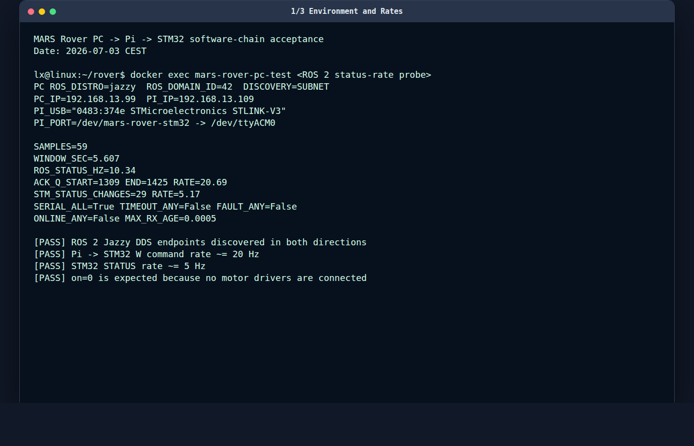
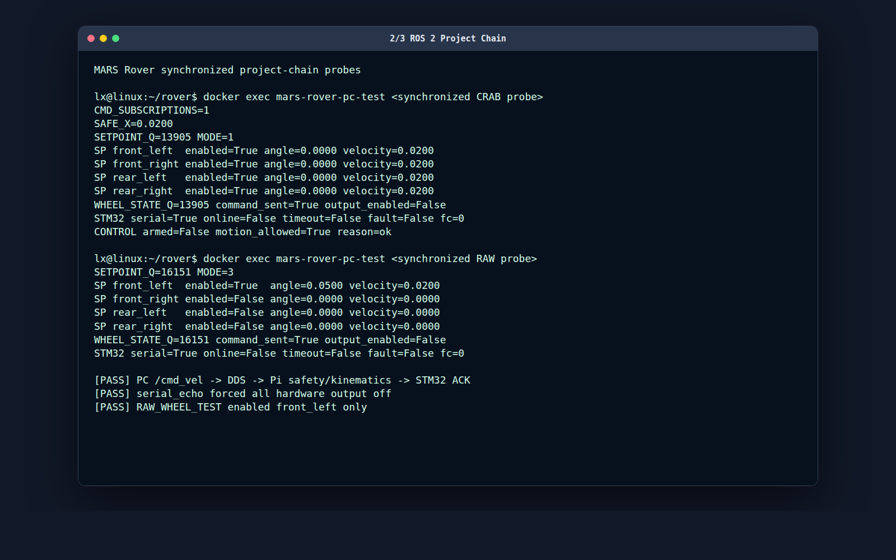
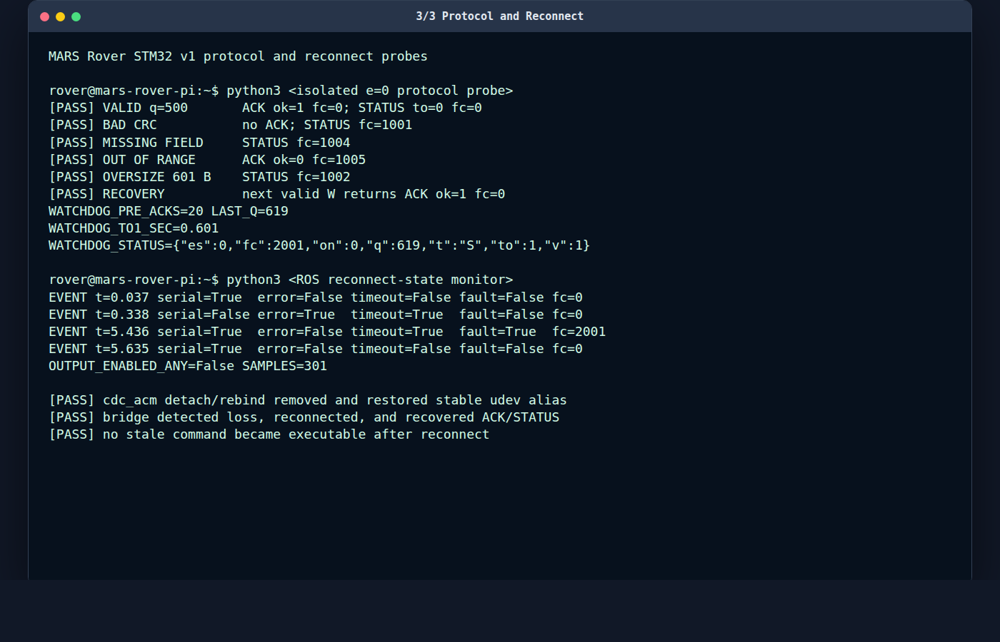

# 电脑–Pi–STM32 纯软件链路测试报告

## 1. 执行结论

2026-07-03 在不连接任何电机驱动器、不调用 arm、不中断或修改 STM32 安全编译锁的条件下，完成了：

```text
Linux 电脑 ROS 2
  -> 局域网 DDS
  -> Raspberry Pi ROS 2 控制链
  -> USB ST-LINK VCP
  -> STM32 v1 协议固件
  -> ACK / STATUS
  -> Raspberry Pi ROS 2
  -> 局域网 DDS
  -> Linux 电脑
```

总体结论：**软件链路通过，真实执行保持锁定。**

- DDS、ROS 2 节点、运动学、串口编码、STM32 v1 解析、ACK/STATUS、错误码、watchdog 和自动重连均得到实测证据。
- CRAB 和 RAW_WHEEL_TEST 的非零软件目标均到达 STM32；所有项目帧保持不可执行，ROS 回显始终为 `output_enabled=false`。
- STM32 在未连接驱动器时持续报告 `on=0`，这是当前固件的正确安全行为，不视为通信失败。
- 未测试 RS-485、Modbus、驱动器在线、homing、steer-before-drive 的真实执行效果或电机动作。

## 2. 测试边界与安全措施

测试期间满足：

- Pi 与 STM32 之间只有 USB 数据连接。
- STM32 未连接 MKS SERVO57D、BLD-305S 或其他电机驱动器。
- 没有电机功率支路。
- 没有调用 `/mars_rover/set_armed`。
- `serial_echo` 阶段强制 `e=0`。
- `real_single_wheel` 阶段保持 `armed=false`，STM32 `on=0`，安全门拒绝运动。
- 测试结束后全部 ROS launch 干净关闭，串口无人占用。
- 最终被动 STATUS 为 `on=0,to=1,fc=2001`，说明 STM32 没有持续收到 W 命令。

## 3. 环境与版本

| 项目 | 实测值 |
|---|---|
| 电脑 IP | `192.168.13.99/24` |
| Pi IP | `192.168.13.109/24` |
| 电脑 ROS 2 | Jazzy，Docker host network |
| Pi ROS 2 | Jazzy，原生 Ubuntu 24.04 arm64 |
| DDS Domain | `ROS_DOMAIN_ID=42` |
| 发现范围 | `ROS_AUTOMATIC_DISCOVERY_RANGE=SUBNET` |
| RMW | `rmw_fastrtps_cpp` |
| 电脑 Git HEAD | `61d130280b7ee38d34dfd52bb482edf8c0655dd2` |
| Pi release | `/home/rover/rover/releases/20260703T124357-44f1bbe/mars_rover_ws` |
| STM32 USB | `0483:374e STMicroelectronics STLINK-V3` |
| STM32 原始端口 | `/dev/ttyACM0` |
| STM32 稳定别名 | `/dev/mars-rover-stm32` |
| 串口参数 | 115200 8N1 |

Pi 部署源文件使用 CRLF 行尾，因此原始 SHA256 与 Linux 工作区不同；去除 `\r` 后，所有 `mars_rover_msgs/msg/*.msg` 文件哈希与电脑端完全一致。`44f1bbe..61d1302` 之间的 `mars_rover_ws` 内容也无差异，因此本轮自定义 DDS 消息兼容。

电脑和 Pi 的 ROS 2 测试基线均为：

```text
Summary: 61 tests, 0 errors, 0 failures, 0 skipped
```

## 4. T4：USB 枚举与稳定设备名

### 4.1 初始检查

初始枚举正常：

```text
Bus 001 Device 004: ID 0483:374e STMicroelectronics STLINK-V3
/dev/ttyACM0  root:dialout 0660
/dev/serial/by-id/usb-STMicroelectronics_STLINK-V3_003200353235511437333439-if02
```

Pi 用户 `rover` 属于 `dialout`。初始缺少 `/dev/mars-rover-stm32`，因此 T4 最初不满足正式准入条件。

### 4.2 修复

新增：

```text
/etc/udev/rules.d/99-mars-rover-stm32.rules
```

匹配 `0483:374e` 和 ST-LINK 序列号，生成：

```text
/dev/mars-rover-stm32 -> ttyACM0
```

Pi 上还存在旧规则 `/etc/udev/rules.d/99-mars-stm32.rules`，它匹配旧 PID `374b` 并生成另一名称；本轮没有删除该历史规则，因为它不匹配当前 `374e` 设备。

### 4.3 断开/恢复

通过受控解绑和重绑 `cdc_acm` 接口 `1-1.2:1.2` 模拟 USB 串口消失和恢复：

- 解绑后 `/dev/ttyACM0` 与 `/dev/mars-rover-stm32` 均消失。
- 重绑后两者自动恢复，稳定别名仍指向 `/dev/ttyACM0`。

结果：**通过 OS、udev 和 bridge 级恢复测试。** 本轮没有人工物理拔出 USB 数据线，真实机械拔插仍应在现场补做一次。

## 5. T5：v1 协议与速率

### 5.1 被动 STATUS

不发送任何命令时，3 秒内收到 16 条 STATUS，约 5.3 Hz：

```json
{"es":0,"fc":2001,"on":0,"q":0,"t":"S","to":1,"v":1}
```

该结果证明 STM32 已烧录当前 v1 STATUS 协议，并符合“无 W 时 watchdog 超时”的定义。

### 5.2 20 Hz W / ACK / 5 Hz STATUS

直接发送 40 条 `e=0` STOP 帧：

```text
SENT=40
ACK_COUNT=40
```

ROS bridge 运行时的 5.607 秒统计：

| 指标 | 实测值 |
|---|---:|
| `/mars_rover/stm32/status` 发布频率 | 10.34 Hz |
| ACK 序号增长率，即 W/ACK 频率 | 20.69 Hz |
| STM32 STATUS 序号变化率 | 5.17 Hz |
| 最大 `last_rx_age` | 0.0005 s |
| timeout/fault | 均未出现 |

第一次只发送一条 W 时没有看到 ACK，随后 20 Hz 连续发送立即得到 40/40 ACK。该现象可能来自 VCP 刚打开时的首帧时序，列为观察项；项目 bridge 本身持续 20 Hz 发送，因此未影响本轮链路。

第一轮 `serial_echo` 从 17:19 到 17:33 运行超过 10 分钟，日志中没有持续 CRC、解析或串口错误。

## 6. 完整电脑–Pi–STM32 项目链路

### 6.1 DDS 基础复核

- `std_msgs/String` 电脑到 Pi：通过。
- `geometry_msgs/Twist` 新话题电脑到 Pi：通过。
- Pi 到电脑的 ROS 状态与项目消息：通过。
- DDS endpoint 发现偶尔需要约 1–2 秒，因此同步探针在发布前显式等待 subscription match。

### 6.2 CRAB

电脑发送 `linear.x=0.02 m/s`，同步观察结果：

```text
SAFE_X=0.0200
SETPOINT_Q=13905 MODE=1
front_left   enabled=True angle=0.0000 velocity=0.0200
front_right  enabled=True angle=0.0000 velocity=0.0200
rear_left    enabled=True angle=0.0000 velocity=0.0200
rear_right   enabled=True angle=0.0000 velocity=0.0200
command_sent=True
output_enabled=False
STM32 timeout=False fault=False fc=0
```

模式切换后的第一批非零命令被 `fresh_command_required` 正确拦截；发送一条新零命令后，新的非零命令才被放行。这符合安全状态机设计。

结果：**通过。**

### 6.3 RAW_WHEEL_TEST

电脑发送 `linear.x=0.02 m/s`、`angular.z=0.05 rad`：

```text
SETPOINT_Q=16151 MODE=3
front_left   enabled=True  angle=0.0500 velocity=0.0200
front_right  enabled=False angle=0.0000 velocity=0.0000
rear_left    enabled=False angle=0.0000 velocity=0.0000
rear_right   enabled=False angle=0.0000 velocity=0.0000
command_sent=True
output_enabled=False
STM32 timeout=False fault=False fc=0
```

结果：**通过。** 只有 front_left 产生测试目标，STM32 正常 ACK，但真实输出关闭。

## 7. 协议错误与 watchdog

所有测试帧均为 `e=0`；没有发送真实使能。

| 用例 | 预期 | 实测 | 结果 |
|---|---|---|---|
| 合法 W，q=500 | ACK `ok=1,fc=0` | 符合 | 通过 |
| CRC32 损坏 | 不 ACK，STATUS `1001` | 符合 | 通过 |
| 缺少 `w` 字段 | STATUS `1004` | 符合 | 通过 |
| 速度 `9.9 m/s` 越界 | ACK `ok=0,fc=1005` | 符合 | 通过 |
| 601 字节超长帧 | STATUS `1002` | 符合 | 通过 |
| 错误后发送合法 W | 恢复 ACK `ok=1,fc=0` | 符合 | 通过 |
| 20 条连续 STOP | 20 条 ACK | `20/20` | 通过 |
| 停止 W | STATUS `to=1,fc=2001` | 0.601 s 首次观察到 | 通过 |

watchdog 固件阈值为 0.5 秒，STATUS 约 5 Hz，因此从最后一条 W 到电脑观察到超时 STATUS 的时间包含最多约 0.2 秒上报延迟。本轮观测值 0.601 秒符合该模型。

## 8. USB 断开、重连和旧命令抑制

Pi 本机状态监视器记录：

```text
t=0.037 serial=True  error=False timeout=False fault=False fc=0
t=0.338 serial=False error=True  timeout=True  fault=False fc=0
t=5.436 serial=True  error=False timeout=True  fault=True  fc=2001
t=5.635 serial=True  error=False timeout=False fault=False fc=0
OUTPUT_ENABLED_ANY=False SAMPLES=301
```

bridge 日志同时记录：

```text
serial write/read failed: [Errno 5] Input/output error
serial open failed: [Errno 2] No such file or directory
Opened STM32 serial port /dev/mars-rover-stm32
```

结论：设备消失被检测，重连后先经历 watchdog 状态，然后收到新 ACK/STATUS 并恢复通信；301 个采样中没有任何 `output_enabled=true`，旧目标没有变成可执行输出。

## 9. T6：real single-wheel 保持禁用

实测参数：

```text
hardware_output_mode=single_wheel
active_test_wheel=front_left
drive mode startup=STOP
```

切换到 RAW_WHEEL_TEST 后发送非零输入：

```text
front_left enabled=True，目标速度被安全门归零
其余三轮 enabled=False
command_sent=True
output_enabled=False
ControlState armed=False motion_allowed=False reason=stm32_offline
```

在 single-wheel profile 请求 CRAB：

```text
mode: 3
reason: profile rejected: CRAB
```

结果：**通过。** 没有驱动器时 STM32 `on=0`，因此 real_serial 安全门拒绝运动；不合规四轮模式也被拒绝。

## 10. 验收清单

| 验收项 | 结果 | 说明 |
|---|---|---|
| 双向 DDS | 通过 | String、Twist、自定义消息均验证 |
| USB 串口持续通信 | 通过 | W/ACK 约 20 Hz，STATUS 约 5 Hz |
| v1 CRC/字段/范围检查 | 通过 | 1001/1002/1004/1005 均符合 |
| watchdog | 通过 | 首次可观测超时 STATUS 为 0.601 s |
| 项目命令保持不可执行 | 通过 | `output_enabled=false`，未 arm |
| 无驱动器 `on=0` | 符合预期 | 不判为通信失败 |
| 自动重连 | 通过 | alias 恢复、bridge 重开、ACK 恢复 |
| 旧命令不恢复 | 通过 | 301 样本均未使能 |
| 物理拔插 | 未执行 | 已完成等价 driver unbind/rebind |
| RS-485/Modbus/homing/电机 | 不在范围 | 无对应硬件连接 |

## 11. 发现的问题与建议

1. **稳定别名初始缺失，已修复。** 新规则匹配当前 STLINK-V3 `0483:374e` 和序列号。
2. **部署手册 T5 的 `online=true` 不适用于无驱动器阶段。** 当前固件 `on=1` 需要执行锁解除、驱动器在线和 homing；本阶段正确预期是 `serial_connected=true`、ACK/STATUS 新鲜、`online=false`。
3. **首次单帧可能丢失。** 建议保留 bridge 20 Hz 连续发送，并在正式协议验收中统计端口打开后的首帧 ACK 延迟。
4. **DDS 发现需要等待。** 自动测试应在发布前检查 subscription count，避免进程刚启动就发送一次性消息导致观察竞态。
5. **补做真实 USB 拔插。** 在仍无驱动器的条件下人工拔插一次，确认结果与 cdc_acm 解绑/重绑一致。

## 12. 交付物

终端截图：

- `screenshots/01_environment_and_rates.png`
- `screenshots/02_project_chain.png`
- `screenshots/03_protocol_and_reconnect.png`







由于当前 GNOME Wayland 会话拒绝非交互式 `ScreenshotWindow` 调用，三张 PNG 由无头浏览器将保存的真实终端 transcript 渲染为终端窗口样式；对应原始文本为 `terminal_01_*.txt`、`terminal_02_*.txt`、`terminal_03_*.txt`。数值均来自本轮实际命令输出，原始 Pi 日志保存在 `logs/`，没有把渲染图作为原始日志替代品。

原始 Pi 日志位于 `logs/`：

- `rover_serial_echo_20260703T171949.log`
- `rover_protocol_test_20260703T173457.log`
- `rover_protocol_test2_20260703T173542.log`
- `rover_serial_reconnect_20260703T173851.log`
- `rover_reconnect_status_20260703T174123.log`
- `rover_real_single_disarmed_20260703T174247.log`

`SHA256SUMS` 保存上述六份日志和三张截图的校验值。
